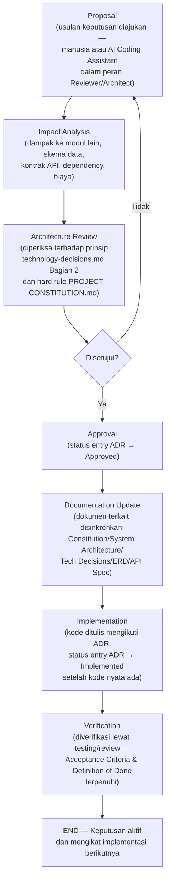

# DECISION LOG
## Platform Web RUMAHAGEN

> Dokumen ini adalah catatan resmi seluruh keputusan penting proyek — teknis maupun non-teknis — beserta alasan di baliknya. Menjadi referensi wajib bagi seluruh AI Coding Assistant (Claude, Bolt.new, ChatGPT, Cursor) dan developer manusia sebelum melakukan implementasi, maintenance, atau refactor.

---

# 1. Document Information

| Field | Value |
|---|---|
| **Document Name** | Decision Log — Platform Web RUMAHAGEN |
| **Version** | 1.0 |
| **Status** | Living Document — BERLAKU sejak dibuat, diperbarui berkelanjutan sepanjang lifecycle proyek |
| **Last Updated** | 8 Agustus 2026 (penambahan **ADR-047** — sinkronisasi Image Duplicate Detection Strategy dari `architecture-decision-records.md` ADR-029; **OD-25** diregistrasi dan diresolusi di §11 dalam siklus yang sama. Riwayat: 7 Agustus 2026, penambahan **OD-24** — konfirmasi gate implementasi kode Modul 12) |
| **Owner** | Principal Software Architect / Technical Lead — **Mujtahid Aktanto (Solo Project Owner, AI-Assisted)** — resolusi **OD-06**, 4 Agustus 2026 |
| **Related Documents** | `PROJECT-CONSTITUTION.md`, `SYSTEM-ARCHITECTURE.md`, `technology-decisions.md`, `dependency-manifest.md`, `AI-DEVELOPMENT-BLUEPRINT.md` (versi aktif), `AI-CONTEXT-PACK.md`, `DEVELOPMENT-ROADMAP.md`, `TASK-TEMPLATE.md`, `CURRENT-PROJECT-STATE.md`, `CHANGELOG.md`, dan dokumen sumber v1.1 (PRD/ERD/ERD Diagram/API Specification/User Flow/SEO Analytics Specification) |

**Kedudukan dokumen dalam hierarki governance:** Decision Log **tidak menggantikan** dokumen manapun di atas — fungsinya adalah menjelaskan **mengapa** sebuah keputusan yang tercatat di dokumen-dokumen tersebut diambil, kapan, dan apa alternatif yang dipertimbangkan. Jika `PROJECT-CONSTITUTION.md` menyatakan sesuatu "final" tanpa penjelasan alasan, Decision Log inilah tempat alasan tsb dicatat lengkap.

> **Catatan status keputusan vs status dokumen sumber:** Sebagian keputusan di Bagian 5 diambil dari `technology-decisions.md`, yang statusnya sendiri masih **"Draft — menunggu review & pengesahan tim"**. Decision Log ini tetap mencatatnya dengan status **Approved** (bukan Proposed) karena dokumen sumber tsb secara eksplisit menyebut stack-nya sebagai *"keputusan resmi dan final"* yang mengikat implementasi — namun pengesahan organisasi formal (nama individu/komite yang menandatangani) belum terjadi. Ini dicatat sebagai item tersendiri di **Open Decisions** (Bagian 11).

---

# 2. Cara Menggunakan Decision Log

1. **Setiap keputusan baru wajib ditambahkan sebagai entry baru** (`ADR-XXX` berikutnya secara berurutan) — tidak pernah disisipkan ke nomor yang sudah dipakai.
2. **Entry lama tidak boleh dihapus atau ditulis ulang isinya**, apa pun yang terjadi kemudian. Sejarah keputusan (termasuk yang sudah usang) adalah bagian dari nilai dokumen ini.
3. **Jika sebuah keputusan berubah**, buat **entry ADR baru** yang secara eksplisit menyebutkan `ADR` mana yang digantikannya di field *Related Documents*/*Future Review* — lalu ubah status entry lama menjadi `Replaced` (lihat Bagian 3). Jangan pernah mengedit isi keputusan lama seolah-olah itu keputusan awal.
4. **Selalu referensikan dokumen yang berkaitan** — setiap entry wajib menyebut dokumen sumber mana yang mencatat/menerapkan keputusan tsb (`PROJECT-CONSTITUTION.md`, `SYSTEM-ARCHITECTURE.md`, `technology-decisions.md`, ERD, API Specification, dll.) sehingga pembaca dapat menelusuri implementasi nyatanya.
5. **AI Coding Assistant wajib membaca Decision Log ini sebelum mengambil pendekatan teknis apa pun** yang berpotensi tumpang tindih dengan keputusan yang sudah tercatat (lihat Bagian 9).
6. Dokumen ini **tidak memutuskan sendiri** pertentangan yang ditemukan antar dokumen sumber — pertentangan semacam itu dicatat di **Open Decisions** (Bagian 11), menunggu keputusan eksplisit manusia.

---

# 3. Decision Status

| Status | Arti |
|---|---|
| **Proposed** | Keputusan diusulkan/dipertimbangkan, namun belum direview secara arsitektural dan belum mengikat implementasi. AI/developer **tidak boleh** mengimplementasikan sesuatu hanya berdasarkan entry berstatus ini tanpa konfirmasi lebih lanjut. |
| **Approved** | Keputusan sudah disetujui secara arsitektural dan **mengikat** untuk implementasi berikutnya, tetapi **belum tentu sudah ada di kode** (proyek saat ini masih Pra-Development — lihat `CURRENT-PROJECT-STATE.md`). Ini adalah status "siap dieksekusi". |
| **Implemented** | Keputusan sudah disetujui **dan** sudah benar-benar ada di kode/skema/infrastruktur nyata, dapat diverifikasi di repository/lingkungan yang berjalan. |
| **Deprecated** | Keputusan pernah berlaku dan mungkin masih ada sisa implementasinya di kode, namun **tidak lagi direkomendasikan** untuk dipakai pada kode baru — belum tentu sudah sepenuhnya digantikan. |
| **Replaced** | Keputusan telah **sepenuhnya digantikan** oleh keputusan lain yang tercatat sebagai entry ADR baru — entry ini dipertahankan sebagai sejarah, bukan dihapus. |

---

# 4. Decision Entry Template

Template baku untuk setiap entry baru di Decision Log:

```markdown
## ADR-XXX — <Decision Title>

**Date:** <YYYY-MM-DD>
**Status:** Proposed | Approved | Implemented | Deprecated | Replaced
**Category:** <lihat Bagian 6 — satu atau lebih kategori>
**Related Documents:** <dokumen sumber yang mencatat/menerapkan keputusan ini>

### Problem
<Masalah/kebutuhan apa yang mendorong perlunya keputusan ini>

### Decision
<Keputusan yang diambil, dinyatakan tegas dan tidak ambigu>

### Reason
<Alasan keputusan ini diambil, dikaitkan ke prinsip/kriteria yang relevan>

### Alternatives Considered
<Opsi lain yang dipertimbangkan dan mengapa tidak dipilih>

### Consequences
<Dampak positif maupun trade-off yang harus diterima akibat keputusan ini>

### Implementation Notes
<Catatan teknis praktis untuk implementasi — pola integrasi, batasan, hal yang perlu diperhatikan AI/developer>

### Future Review
<Kondisi yang dapat memicu keputusan ini ditinjau ulang di masa depan>
```

---

# 5. Initial Decisions

> Seluruh entry di bagian ini mencatat keputusan yang **sudah diambil** berdasarkan dokumen yang telah diupload (`PROJECT-CONSTITUTION.md`, `SYSTEM-ARCHITECTURE.md`, `technology-decisions.md`, `dependency-manifest.md`, dan dokumen sumber v1.1). Status **Approved** berarti mengikat untuk implementasi berikutnya — lihat catatan status di Bagian 1.

## ADR-001 — Next.js (App Router) sebagai Frontend Framework

**Date:** 2026-07-26
**Status:** Approved
**Category:** Architecture, Frontend
**Related Documents:** `PROJECT-CONSTITUTION.md` Bagian 4 & Riwayat Keputusan Arsitektur #6, `SYSTEM-ARCHITECTURE.md` Bagian 4, `technology-decisions.md` 4.1, `SEO-Analytics-Specification-v1.1.md` §1.1

### Problem
Seluruh halaman publik (homepage, search, detail listing, profil agen, detail proyek developer) **wajib** SSR/SSG/ISR agar terindeks mesin pencari secepat dan seakurat mungkin sejak hari pertama rilis — keputusan rendering ini mahal diubah setelah traffic organik terbentuk.

### Decision
Menggunakan **Next.js dengan App Router** sebagai satu-satunya framework frontend, dengan Server Components untuk halaman publik dan Route Handlers sebagai kandidat BFF.

### Reason
Satu-satunya pilihan arus utama yang memenuhi seluruh syarat SSR/SSG/ISR wajib sekaligus mendukung ekosistem React penuh dan integrasi native dengan Vercel.

### Alternatives Considered
- **Remix** — ekosistem lebih kecil, dukungan Vercel-native lebih lemah.
- **Astro** — kurang cocok untuk aplikasi interaktif kompleks (dashboard/admin CSR).
- **SPA React murni (Vite) + backend terpisah** — gagal memenuhi syarat SSR wajib tanpa menambah kompleksitas prerendering terpisah.

### Consequences
- Kurva belajar App Router (Server Components, model caching) perlu dipahami tim.
- Strategi caching (`fetch` cache directives) butuh kedisiplinan agar tidak salah men-cache data privat.
- Membuka jalan integrasi native dengan Vercel (lihat ADR-008).

### Implementation Notes
Route group `(public)` wajib Server Component untuk data-fetching utama; `(dashboard)`/`(admin)` CSR dengan `noindex, nofollow`. Jangan membuat halaman publik baru sebagai client component murni dengan `useEffect`+`fetch` sebagai sumber data utama.

### Future Review
Jika Next.js mengubah model rendering/caching secara fundamental di versi mayor mendatang, atau jika kebutuhan mobile-native (lihat Bagian 10) mendorong pemisahan backend penuh.

---

## ADR-002 — TypeScript sebagai Bahasa Utama

**Date:** 2026-07-26
**Status:** Approved
**Category:** Architecture
**Related Documents:** `PROJECT-CONSTITUTION.md` Bagian 6, `technology-decisions.md` 4.2

### Problem
Proyek membutuhkan satu sumber kebenaran tipe data (`packages/shared-types`) yang konsisten di frontend & backend sekaligus, untuk skema RBAC/ownership yang kompleks dan rawan bug jika tidak bertipe statis.

### Decision
Seluruh codebase (frontend, Route Handlers, skema validasi, shared types) ditulis dalam **TypeScript** dengan `strict: true`, tanpa `any` implisit.

### Reason
Deteksi error saat compile-time, autocomplete AI/IDE jauh lebih akurat, refactor besar lebih aman — prasyarat mutlak untuk prinsip *Single Source of Truth*.

### Alternatives Considered
- **JavaScript murni** — ditolak karena tidak mendukung Single Source of Truth tipe data lintas layer dan risiko bug runtime jauh lebih tinggi.

### Consequences
Build time lebih lambat dibanding JS murni; butuh disiplin tim agar tidak memakai `any`/`// @ts-ignore` untuk menutupi masalah tipe.

### Implementation Notes
`strict: true` wajib di seluruh `tsconfig.json`. AI dilarang menonaktifkan strict mode demi "membuat kode jalan".

### Future Review
Tidak ada pemicu peninjauan ulang yang diantisipasi — ini keputusan fondasi jangka panjang.

---

## ADR-003 — Supabase sebagai Backend-as-a-Service

**Date:** 2026-07-26
**Status:** Approved
**Category:** Infrastructure, Backend
**Related Documents:** `PROJECT-CONSTITUTION.md` Bagian 4 & 12, `technology-decisions.md` 4.6

### Problem
Proyek membutuhkan Auth + Storage + database relasional + Row Level Security tanpa membangun ulang seluruhnya dari nol, dengan tim kecil dan target MVP cepat.

### Decision
Menggunakan **Supabase** sebagai platform backend-as-a-service (Postgres, Auth, Storage, RLS, Edge Functions).

### Reason
Memberi Auth+Storage+RLS siap pakai sekaligus database relasional penuh yang dibutuhkan skema ERD kaya relasi (37+ entitas, FK/ENUM/UNIQUE composite) — mengurangi jumlah vendor yang perlu dikelola tim kecil.

### Alternatives Considered
- **Firebase (Firestore/NoSQL)** — tidak cocok skema relasional ketat proyek.
- **Backend custom (NestJS/Express + Postgres terkelola sendiri)** — menambah beban operasional yang bertentangan dengan prinsip Simplicity & Cost Efficiency di tahap MVP.

### Consequences
Vendor lock-in relatif terhadap konvensi Supabase; skala sangat besar mungkin perlu strategi tambahan (read replica/sharding) di fase lanjutan; RLS policy kompleks butuh kedisiplinan penulisan agar tidak membocorkan data.

### Implementation Notes
Wajib dua lapis pertahanan: RBAC middleware aplikasi **dan** RLS (lihat ADR-011). Service role key hanya server-side.

### Future Review
Jika volume data/traffic melampaui kapasitas single-instance Postgres Supabase secara signifikan — evaluasi read replica/sharding sebagai keputusan arsitektur terpisah.

---

## ADR-004 — PostgreSQL sebagai Database

**Date:** 2026-07-26
**Status:** Approved
**Category:** Database
**Related Documents:** `PROJECT-CONSTITUTION.md` Bagian 4, `technology-decisions.md` 4.7, `ERD-Skema-Database-Real-Estate-Agency-v1.1.md`

### Problem
Skema ERD proyek memakai relasi ketat (FK, ENUM, UNIQUE composite, cascading wilayah) yang menjadi tulang punggung RBAC dan ownership hard rule.

### Decision
Menggunakan **PostgreSQL** (di-host via Supabase) sebagai database relasional utama.

### Reason
ACID compliance, indexing kaya (composite, trigram/full-text), ekosistem migration/backup matang — cocok untuk relasi ketat yang dibutuhkan skema.

### Alternatives Considered
- **MongoDB/NoSQL document store** — tidak cocok kebutuhan relasi ketat & constraint yang menjadi tulang punggung RBAC/ownership.

### Consequences
Scaling horizontal butuh strategi eksplisit (partitioning/sharding) jika volume tumbuh sangat besar — dicatat sebagai keputusan arsitektur terpisah di masa depan.

### Implementation Notes
Migration murni SQL via Supabase CLI, disimpan di repo, tidak diedit langsung lewat Supabase Studio di production (lihat ADR-014).

### Future Review
Jika kebutuhan multi-tenant/multi-region (lihat Bagian 10) memerlukan penyesuaian skema besar.

---

## ADR-005 — Supabase Auth untuk Authentication

**Date:** 2026-07-26
**Status:** Approved
**Category:** Authentication
**Related Documents:** `PROJECT-CONSTITUTION.md` Bagian 10, `technology-decisions.md` 4.8, `API-Specification-v1.1.md` §0.1 & §1.1

### Problem
Dibutuhkan mekanisme login (email/password, OTP, Google OAuth2) tanpa membangun ulang dari nol, namun endpoint lain tidak boleh terikat pada metode login spesifik.

### Decision
Menggunakan **Supabase Auth**, dibungkus **JWT internal platform** — seluruh layer di luar Auth hanya mengenal JWT ini, bukan metode login aslinya.

### Reason
OTP & OAuth2 siap pakai, terintegrasi rapat dengan RLS Supabase (`auth.uid()`), tanpa menambah vendor Auth terpisah.

### Alternatives Considered
- **Auth0, Clerk** — menambah vendor terpisah dari database, biaya & kompleksitas tambahan.
- **NextAuth.js/Auth.js custom** — tidak seintegrasi Supabase Auth dengan RLS Postgres yang sudah dipilih.

### Consequences
Role/permission aplikasi (RBAC kustom 8 role) tidak sepenuhnya native di Supabase Auth — wajib tetap dikelola di tabel `roles`/`role_permissions` aplikasi sendiri (lihat ADR-011).

### Implementation Notes
Verifikasi `id_token` Google OAuth wajib server-side dengan Google Auth Library resmi. Role tidak boleh disimpan sebagai satu-satunya sumber kebenaran di token/metadata Supabase.

### Future Review
Tidak ada pemicu spesifik diantisipasi kecuali kebutuhan SSO enterprise di masa depan.

---

## ADR-006 — RLS + RBAC Kustom Aplikasi untuk Authorization

**Date:** 2026-07-26
**Status:** Approved
**Category:** Authorization, Security
**Related Documents:** `PROJECT-CONSTITUTION.md` Bagian 11 & 20 poin 2, `technology-decisions.md` 4.9, `ERD-Skema-Database-Real-Estate-Agency-v1.1.md` §2.28–2.30

### Problem
Sistem membutuhkan kontrol akses granular untuk 8 role dengan hard rule ownership (`agent_id`) yang tidak boleh bocor lintas agen, bahkan jika satu lapisan pertahanan gagal.

### Decision
Menerapkan **dua lapis pertahanan**: RBAC kustom aplikasi (`roles`/`permissions`/`role_permissions`, model `granted_scope`: `own`/`all`/`none`) sebagai lapisan pertama, dan **Row Level Security (RLS)** Supabase sebagai lapisan kedua.

### Reason
Satu lapisan gagal (mis. bug middleware) tidak langsung membocorkan seluruh data karena RLS tetap menjaring di level database.

### Alternatives Considered
- **RBAC aplikasi saja tanpa RLS** — ditolak karena bertentangan langsung dengan hard rule keamanan proyek (dua lapisan wajib).

### Consequences
Kompleksitas ganda — setiap perubahan skema permission harus disinkronkan hati-hati di kedua lapisan.

### Implementation Notes
Superadmin selalu bypass (short-circuit); Manager selalu `granted_scope = 'all'` (global, tanpa mode scoped tim/wilayah — keputusan final, lihat ADR-024). `granted_scope` diterapkan di layer service/repository, bukan controller.

### Future Review
Jika kebutuhan bisnis "Manager per wilayah" benar-benar muncul di masa depan — akan menjadi ADR baru yang mengganti sebagian ADR-024, bukan menambal diam-diam.

---

## ADR-007 — Supabase Storage untuk File Storage

**Date:** 2026-07-26
**Status:** Approved
**Category:** Infrastructure, Security
**Related Documents:** `PROJECT-CONSTITUTION.md` Bagian 12 & 16, `technology-decisions.md` 4.10

### Problem
Dibutuhkan penyimpanan foto/video listing (publik) dan dokumen legalitas agen (privat, sensitif) dengan kontrol akses yang terintegrasi dengan Auth/RLS.

### Decision
Menggunakan **Supabase Storage** dengan bucket terpisah tegas: publik (`listing-photos`, `listing-videos`, `developer-project-media`) vs privat (`agent-verification-documents`).

### Reason
Terintegrasi langsung dengan Supabase Auth/RLS untuk kontrol akses signed URL, mengurangi vendor tambahan di tahap MVP.

### Alternatives Considered
- **Cloudinary, ImageKit, AWS S3+CloudFront** — dicatat sebagai evaluasi fase lanjutan (Bagian 10) jika kebutuhan transformasi gambar (resize dinamis multi-varian, video streaming) melampaui kapasitas Supabase Storage.

### Consequences
Transformasi gambar (resize/WebP/AVIF) tidak sekaya CDN gambar khusus — dikompensasi dengan kompresi client-side (`browser-image-compression`, lihat ADR-027).

### Implementation Notes
Dokumen legalitas tidak pernah lewat CDN publik; akses hanya via signed URL berumur pendek untuk role `superadmin`/`manager`/`admin`.

### Future Review
Jika kebutuhan transformasi gambar/video bertumbuh kompleks — evaluasi Cloudinary/ImageKit sebagai lapisan tambahan (bukan pengganti).

---

## ADR-008 — Vercel sebagai Hosting/Deployment

**Date:** 2026-07-27
**Status:** Approved
**Category:** Deployment, Infrastructure
**Related Documents:** `SYSTEM-ARCHITECTURE.md` Bagian 4 & 18, `technology-decisions.md` 4.11

### Problem
Dibutuhkan platform hosting yang mendukung penuh fitur Next.js App Router (ISR, Edge Middleware, Image Optimization) tanpa konfigurasi tambahan, dengan alur deploy yang cepat untuk tim kecil.

### Decision
Menggunakan **Vercel** sebagai platform hosting & deployment aplikasi Next.js.

### Reason
Kombinasi Next.js + Vercel adalah pasangan native (pembuat framework yang sama) — zero-config deploy, preview deployment per PR, edge caching bawaan mendukung target TTFB < 600ms.

### Alternatives Considered
- **Self-hosted (Docker+VPS/Kubernetes)** — beban operasional DevOps tidak sepadan untuk tim kecil di tahap MVP.
- **Netlify, AWS Amplify** — dukungan fitur App Router terbaru kurang seketat Vercel sebagai pembuat framework.

### Consequences
Model harga berbasis fungsi serverless/edge dapat signifikan pada traffic sangat tinggi — perlu dipantau seiring pertumbuhan.

### Implementation Notes
Deployment pipeline: GitHub → Vercel. Environment variables dikelola terpisah per environment (preview vs production) di dashboard Vercel, tidak pernah di-commit ke repo.

> **Catatan governance:** keputusan ini **belum tercatat formal** di `PROJECT-CONSTITUTION.md` (baru ada di `SYSTEM-ARCHITECTURE.md`/`technology-decisions.md`) — lihat Open Decisions Bagian 11 poin 3.

### Future Review
Jika biaya serverless/edge Vercel menjadi tidak proporsional terhadap traffic aktual di fase lanjutan.

---

## ADR-009 — GitHub sebagai Repository & CI/CD

**Date:** 2026-07-27
**Status:** Approved
**Category:** Deployment, Infrastructure
**Related Documents:** `technology-decisions.md` 4.12–4.13, `PROJECT-CONSTITUTION.md` Bagian 21

### Problem
Dibutuhkan version control dengan integrasi native ke hosting (Vercel) dan CI/CD yang matang.

### Decision
Menggunakan **GitHub** sebagai repository, dengan **GitHub Actions** untuk CI (lint, type-check, test, migration check) dan integrasi otomatis ke Vercel untuk deployment.

### Reason
Integrasi native dengan Vercel (auto-deploy per push/PR) dan ekosistem terbesar untuk code review/Actions/integrasi pihak ketiga (Sentry, dll).

### Alternatives Considered
- **GitLab, Bitbucket** — tidak memberi keuntungan tambahan dibanding GitHub untuk kombinasi stack ini, sementara integrasi Vercel paling matang lewat GitHub.

### Consequences
Tidak relevan untuk tim yang sudah terkunci di platform Git lain — tidak berlaku di proyek ini.

### Implementation Notes
Branch protection + status check (lint/type-check/test/migration) wajib lolos sebelum merge ke `main`. Commit message mengikuti Conventional Commits.

### Future Review
Tidak ada pemicu spesifik diantisipasi.

---

## ADR-010 — Resend untuk Transactional Email

**Date:** 2026-07-27
**Status:** Approved
**Category:** Backend
**Related Documents:** `technology-decisions.md` 4.14, `SYSTEM-ARCHITECTURE.md` Bagian 23 poin 10

### Problem
Dibutuhkan pengiriman email transaksional (OTP registrasi, notifikasi status approval, reminder) — provider belum ditetapkan eksplisit di dokumen sumber v1.1.

### Decision
Menggunakan **Resend** sebagai provider transactional email, dipasangkan dengan **React Email** untuk template berbasis komponen React.

### Reason
Developer experience TypeScript/React paling selaras dengan stack Next.js yang sudah dipilih; deliverability baik; dashboard log pengiriman untuk debugging.

### Alternatives Considered
- **SendGrid, Postmark** — valid tapi DX TypeScript-nya dinilai kurang seselaras Resend.
- **Amazon SES** — butuh konfigurasi infrastruktur tambahan (domain warm-up, DKIM manual) yang lebih berat untuk tim kecil.

### Consequences
Harga per volume email perlu dipantau seiring pertumbuhan basis pengguna (agen + buyer).

### Implementation Notes
Dipakai untuk OTP (Modul 1) & notifikasi status (Modul 8) — bukan untuk marketing/bulk email. Jangan mengirim data sensitif (`net_income`, dokumen legalitas) sebagai lampiran/isi email.

### Future Review
Jika kebutuhan volume email melonjak signifikan (mis. campaign marketing skala besar) — evaluasi ulang model harga.

---

## ADR-011 — Sentry untuk Monitoring & Error Tracking

**Date:** 2026-07-27
**Status:** Approved
**Category:** Monitoring
**Related Documents:** `technology-decisions.md` 4.15, `SYSTEM-ARCHITECTURE.md` Bagian 23 poin 11

### Problem
Dibutuhkan error tracking & performance monitoring untuk frontend (Next.js) dan Route Handlers — tool belum ditetapkan di dokumen sumber v1.1.

### Decision
Menggunakan **Sentry** (`@sentry/nextjs`) sebagai tool monitoring resmi.

### Reason
SDK resmi terintegrasi rapat dengan App Router (server & client components, edge runtime); source map otomatis untuk stack trace production yang terbaca; performance tracing untuk mendeteksi regresi Core Web Vitals/TTFB.

### Alternatives Considered
- **Datadog, self-hosted (Grafana+Loki)** — jauh lebih kompleks & mahal untuk kebutuhan MVP.
- **LogRocket** — lebih fokus session replay dibanding error/performance tracing.

### Consequences
Volume error/tracing tinggi dapat memakan kuota paket berbayar — perlu sampling rate dikonfigurasi wajar.

### Implementation Notes
`request_id`/`correlation_id` error backend wajib konsisten dengan yang dikembalikan ke client. Jangan pernah mengirim data sensitif (`net_income`, KTP/NPWP, token JWT penuh) ke Sentry breadcrumb/context.

### Future Review
Tidak ada pemicu spesifik diantisipasi.

---

## ADR-012 — Tailwind CSS sebagai CSS Framework

**Date:** 2026-07-26
**Status:** Approved
**Category:** UI/UX
**Related Documents:** `PROJECT-CONSTITUTION.md` Bagian 4, `technology-decisions.md` 4.4

### Problem
Dibutuhkan pendekatan styling yang mendukung Core Web Vitals rendah-JS (tanpa CSS-in-JS runtime) dan desain sistem yang konsisten & dapat diaudit.

### Decision
Menggunakan **Tailwind CSS v4** (CSS-first configuration) sebagai satu-satunya pendekatan styling.

### Reason
Tidak ada beban JS runtime tambahan (bertentangan dengan CSS-in-JS); build sangat cepat; ukuran CSS akhir kecil karena purging otomatis.

### Alternatives Considered
- **CSS Modules murni** — tidak menyediakan sistem desain token yang konsisten out-of-the-box seperti Tailwind+shadcn/ui.
- **styled-components/Emotion (CSS-in-JS)** — menambah beban JS di client, bertentangan prinsip performance.

### Consequences
Markup dapat terlihat padat kelas utilitas; migrasi v3→v4 (jika terjadi) memerlukan penyesuaian variabel warna (HSL→OKLCH) — tidak relevan karena proyek diinisialisasi langsung di v4.

### Implementation Notes
Jangan menambahkan library CSS-in-JS sebagai "pelengkap" — seluruh styling baru wajib memakai kelas Tailwind/komponen shadcn/ui yang sudah ada.

### Future Review
Tidak ada pemicu spesifik diantisipasi.

---

## ADR-013 — shadcn/ui sebagai UI Component Library

**Date:** 2026-07-26
**Status:** Approved
**Category:** UI/UX
**Related Documents:** `PROJECT-CONSTITUTION.md` Bagian 4, `technology-decisions.md` 4.3

### Problem
Dibutuhkan komponen UI headless yang dapat diaudit dan dikustomisasi penuh tanpa "fighting the library" bergaya desain vendor.

### Decision
Menggunakan **shadcn/ui** (berbasis Radix UI primitives, digenerate langsung ke repo) sebagai component library.

### Reason
Kode komponen sepenuhnya berada di repo (`components/ui/`) sehingga dapat dikustomisasi bebas; aksesibilitas bawaan dari Radix UI; kompatibel penuh Tailwind v4 & React 19.

### Alternatives Considered
- **Material UI (MUI), Ant Design** — membawa opini desain visual kuat (sulit dikustomisasi total), bundel lebih berat — **eksplisit dilarang** (lihat Architecture Constraints).
- **Chakra UI** — valid tapi tidak dipilih untuk menghindari dua sistem desain berbeda filosofi tanpa kebutuhan jelas.

### Consequences
Bukan package versi tunggal yang di-`npm update` — update komponen upstream ditarik manual via CLI; tim wajib disiplin tidak memodifikasi struktur dasar komponen secara sembarangan.

### Implementation Notes
Selalu cek `components/ui/` sebelum membuat komponen custom baru yang fungsinya serupa. Bergantung pada `@radix-ui/*` per komponen, `class-variance-authority`, `clsx`, `tailwind-merge`.

### Future Review
Jika shadcn/ui menghentikan dukungan versi Tailwind/React yang dipakai proyek.

---

## ADR-014 — Lucide React sebagai Icon Set

**Date:** 2026-07-26
**Status:** Approved
**Category:** UI/UX
**Related Documents:** `technology-decisions.md` 4.5

### Problem
Dibutuhkan set ikon SVG yang ringan dan konsisten secara visual di seluruh UI.

### Decision
Menggunakan **Lucide React**, diimpor per-ikon.

### Reason
Ikon default resmi ekosistem shadcn/ui, tree-shakeable per-ikon, aktif dipelihara, kompatibel React Server/Client Components.

### Alternatives Considered
- **React Icons** — menggabungkan banyak set berbeda gaya dalam satu dependency besar (risiko inkonsistensi visual & bundle lebih besar).
- **Heroicons** — kurang terintegrasi rapat dengan shadcn/ui dibanding Lucide.

### Consequences
Gaya ikon tunggal (line icons) — jika kebutuhan desain memerlukan gaya lain, perlu keputusan tambahan.

### Implementation Notes
Import per-ikon (`import { Home } from "lucide-react"`). Jangan mencampur set ikon lain dalam satu halaman/komponen.

### Future Review
Jika kebutuhan desain memerlukan gaya ikon berbeda (filled/duotone) secara signifikan.

---

## ADR-015 — TanStack Query untuk Server State Management

**Date:** 2026-07-27
**Status:** Approved
**Category:** State Management
**Related Documents:** `technology-decisions.md` 4.16, `dependency-manifest.md`

### Problem
Dashboard/admin panel (CSR) membutuhkan pengelolaan cache server-state (loading/error/stale) tanpa reinventing logic tsb secara manual.

### Decision
Menggunakan **TanStack Query** sebagai satu-satunya library server-state, khusus di route group `(dashboard)`/`(admin)`.

### Reason
Automatic refetching, cache invalidation granular, devtools bawaan; mengurangi boilerplate `useEffect`+`useState` manual.

### Alternatives Considered
- **SWR** — **eksplisit dilarang** (Architecture Constraints) untuk menghindari dua library server-state berfungsi sama berjalan berdampingan; TanStack Query dipilih karena fitur mutation & devtools lebih lengkap untuk CRUD dashboard kompleks.

### Consequences
Konsep cache key & invalidation butuh pemahaman tim agar tidak terjadi stale data yang tidak disadari.

### Implementation Notes
Halaman publik `(public)` tetap mengandalkan Server Component fetch, **bukan** TanStack Query, untuk menjaga SSR. Jangan mencampur pola fetch manual dengan TanStack Query dalam komponen yang sama.

> **Catatan governance:** `SYSTEM-ARCHITECTURE.md` Bagian 10 masih memakai frasa lama "React Query/SWR — pilih satu" — lihat Open Decisions Bagian 11 poin 2 untuk sinkronisasi.

### Future Review
Tidak ada pemicu spesifik diantisipasi.

---

## ADR-016 — Zustand untuk UI State Management

**Date:** 2026-07-27
**Status:** Approved
**Category:** State Management
**Related Documents:** `technology-decisions.md` 4.17

### Problem
Dibutuhkan state management untuk state UI lokal/lintas komponen yang bukan server-state (wizard form multi-step, filter UI sementara, modal global).

### Decision
Menggunakan **Zustand**, satu store per domain UI (bukan satu store raksasa global).

### Reason
API minimal tanpa boilerplate reducer/action/dispatch, ukuran bundle sangat kecil, hanya me-render ulang komponen yang subscribe ke slice terkait.

### Alternatives Considered
- **Redux (Toolkit)** — **eksplisit dilarang** (Architecture Constraints), boilerplate berlebihan untuk kebutuhan UI state proyek ini.
- **Context API murni** — tidak dioptimasi untuk update frekuensi tinggi.
- **Jotai/Recoil** — valid tapi tidak dipilih agar tidak menambah library state tanpa kebutuhan jelas di luar yang sudah dipilih.

### Consequences
Tanpa disiplin tim, store bisa jadi "keranjang sampah" state acak.

### Implementation Notes
Server state **tidak pernah** disimpan di Zustand — itu domain TanStack Query. Sebelum membuat store baru, pastikan itu benar-benar UI state.

### Future Review
Tidak ada pemicu spesifik diantisipasi.

---

## ADR-017 — React Hook Form untuk Form Management

**Date:** 2026-07-27
**Status:** Approved
**Category:** Frontend, Validation
**Related Documents:** `technology-decisions.md` 4.18

### Problem
Dibutuhkan manajemen state form performa tinggi untuk form kompleks (listing multi-step, upload multi-foto, field lokasi cascading, kalkulator DBR).

### Decision
Menggunakan **React Hook Form**, dipasangkan dengan `@hookform/resolvers` + Zod (lihat ADR-018).

### Reason
Performa tinggi (uncontrolled inputs, minim re-render), mendukung nested fields/field array yang dibutuhkan form listing.

### Alternatives Considered
- **Formik** — **eksplisit dilarang** (Architecture Constraints), performa re-render lebih rendah pada form besar/kompleks.

### Consequences
Pola uncontrolled berbeda dari form berbasis state React biasa — perlu penyesuaian pola pikir tim.

### Implementation Notes
Skema validasi Zod ditulis sekali di `lib/validation`/`shared-types`, dipakai sebagai resolver — jangan duplikasi aturan validasi manual di komponen form.

### Future Review
Tidak ada pemicu spesifik diantisipasi.

---

## ADR-018 — Zod untuk Validation

**Date:** 2026-07-27
**Status:** Approved
**Category:** Validation
**Related Documents:** `PROJECT-CONSTITUTION.md` Bagian 14, `technology-decisions.md` 4.19

### Problem
Dibutuhkan satu skema validasi tunggal yang dipakai baik di client (real-time form) maupun server (validasi ulang sebelum tulis DB), untuk mencegah drift antara tipe TypeScript manual dan aturan validasi runtime.

### Decision
Menggunakan **Zod** sebagai satu-satunya skema validasi, dengan `z.infer` untuk menghasilkan tipe statis otomatis.

### Reason
TypeScript-first, memenuhi prinsip Single Source of Truth validasi.

### Alternatives Considered
- **Yup, Joi** — tidak memiliki inferensi tipe TypeScript native sekuat Zod, tetap butuh definisi tipe terpisah yang berisiko drift.

### Consequences
Skema kompleks (validasi kondisional lintas field, mis. konversi tenor tahun→bulan) butuh `.refine()`/`.transform()` yang perlu didokumentasikan.

### Implementation Notes
Backend tidak pernah mempercayai validasi frontend — validasi ulang wajib untuk semua endpoint mutating. Field wajib PRD Modul 3.2 divalidasi sebelum status listing berubah ke `pending_review`.

### Future Review
Tidak ada pemicu spesifik diantisipasi.

---

## ADR-019 — Vitest untuk Unit Testing

**Date:** 2026-07-27
**Status:** Approved
**Category:** Testing
**Related Documents:** `technology-decisions.md` 4.20

### Problem
Dibutuhkan unit test untuk business logic (service layer, utility function, skema Zod) dengan kecepatan eksekusi tinggi pada stack Next.js/TypeScript modern.

### Decision
Menggunakan **Vitest** sebagai test runner unit testing.

### Reason
Kompatibel native dengan tooling Vite/Next.js modern, konfigurasi minimal, kecepatan eksekusi tinggi, dukungan native TypeScript/ESM.

### Alternatives Considered
- **Jest** — tetap valid secara fungsional, namun Vitest dipilih untuk performa & kompatibilitas ESM/TypeScript yang lebih mulus — menghindari dua test runner berjalan berdampingan tanpa alasan kuat.

### Consequences
Ekosistem plugin sedikit lebih muda dibanding Jest.

### Implementation Notes
Business logic sensitif (kalkulasi DBR, filter `granted_scope`, ownership check) wajib memiliki unit test eksplisit, dijalankan sebagai CI gate wajib.

### Future Review
Tidak ada pemicu spesifik diantisipasi.

---

## ADR-020 — React Testing Library untuk Component Testing

**Date:** 2026-07-27
**Status:** Approved
**Category:** Testing
**Related Documents:** `technology-decisions.md` 4.21

### Problem
Dibutuhkan pengujian komponen React dari perspektif interaksi pengguna, bukan detail implementasi internal.

### Decision
Menggunakan **React Testing Library**, dipasangkan dengan `@testing-library/jest-dom`.

### Reason
Standar industri, filosofi "test seperti pengguna memakai aplikasi" cocok memverifikasi form/dashboard kompleks; terintegrasi mulus dengan Vitest.

### Alternatives Considered
- **Enzyme** — tidak lagi dipelihara aktif untuk versi React modern (Server Components) — tidak kompatibel App Router.

### Consequences
Tidak menguji end-to-end lintas halaman/navigasi nyata (itu domain Playwright).

### Implementation Notes
Query elemen berdasarkan role/label (`getByRole`), bukan `data-testid` sebagai default pertama, agar turut memverifikasi aksesibilitas.

### Future Review
Tidak ada pemicu spesifik diantisipasi.

---

## ADR-021 — Playwright untuk E2E Testing

**Date:** 2026-07-27
**Status:** Approved
**Category:** Testing
**Related Documents:** `technology-decisions.md` 4.22

### Problem
Dibutuhkan pengujian end-to-end lintas browser untuk alur kritis (registrasi agen, publish listing, submit DBR, moderasi admin), termasuk alur OAuth Google yang lintas origin.

### Decision
Menggunakan **Playwright** sebagai tool E2E testing.

### Reason
Dukungan multi-browser (Chromium, Firefox, WebKit) dalam satu API, auto-wait bawaan mengurangi flaky test, dukungan resmi Next.js/Vercel yang matang, dan performa lebih baik untuk pengujian multi-tab/multi-origin (relevan untuk redirect OAuth Google) dibanding alternatif.

### Alternatives Considered
- **Cypress** — secara historis lebih terbatas pada multi-tab/multi-origin testing dan dukungan WebKit.

### Consequences
Waktu eksekusi E2E lebih lambat dibanding unit test — perlu strategi seleksi alur kritis saja.

### Implementation Notes
Dijalankan terhadap `next build && next start` (bukan `next dev`) di CI agar representatif kondisi production. Prioritaskan cakupan Acceptance Criteria PRD, bukan menduplikasi seluruh unit test di level E2E.

### Future Review
Tidak ada pemicu spesifik diantisipasi.

---

## ADR-022 — Recharts untuk Data Visualization

**Date:** 2026-07-27
**Status:** Approved
**Category:** UI/UX
**Related Documents:** `technology-decisions.md` 4.23

### Problem
Dashboard agen (jumlah lead 7/30 hari) dan dashboard admin (statistik agen/listing/proyek) membutuhkan visualisasi data standar (bar, line, pie).

### Decision
Menggunakan **Recharts** sebagai library chart.

### Reason
Berbasis React/SVG deklaratif (komponen React biasa), dokumentasi baik, cukup untuk kebutuhan chart standar proyek; responsif bawaan (`ResponsiveContainer`).

### Alternatives Considered
- **Chart.js, Victory** — valid namun tidak dipilih untuk menghindari dua library chart tanpa kebutuhan jelas.
- **D3 murni** — lebih fleksibel untuk visualisasi sangat kompleks, namun belum menjadi kebutuhan di scope Fase 1–2.

### Consequences
Untuk visualisasi geospasial lanjutan di masa depan mungkin kurang fleksibel dibanding D3 murni.

### Implementation Notes
Dipakai di Modul 8 (Dashboard) & Modul 9 (Admin Laporan).

### Future Review
Jika kebutuhan visualisasi sangat kompleks/custom muncul di fase lanjutan (mis. peta panas geospasial).

---

## ADR-023 — TanStack Table untuk Data Table

**Date:** 2026-07-27
**Status:** Approved
**Category:** UI/UX
**Related Documents:** `technology-decisions.md` Bagian 3, `dependency-manifest.md`

### Problem
Admin Panel membutuhkan tabel data headless untuk daftar user, listing, dan laporan dengan sorting/filtering/pagination manual (server-side).

### Decision
Menggunakan **TanStack Table** sebagai library tabel.

### Reason
Headless (tidak membawa styling sendiri, cocok dipadukan Tailwind/shadcn/ui), mendukung `manualPagination` untuk query list yang selalu paginated di server.

### Alternatives Considered
Tidak ada alternatif lain yang dicatat eksplisit di dokumen sumber — dipilih sebagai satu-satunya solusi tabel resmi untuk menghindari duplikasi fungsi (Architecture Constraints poin 11).

### Consequences
Butuh effort integrasi manual untuk styling (karena headless) — dikompensasi oleh fleksibilitas penuh dengan Tailwind.

### Implementation Notes
Dipakai di Modul 9 Admin Panel (daftar user, listing, laporan). Jangan menambah library table kedua.

### Future Review
Tidak ada pemicu spesifik diantisipasi.

---

## ADR-024 — dnd-kit untuk Drag & Drop

**Date:** 2026-07-27
**Status:** Approved
**Category:** UI/UX
**Related Documents:** `technology-decisions.md` 4.25, `dependency-manifest.md`

### Problem
Dibutuhkan drag-and-drop untuk reorder foto listing (Modul 3) dan reorder lesson/soal kuis (Modul 4).

### Decision
Menggunakan **dnd-kit** (`@dnd-kit/core` + `@dnd-kit/sortable`).

### Reason
Pengganti resmi `react-beautiful-dnd` yang sudah deprecated; aktif dipelihara, mendukung React modern.

### Alternatives Considered
- **react-beautiful-dnd** — **eksplisit dilarang** (deprecated oleh tim intinya).

### Consequences
Tidak ada trade-off signifikan dicatat di dokumen sumber.

### Implementation Notes
`@dnd-kit/sortable` adalah preset di atas `@dnd-kit/core` — keduanya wajib versi yang saling kompatibel.

### Future Review
Tidak ada pemicu spesifik diantisipasi.

---

## ADR-025 — date-fns untuk Date Utility

**Date:** 2026-07-27
**Status:** Approved
**Category:** Backend, Frontend
**Related Documents:** `technology-decisions.md` 4.26

### Problem
Dibutuhkan manipulasi & formatting tanggal (masa berlaku listing, expiry, jadwal event, tenor DBR) dengan dukungan locale Indonesia.

### Decision
Menggunakan **date-fns** sebagai satu-satunya library utilitas tanggal.

### Reason
Modular (tree-shakeable per fungsi), immutable by design, ukuran bundle jauh lebih kecil dibanding alternatif monolitik, dukungan locale `id`.

### Alternatives Considered
- **Moment.js** — **eksplisit dilarang** (mode maintenance, mutable API rawan bug, ukuran besar).
- **Day.js, Luxon** — valid secara teknis, tidak dipilih agar tidak ada dua library date-utility tumpang tindih.

### Consequences
Penanganan timezone kompleks lintas zona waktu membutuhkan paket pendamping (`date-fns-tz`) jika suatu saat dibutuhkan — belum jadi kebutuhan eksplisit (aplikasi berbasis WIB/lokal Indonesia).

### Implementation Notes
Konversi tenor tahun→bulan (lihat ADR-034) sebaiknya memakai utility murni, bukan objek Date. Impor fungsi spesifik, jangan impor seluruh objek.

### Future Review
Jika kebutuhan multi-timezone muncul (mis. ekspansi platform ke luar WIB).

---

## ADR-026 — pdf-lib untuk PDF Generation

**Date:** 2026-07-27
**Status:** Approved
**Category:** Backend
**Related Documents:** `technology-decisions.md` 4.27

### Problem
Modul 7 (DBR) membutuhkan export hasil simulasi ke PDF sebagai lampiran pengajuan KPR ke bank.

### Decision
Menggunakan **pdf-lib** untuk generate PDF terprogram di server (Route Handler).

### Reason
Library PDF murni JS/TS yang berjalan baik di Node.js tanpa dependency native/binary eksternal — ringan untuk lingkungan serverless (Vercel Functions).

### Alternatives Considered
- **Puppeteer/Playwright (render HTML→PDF)** — jauh lebih berat untuk lingkungan serverless (ukuran binary besar, cold start lambat).
- **jsPDF** — tumpang tindih penuh dengan pdf-lib, ditolak untuk menghindari duplikasi fungsi.

### Consequences
Tidak dirancang untuk "convert HTML ke PDF" — layout kompleks harus disusun manual lewat koordinat teks/gambar.

### Implementation Notes
Data finansial (`net_income`, `existing_installments`) yang masuk PDF tetap tunduk aturan data sensitif — PDF hasil generate tidak boleh disimpan di bucket publik.

### Future Review
Tidak ada pemicu spesifik diantisipasi.

---

## ADR-027 — browser-image-compression untuk Image Compression

**Date:** 2026-07-27
**Status:** Approved
**Category:** Frontend
**Related Documents:** `technology-decisions.md` 4.28

### Problem
Foto listing perlu dikompresi sebelum upload agar tidak membebani bandwidth dan mendukung target LCP.

### Decision
Menggunakan **browser-image-compression** untuk kompresi gambar sisi client sebelum upload ke Supabase Storage.

### Reason
Berjalan di Web Worker (tidak memblokir main thread), mengurangi kebutuhan CDN transformasi pihak ketiga yang berat di server.

### Alternatives Considered
- **Kompresi server-side penuh (Sharp) / CDN transformation sebagai satu-satunya lapisan** — menambah beban proses di serverless function; pendekatan hybrid dipilih agar selaras keputusan tidak menambah vendor CDN gambar terpisah (lihat ADR-007).

### Consequences
Kompresi client bergantung kemampuan device pengguna di lapangan — tetap perlu validasi ulang di server.

### Implementation Notes
Validasi tipe file **wajib** tetap dilakukan di server (magic bytes) — kompresi client bukan pengganti validasi keamanan upload.

### Future Review
Tidak ada pemicu spesifik diantisipasi.

---

## ADR-028 — Google Maps Platform untuk Maps/Geocoding

**Date:** 2026-07-27
**Status:** ~~Approved~~ → **Replaced** (digantikan **ADR-041**, 2026-07-30 — lihat entry tsb)
**Category:** Backend, Frontend
**Related Documents:** `technology-decisions.md` 4.29, `API-Specification-v1.1.md` §13/§9.1

### Problem
Fitur lokasi listing membutuhkan autocomplete alamat (client-side) serta reverse geocoding & distance matrix (server-side), dengan akurasi data alamat Indonesia yang matang.

### Decision
Menggunakan **Google Maps Platform** sebagai provider Maps/Geocoding.

### Reason
Akurasi data alamat/POI Indonesia yang matang, dokumentasi lengkap, satu vendor untuk seluruh kebutuhan (Autocomplete, Geocoding, Distance Matrix, Places Nearby).

### Alternatives Considered
- **Mapbox** — tetap alternatif valid secara teknis dan sebelumnya dicatat sebagai opsi terbuka di dokumen sumber; tidak dipilih pada iterasi keputusan ini.

### Consequences
Model harga per-request setelah kuota gratis terlampaui — perlu pemisahan tegas client-key (dibatasi domain/referrer, kuota rendah) vs server-key (rahasia, kuota penuh).

### Implementation Notes
Reverse geocoding & Distance Matrix server-side (API key rahasia); Autocomplete client-side (API key dibatasi domain/referrer). Jangan pernah mengekspos `GOOGLE_MAPS_API_KEY_SERVER` ke client. Package wrapper React spesifik (`@vis.gl/react-google-maps` vs `@react-google-maps/api`) belum ditentukan (lihat `dependency-manifest.md` Bagian 9).

> **Catatan governance:** keputusan ini diambil di `technology-decisions.md`, namun dokumen tsb sendiri mencatat perlunya **konfirmasi eksplisit tim bisnis** (implikasi biaya per-request) sebelum disinkronkan sebagai final ke `PROJECT-CONSTITUTION.md`/`API-Specification-v1.1.md`, yang saat ini masih mencatat provider Maps sebagai belum final. Lihat Open Decisions Bagian 11 poin 4.

### Future Review
Menunggu konfirmasi tim bisnis atas implikasi biaya; jika ditolak, ADR ini akan diberi status `Replaced` oleh ADR baru yang menetapkan Mapbox.

> **Update 2026-07-30 — Status berubah menjadi `Replaced`.** Prioritas proyek direvisi ke tiga kriteria dominan (budget-friendly, adopsi komunitas developer Indonesia, Bolt-friendliness), memicu re-evaluasi provider melalui sesi Architecture Review Board lanjutan. Keputusan final **bukan** Google Maps Platform maupun Mapbox seperti yang diantisipasi *Future Review* di atas, melainkan **Leaflet + OpenStreetMap + LocationIQ (Primary)/Geoapify (Approved Alternative)** — lihat **ADR-041** untuk keputusan final lengkap. Google Maps Platform tidak ditolak permanen — dipertahankan sebagai jalur migrasi tahap Enterprise di roadmap ADR-041. Entry ini **dipertahankan apa adanya** sebagai sejarah keputusan, sesuai Bagian 2 poin 2–3.

---

## ADR-029 — Migration Murni SQL (Tanpa ORM Auto-Sync)

**Date:** 2026-07-26
**Status:** Approved
**Category:** Database, Architecture
**Related Documents:** `PROJECT-CONSTITUTION.md` Bagian 9 & 12, `technology-decisions.md` Bagian 6 poin 14

### Problem
Perubahan skema database yang tidak terkontrol (auto-sync ORM langsung ke production) berisiko tinggi terhadap data production dan sulit di-review/rollback.

### Decision
Seluruh perubahan skema database dikelola lewat **migration file SQL murni bernomor urut** (via Supabase CLI), direview sebelum diterapkan, dan reversible.

### Reason
Perubahan skema harus dapat direview manusia dan memiliki rencana rollback eksplisit — auto-sync ORM menyembunyikan risiko ini.

### Alternatives Considered
- **ORM auto-sync (mis. Prisma `db push` langsung ke production)** — ditolak karena berisiko schema drift tak terkontrol tanpa jejak review.

### Consequences
Setiap perubahan skema butuh langkah eksplisit (menulis migration) — sedikit lebih lambat dibanding auto-sync, namun jauh lebih aman.

### Implementation Notes
Migration disimpan di repo (`/apps/api/migrations` atau folder migration Supabase CLI). Tidak boleh diedit langsung lewat Supabase Studio di environment production.

### Future Review
Tidak ada pemicu spesifik diantisipasi.

---

## ADR-030 — UUID sebagai Primary Key & Soft Delete Wajib

**Date:** 2026-07-25
**Status:** Approved
**Category:** Database
**Related Documents:** `PROJECT-CONSTITUTION.md` Bagian 9, `ERD-Skema-Database-Real-Estate-Agency-v1.1.md`

### Problem
ID auto-increment integer dapat dienumerasi (mis. menebak jumlah listing/agen kompetitor dengan menaikkan angka ID); penghapusan fisik data transaksional berisiko kehilangan jejak audit & nilai SEO.

### Decision
Seluruh tabel memakai **UUID sebagai primary key** (bukan auto-increment), dan **soft delete** (`deleted_at`) wajib untuk `listings`, `users`, `developer_projects` — dilarang `DELETE` fisik dari aplikasi untuk tabel ini.

### Reason
UUID mencegah enumerasi resource kompetitor; soft delete menjaga jejak audit dan memungkinkan pemulihan/redirect SEO (`url_redirects`) untuk listing yang dihapus.

### Alternatives Considered
- **Auto-increment integer + hard delete** — ditolak karena risiko enumerasi & kehilangan data permanen tanpa jejak.

### Consequences
Index UUID sedikit lebih besar dibanding integer; query harus selalu menyertakan filter `deleted_at IS NULL` secara konsisten.

### Implementation Notes
Listing yang dihapus permanen oleh agen/admin tetap wajib menulis `url_redirects` (301) sebelum status akhir diterapkan.

### Future Review
Tidak ada pemicu spesifik diantisipasi.

---

## ADR-031 — Strategi Rendering per Tipe Halaman (SSR/SSG untuk Publik, CSR untuk Privat)

**Date:** 2026-07-25
**Status:** Approved
**Category:** Architecture, Frontend
**Related Documents:** `SEO-Analytics-Specification-v1.1.md` §1.1, `PROJECT-CONSTITUTION.md` Riwayat Keputusan Arsitektur #6

### Problem
Halaman publik harus terindeks Google secepat & seakurat mungkin sejak hari pertama; halaman privat (dashboard, admin, hasil DBR personal) sebaliknya harus **dicegah** dari indeks demi privasi data.

### Decision
- Homepage, Search & Filter, Detail Listing, Profil Publik Agen, Detail Proyek Developer → **SSR atau SSG/ISR**.
- Dashboard Agen, Admin Panel, Kalkulator DBR (hasil personal), Chat → **CSR**, dengan `noindex, nofollow`.
- Halaman statis (Tentang, Privasi, FAQ) → **SSG**.

### Reason
Googlebot harus menerima HTML berisi konten penuh saat request pertama; CSR murni terbukti lambat/tidak konsisten diindeks. Halaman privat sebaliknya wajib dikeluarkan dari indeks.

### Alternatives Considered
Tidak ada alternatif teknis lain yang dipertimbangkan — ini derivatif langsung dari keputusan Next.js App Router (ADR-001) yang memang dipilih untuk memenuhi kebutuhan ini.

### Consequences
Route group harus disiplin dipisah (`(public)` vs `(dashboard)`/`(admin)`) agar aturan ini tidak tercampur.

### Implementation Notes
`(dashboard)` dan `(admin)` layout wajib set meta `robots: { index: false, follow: false }` di level layout, bukan per halaman.

### Future Review
Tidak ada pemicu spesifik diantisipasi — keputusan arsitektur fondasi jangka panjang.

---

## ADR-032 — Model Role: Formalisasi Buyer & Instructor sebagai Role Resmi

**Date:** 2026-07-26
**Status:** Approved
**Category:** Authorization
**Related Documents:** `PROJECT-CONSTITUTION.md` Riwayat Keputusan Arsitektur #1 & #3, `ERD-Skema-Database-Real-Estate-Agency-v1.1.md` §2.28

### Problem
Dokumen v1.0 tidak konsisten: API Specification menyebut role `buyer` sebagai akun terdaftar, namun PRD hanya mengenal "Calon Pembeli" sebagai Guest tanpa akun; `instructor` disebut di PRD Modul 4 namun tidak masuk tabel role formal.

### Decision
Menambahkan **`buyer`** (akun ringan opsional untuk simpan listing/lead & submit review) dan **`instructor`** (role internal terbatas ke Modul 4) sebagai baris resmi di tabel `roles`, sehingga total **8 role**: Superadmin, Manager, Admin, Instructor, Agen, Developer Partner, Buyer, Guest.

### Reason
Menghilangkan ambiguitas lintas dokumen dan memastikan kedua role punya baris `role_permissions` eksplisit, bukan diasumsikan sebagai alias role lain.

### Alternatives Considered
- **Buyer = Agent dengan flag tambahan** — ditolak karena mencampur domain kepemilikan listing dengan domain pencarian, berisiko bug ownership.
- **Instructor = alias Admin** — ditolak karena Instructor tidak boleh punya akses moderasi listing/RBAC.

### Consequences
Migrasi skema `roles` bertambah 2 baris seed; permission matrix perlu didefinisikan eksplisit untuk keduanya sebelum fitur terkait aktif.

### Implementation Notes
`buyer` tidak pernah otomatis mendapat akses ke data Agen/Admin. `instructor` hanya berwenang di Modul 4.

### Future Review
Tidak ada pemicu spesifik diantisipasi.

---

## ADR-033 — Cakupan Akses Manager Selalu Global (Tanpa Mode Scoped Tim/Wilayah)

**Date:** 2026-07-26
**Status:** Approved
**Category:** Authorization
**Related Documents:** `PROJECT-CONSTITUTION.md` Riwayat Keputusan Arsitektur #2, `User-Flow-RUMAHAGEN-v1.1.md` Modul 9 & 10.3

### Problem
User Flow v1.0 menyebut Manager "terbatas ke tim/wilayahnya" dengan level izin "Scoped (tim/wilayah)" — level ini tidak pernah ada di skema `granted_scope` (`own`/`all`/`none`), sehingga bertentangan dengan PRD & ERD yang menyatakan Manager selalu global.

### Decision
Manager **selalu** memiliki `granted_scope = 'all'` (global, seluruh agen/listing/wilayah) untuk seluruh modul relevan — **tidak ada** dan tidak akan ada mode "scoped tim/wilayah" pada rilis ini.

### Reason
Mengikuti PRD & ERD sebagai dokumen paling detail dan konsisten dengan skema DB nyata; User Flow yang menyebut pembatasan tim/wilayah dianggap keliru dan telah dikoreksi ke v1.1.

### Alternatives Considered
- **Menambahkan level `scoped` ke `granted_scope`** — ditolak untuk rilis ini karena memerlukan perubahan skema baru (`region_scope` di `role_permissions`) yang belum diminta kebutuhan bisnis konkret.

### Consequences
Jika kebutuhan "Manager per wilayah" muncul di masa depan, ini akan menjadi ADR baru yang secara eksplisit mengganti (Replaced) ADR ini — bukan ditambal diam-diam.

### Implementation Notes
AI Coding Assistant dilarang mengimplementasikan pembatasan tim/wilayah untuk Manager dalam bentuk apa pun tanpa ADR baru yang eksplisit menggantikan ini.

### Future Review
Jika tim bisnis secara eksplisit meminta model "Manager regional" — evaluasi sebagai perubahan skema baru.

---

## ADR-034 — Satuan Tenor DBR Selalu dalam Bulan

**Date:** 2026-07-26
**Status:** Approved
**Category:** Validation, Backend
**Related Documents:** `PROJECT-CONSTITUTION.md` Riwayat Keputusan Arsitektur #4, `ERD-Skema-Database-Real-Estate-Agency-v1.1.md` (`dbr_simulations.tenor_months`), `API-Specification-v1.1.md` Bagian 6

### Problem
PRD/User Flow v1.0 menyebut input "Tenor (tahun)" di beberapa tempat, sementara ERD dan contoh payload API eksplisit memakai satuan bulan (`tenor_months`) — berisiko salah konversi jika tidak ditegaskan satu sumber kebenaran.

### Decision
Kontrak data/API untuk tenor KPR **selalu dalam satuan bulan** (`tenor_months`). UI boleh menampilkan input dalam tahun untuk kenyamanan pengguna, namun **wajib dikonversi ke bulan (tahun × 12) di sisi client** sebelum dikirim ke API.

### Reason
Menghindari ambiguitas satuan yang dapat menyebabkan kesalahan kalkulasi finansial (DBR/anuitas) yang berdampak langsung ke keputusan bisnis pengguna (kelayakan KPR).

### Alternatives Considered
- **API menerima kedua satuan (tahun & bulan)** — ditolak karena menambah kompleksitas validasi dan potensi ambiguitas di sisi konsumen API lain di masa depan.

### Consequences
Titik konversi harus konsisten hanya di satu layer (validasi/transform client) — tidak boleh diduplikasi di tempat lain.

### Implementation Notes
Gunakan utility murni (bukan objek Date) untuk konversi tahun→bulan (lihat ADR-025).

### Future Review
Tidak ada pemicu spesifik diantisipasi.

---

## ADR-035 — Migrasi `developer_projects.city` (Freetext) ke `city_id` (FK)

**Date:** 2026-07-26
**Status:** Approved
**Category:** Database
**Related Documents:** `PROJECT-CONSTITUTION.md` Riwayat Keputusan Arsitektur #5, `ERD-Skema-Database-Real-Estate-Agency-v1.1.md`

### Problem
`developer_projects.city` semula bertipe `VARCHAR` bebas, tidak konsisten dengan `listings.city_id` yang sudah memakai FK ke `ref_cities` — mencegah filter lokasi lintas listing & proyek developer digabung secara konsisten.

### Decision
Migrasi `developer_projects.city` (freetext) menjadi **`developer_projects.city_id`** (FK → `ref_cities`), konsisten dengan pola `listings`.

### Reason
Data lokasi proyek developer dan listing biasa kini dapat difilter/diagregasi bersama di pencarian tanpa mapping string manual di aplikasi.

### Alternatives Considered
- **Mapping string manual di layer aplikasi** — ditolak karena rapuh (typo, variasi penulisan nama kota) dan menambah beban maintenance jangka panjang.

### Consequences
Index tambahan `developer_projects(city_id, status, property_type)` direkomendasikan; endpoint `GET /developer-projects` berubah menerima `city_id`, bukan `city` freetext.

### Implementation Notes
Field lokasi baru di modul manapun wajib mengikuti pola cascading region yang sama — dilarang menambah kolom lokasi freetext baru (kecuali `area_keyword`, maks 20 karakter, pengecualian resmi).

### Future Review
Tidak ada pemicu spesifik diantisipasi.

---

## ADR-036 — Fitur Review/Rating Agen Diaktifkan di Fase 1

**Date:** 2026-07-26
**Status:** Approved
**Category:** Architecture, Database
**Related Documents:** `PROJECT-CONSTITUTION.md` Riwayat Keputusan Arsitektur #7, `ERD-Skema-Database-Real-Estate-Agency-v1.1.md` §2.3b (`agent_reviews`)

### Problem
API Specification v1.0 sudah mendefinisikan endpoint `GET /agents/{id}/reviews` sebagai endpoint hidup, namun status aktivasi fitur ini belum diputuskan di PRD/SEO Spec, dan tidak ada tabel `reviews` di ERD.

### Decision
Fitur review/rating agen **diaktifkan di Fase 1**, dengan tabel baru `agent_reviews` (status `pending`→`approved`/`rejected`, submit oleh Buyer, moderasi oleh Admin/Manager/Superadmin). `aggregateRating` di structured data SEO dihitung on-the-fly, hanya tampil jika ≥1 review `approved`.

### Reason
Menutup kesenjangan antara endpoint yang sudah didefinisikan API Spec dengan ketiadaan skema pendukungnya — mengaktifkan sejak awal juga selaras kebutuhan SEO (`aggregateRating` relevan sejak awal, bukan menyusul).

### Alternatives Considered
- **Endpoint sebagai stub kosong hingga fase lanjutan** — dipertimbangkan namun ditolak karena PRD Modul 2 sudah eksplisit ingin menampilkan reputasi agen sejak awal sebagai nilai jual (transparansi reputasi agen).

### Consequences
Menambah tabel baru (`agent_reviews`) dan alur moderasi baru yang harus diaudit keamanannya (mencegah review palsu/spam) sebelum aktif.

### Implementation Notes
Setiap penambahan fitur user-generated content baru mengikuti pola moderasi `agent_reviews` ini sebagai referensi baku.

### Future Review
Jika penyalahgunaan (fake review/spam) terbukti signifikan pasca-rilis — evaluasi rate-limit submission per Buyer atau verifikasi tambahan.

---

## ADR-037 — Hierarki Dokumen Governance & Blueprint Aktif

**Date:** 2026-07-27
**Status:** Approved
**Category:** Documentation, AI Development
**Related Documents:** `AI-DEVELOPMENT-BLUEPRINT.md` (versi aktif) Bagian 1, seluruh dokumen governance

### Problem
Setelah beberapa dokumen governance tambahan diupload (`SYSTEM-ARCHITECTURE.md`, `technology-decisions.md`, `dependency-manifest.md`, dan versi Blueprint baru), dibutuhkan urutan kemenangan yang jelas saat dokumen-dokumen ini tidak sinkron satu sama lain, serta kejelasan versi Blueprint mana yang berlaku.

### Decision
Hierarki governance resmi: `PROJECT-CONSTITUTION.md` > Dokumen Sumber v1.1 (PRD/ERD/API Spec/User Flow/SEO Spec) > `SYSTEM-ARCHITECTURE.md` > `technology-decisions.md` > `dependency-manifest.md` > `AI-DEVELOPMENT-BLUEPRINT.md`. Versi **Blueprint yang diupload** (24 bagian, dengan AI Roles/AI Workflow/Golden Rules) ditetapkan sebagai **versi aktif**, menggantikan versi 32-bagian yang dibuat pada sesi sebelumnya.

### Reason
Tanpa hierarki eksplisit, AI Coding Assistant berisiko mengikuti dokumen yang salah saat menemukan pertentangan; user secara eksplisit memilih versi Blueprint yang lebih lengkap (AI Roles per platform, workflow diagram, Golden Rules 31 poin) sebagai acuan ke depan.

### Alternatives Considered
- **Mempertahankan kedua versi Blueprint berdampingan** — ditolak karena berpotensi membingungkan AI Coding Assistant tentang mana yang mengikat.

### Consequences
Blueprint versi lama (32 bagian) menjadi `Replaced` — dipertahankan sebagai sejarah percakapan namun tidak lagi menjadi acuan aktif.

### Implementation Notes
AI Coding Assistant yang membuka sesi baru wajib mengonfirmasi sedang merujuk versi Blueprint yang benar sebelum memulai kerja.

### Future Review
Setiap kali dokumen governance lain (Constitution, System Architecture) diperbarui dan berdampak ke Blueprint.

---

## ADR-038 — Backend Architecture: Next.js Route Handlers sebagai BFF Tipis (Tanpa Service Node Terpisah)

**Date:** 2026-07-27
**Status:** Approved
**Category:** Architecture, Backend, Infrastructure
**Related Documents:** `PROJECT-CONSTITUTION.md` §4, `SYSTEM-ARCHITECTURE.md` §4/§9/§11/§23, `technology-decisions.md` §9.1, `AI-DEVELOPMENT-BLUEPRINT.md`, `dependency-manifest.md`, `CHANGELOG.md`, `CURRENT-PROJECT-STATE.md`, `architecture-decision-records.md` ADR-001

### Problem
Proyek membutuhkan lapisan backend/API untuk 11 modul PRD dengan RBAC granular 2-lapis, kalkulasi finansial (DBR), dan integrasi pihak ketiga (Maps, Search, Email). Dua pola arsitektur dipertimbangkan: BFF tipis lewat Next.js Route Handlers (menyatu dengan Supabase), atau service backend terpisah (mis. NestJS/Express). Keputusan ini sebelumnya tercatat sebagai pertentangan terbuka antar dokumen governance — lihat **Open Decisions Bagian 11, poin 1**.

### Decision
**Next.js Route Handlers sebagai BFF tipis, terintegrasi langsung dengan Supabase.** Seluruh endpoint API (`API-Specification-v1.1.md`) diimplementasikan sebagai Route Handlers (`app/api/v1/**/route.ts`) dalam satu aplikasi (`apps/web`), berkomunikasi langsung ke Supabase (Auth, Postgres, Storage) via service role key server-side. **Tidak ada** service backend Node terpisah (NestJS/Express) yang diadakan untuk cakupan proyek saat ini.

### Reason
(1) Selaras penuh dengan ADR lain yang sudah mengasumsikan integrasi rapat Supabase+Vercel (ADR-002 Vercel Hosting, ADR-010 Resend, dst.) — memilih service terpisah akan menciptakan inkonsistensi arsitektural terhadap keputusan yang sudah final; (2) kompatibilitas struktural dengan **Bolt.new**, yang dirancang untuk satu aplikasi full-stack Node/Next.js dalam WebContainer, bukan untuk mengorkestrasi dua service terpisah dengan siklus hidup independen; (3) tidak ada bukti kebutuhan bisnis di PRD yang mensyaratkan proses long-running/heavy-compute — modul paling "berat" (DBR, RBAC) adalah operasi CPU ringan berbasis query dan formula; (4) meminimalkan risiko drift asumsi arsitektur antar sesi AI Coding Assistant dengan satu mental model tunggal; (5) kompleksitas operasional & biaya paling rendah untuk tim kecil di tahap MVP — satu deployment unit, tanpa kebutuhan auth-bridging antar sistem.

### Alternatives Considered
- **Next.js Route Handlers sebagai BFF tipis** *(dipilih)*: kompleksitas operasional rendah, satu deployment unit, cocok tim kecil, native terhadap Bolt.new.
- **Service backend terpisah (NestJS/Express)** *(ditolak)*: pemisahan concern lebih jelas untuk logic kompleks (RBAC, DBR) dan skalabilitas independen, namun menimbulkan friksi tinggi dengan Bolt.new (dua proses, dua port, konfigurasi CORS, dua alur build), menambah kompleksitas auth-bridging JWT Supabase ke service terpisah, serta operational overhead yang tidak sepadan dengan kebutuhan skala yang terbukti saat ini.
- **Hybrid: Route Handlers + Supabase Edge Functions untuk logic berat/sensitif** *(tidak ditolak, dipisah ke ADR-006 di `architecture-decision-records.md`, masih OPEN)*: skor tertinggi pada kesesuaian PRD/ERD, namun sengaja tidak dijadikan bagian keputusan ini agar tidak mencampur dua keputusan independen. Keputusan ini tetap kompatibel penuh dengan pendekatan ini di masa depan tanpa perlu direvisi.

### Consequences
**Dampak (Impact):** Menentukan struktur folder — **tidak ada** `apps/api` terpisah, seluruh implementasi berada di `apps/web`; pola implementasi seluruh endpoint `API-Specification-v1.1.md` terkunci sebagai Route Handlers; tidak dibutuhkan repository/deployment terpisah. Berdampak lintas seluruh 11 modul PRD (setiap modul memiliki lapisan API). Proyek terikat pada batas eksekusi fungsi serverless Vercel (~10–60 detik tergantung paket) — proses berat di masa depan (bulk processing, batch job) wajib diarahkan ke Edge Function/Job Queue (ADR-006, masih OPEN), bukan dipaksakan ke Route Handler. Migrasi ke service terpisah di masa depan (bila kebutuhan skalabilitas berubah signifikan, dikonfirmasi data produksi) memerlukan ekstraksi logic dari Route Handlers — dapat dilakukan bertahap karena logic tetap TypeScript murni (ADR-025), namun tetap merupakan pekerjaan migrasi non-trivial. Konvensi API (bentuk kontrak) tidak berubah — hanya lokasi eksekusinya yang kini terkunci.

### Dokumen Terdampak (Affected Documents)
`PROJECT-CONSTITUTION.md` §4, `SYSTEM-ARCHITECTURE.md` §4/§9/§11/§23, `technology-decisions.md` §9.1, `AI-DEVELOPMENT-BLUEPRINT.md`, `dependency-manifest.md`, `decision-log.md` (entry ini), `CHANGELOG.md`, `CURRENT-PROJECT-STATE.md`, Technical Specification (belum ada).

### Implementation Notes
Diselesaikan melalui sesi Architecture Review Board (27 Juli 2026) mengikuti proses 10-tahap governance. Status akhir sesi tersebut **APPROVED WITH NOTES** — dua catatan kondisional dari Board: (1) batas eksekusi serverless Vercel wajib didokumentasikan eksplisit di `SYSTEM-ARCHITECTURE.md` saat sinkronisasi; (2) **Bolt.new** sebagai bagian toolchain resmi proyek belum tercatat di `technology-decisions.md`/`dependency-manifest.md` dan direkomendasikan ditambahkan secara eksplisit, bukan hanya menjadi konteks satu sesi percakapan. Keputusan ini **menyelesaikan Open Decisions Bagian 11, poin 1** — item tersebut agar ditandai *Resolved* dan dipindahkan/direferensikan ke entry ini pada pembaruan Bagian 11 berikutnya.

> **Catatan sinkronisasi:** Sumber utama keputusan ini adalah `architecture-decision-records.md` ADR-001 (Backend Architecture), yang menggunakan skema penomoran ADR independen dari `decision-log.md`. Entry ini adalah pencatatan/sinkronisasi keputusan tsb ke dalam Decision Log dengan Decision ID lanjutan (`ADR-038`) sesuai aturan penomoran Bagian 2.

### Future Review
Ditinjau ulang jika kebutuhan proses long-running/heavy-compute atau skala traffic yang terbukti melampaui batas fungsi serverless Vercel dikonfirmasi eksplisit oleh data produksi pasca-rilis.

---

## ADR-039 — Search Strategy: PostgreSQL Full-Text Search + pg_trgm (Fase 1), Migrasi Terjadwal ke Typesense (Fase 2)

**Date:** 2026-07-28
**Status:** Approved
**Category:** Architecture, Backend, Database
**Related Documents:** `technology-decisions.md` §3/§4.30, `SYSTEM-ARCHITECTURE.md` §3/§4/§7/§9/§11/§16/§21/§23/§24, `PROJECT-CONSTITUTION.md` §4/§22/§23/§24, `AI-DEVELOPMENT-BLUEPRINT.md` §4/§21/§22/§23/§26, `dependency-manifest.md`, `CHANGELOG.md`, `CURRENT-PROJECT-STATE.md`, `architecture-decision-records.md` ADR-005

### Problem
`API-Specification-v1.1.md` §3 mensyaratkan `GET /properties/search` dan `GET /properties/autocomplete` dengan filter kombinasi (kategori, tipe transaksi, lokasi cascading, rentang harga/luas, kamar, sertifikat) serta typo-tolerance pada autocomplete. Belum ada mesin pencari resmi yang tercatat di `technology-decisions.md` *Official Technology Stack*. Keputusan ini sebelumnya tercatat sebagai pertentangan terbuka antar dokumen governance — lihat **Open Decisions Bagian 11, poin 5 (bagian Search Engine)** — dan dievaluasi dengan konteks ADR-001 (Backend Architecture) yang sudah Approved 27 Juli 2026.

### Decision
**Strategi bertahap (hybrid).** Fase 1 (MVP, saat ini): **PostgreSQL Full-Text Search (`tsvector`/`tsquery`) dikombinasikan ekstensi `pg_trgm`** untuk fuzzy/typo-tolerance terbatas pada autocomplete — kolom generated `search_vector` ditambahkan pada tabel `listings` dengan index GIN, tanpa komponen infrastruktur tambahan di luar Supabase. Fase 2 (migrasi terjadwal, bukan reaktif): migrasi ke **Typesense** dipicu begitu salah satu dari tiga kriteria ambang berikut tercapai — (a) volume listing aktif melampaui ±50.000 baris, (b) latensi p95 endpoint `/properties/search` melampaui 500ms pada beban produksi terukur, atau (c) keluhan relevansi pencarian berulang (≥3 laporan independen dalam satu sprint) yang tidak dapat diperbaiki lewat tuning index Postgres.

### Reason
(1) Konsisten dengan ADR-001/ADR-038 (Approved) — tidak menambah komponen infrastruktur di luar Supabase/Vercel pada fase saat ini, selaras filosofi minimal-vendor yang baru dikunci; (2) tidak ada proyeksi volume listing di PRD/roadmap yang membuat Postgres FTS menjadi bottleneck nyata di Fase 1; (3) sinkronisasi data ke index eksternal (Typesense/Elasticsearch/Algolia) bergantung pada mekanisme job queue yang keputusannya (ADR-006) masih **OPEN** — memilih mesin eksternal sekarang berarti berasumsi terhadap ADR lain yang belum disahkan; (4) query SQL adalah pola paling matang untuk AI Coding Assistant/Bolt.new men-generate kode secara konsisten lintas sesi; (5) biaya dan risiko vendor lock-in paling rendah untuk fase proyek saat ini, selaras model monetisasi platform yang juga masih belum final; (6) strategi ini bukan keputusan permanen — kriteria ambang migrasi eksplisit mencegah keputusan reaktif di masa depan.

### Alternatives Considered
- **PostgreSQL Full-Text Search + pg_trgm (strategi bertahap dengan migrasi terjadwal)** *(dipilih)*: nol biaya infrastruktur tambahan, nol vendor baru, konsisten ADR-001, dengan exit plan eksplisit ke Typesense.
- **Postgres FTS/trigram sebagai solusi permanen tanpa rencana migrasi** *(ditolak)*: tidak memenuhi kebutuhan typo-tolerance & performa filter kompleks jangka panjang begitu volume listing bertumbuh signifikan — direkomendasikan `foundation-validation-report.md` hanya sebagai MVP, bukan solusi akhir.
- **Typesense sejak Fase 1** *(ditolak untuk Fase 1, dipertahankan sebagai target migrasi Fase 2)*: unggul teknis (skalabilitas, typo-tolerance, Developer Experience) namun menambah komponen infrastruktur & ketergantungan pada ADR-006 sebelum diperlukan — dinilai over-engineering pada fase MVP tim kecil.
- **Elasticsearch/OpenSearch** *(ditolak untuk seluruh fase proyek saat ini)*: kapabilitas setara/lebih dari Typesense namun kompleksitas operasional dan biaya cluster tertinggi di antara seluruh opsi, tanpa kebutuhan agregasi analitik kompleks yang memerlukannya.
- **Algolia (search-as-a-service)** *(ditolak)*: implementasi tercepat namun vendor lock-in tertinggi dan model biaya per-record+request berisiko melonjak seiring pertumbuhan listing — tidak proporsional dengan model monetisasi platform yang belum final.

### Consequences
**Dampak (Impact):** `GET /properties/search` dan `GET /properties/autocomplete` diimplementasikan penuh menggunakan query Postgres (`to_tsquery`/`similarity()`) di dalam `apps/web` (Route Handlers, konsisten ADR-001) — tidak ada folder/service baru. Skema database bertambah kolom generated `search_vector` (tsvector) + index GIN pada tabel `listings`, tanpa tabel baru. `GET /properties/map-bounds` dan `GET /properties/nearby` tidak terpengaruh (murni geospasial). Typo-tolerance Fase 1 lebih terbatas dibanding mesin pencari khusus — batasan MVP yang disengaja, bukan bug. Tim wajib memantau tiga kriteria ambang migrasi secara berkala agar migrasi Fase 2 tidak terlambat. ADR-006 (Job Queue) kini dapat diputuskan tanpa ketergantungan urgent dari ADR-005/ADR-039 — mekanisme sinkronisasi index Fase 2 tetap menunggu resolusi ADR-006 saat migrasi benar-benar dieksekusi.

### Dokumen Terdampak (Affected Documents)
`technology-decisions.md` §3/§4.30, `SYSTEM-ARCHITECTURE.md` §3/§4/§7/§9/§11/§16/§21/§23/§24, `PROJECT-CONSTITUTION.md` §4/§22/§23/§24, `AI-DEVELOPMENT-BLUEPRINT.md` §4/§21/§22/§23/§26, `dependency-manifest.md`, `decision-log.md` (entry ini), `CHANGELOG.md`, `CURRENT-PROJECT-STATE.md`, `ERD-Skema-Database-RUMAHAGEN-v1.1.md` (kolom `search_vector`), `API-Specification-RUMAHAGEN-v1.1.md` §3.

### Implementation Notes
Diselesaikan melalui sesi Architecture Review Board (28 Juli 2026) mengikuti proses 10-tahap governance yang sama dengan ADR-001/ADR-038. Status akhir sesi tersebut **APPROVED WITH NOTES** — dua catatan kondisional dari Board: (1) proyeksi volume listing realistis 6–12 bulan pertama perlu dikonfirmasi tim bisnis untuk memvalidasi/menyesuaikan angka ambang 50.000 baris yang dipakai sebagai baseline awal; (2) kapasitas DevOps/anggaran untuk Typesense di masa depan (self-hosted vs Typesense Cloud) perlu dikonfirmasi sebelum kriteria ambang migrasi tercapai. Keputusan ini **menyelesaikan bagian Search Engine dari Open Decisions Bagian 11, poin 5** — item tersebut agar ditandai *Resolved* dan dipindahkan/direferensikan ke entry ini pada pembaruan Bagian 11 berikutnya (lihat pembaruan Bagian 11 di revisi ini).

> **Catatan sinkronisasi:** Sumber utama keputusan ini adalah `architecture-decision-records.md` ADR-005 (Search Strategy), yang menggunakan skema penomoran ADR independen dari `decision-log.md`. Entry ini adalah pencatatan/sinkronisasi keputusan tsb ke dalam Decision Log dengan Decision ID lanjutan (`ADR-039`) sesuai aturan penomoran Bagian 2.

### Future Review
Ditinjau ulang setiap kali salah satu dari tiga kriteria ambang migrasi (volume listing >±50.000, latensi p95 >500ms, atau keluhan relevansi berulang) terpenuhi, atau maksimal setiap akhir kuartal pasca-launch sebagai pemeriksaan rutin — mana yang lebih dulu tercapai.

---

## ADR-040 — Job Queue Strategy: Vercel Cron Jobs + Postgres Trigger/Database Webhook (Fase 1), Migrasi Terjadwal ke QStash (Fase 2)

**Date:** 2026-07-29
**Status:** Approved
**Category:** Architecture, Backend, Infrastructure
**Related Documents:** `technology-decisions.md` §3/§4.31, `SYSTEM-ARCHITECTURE.md` §2/§3/§4/§6/§7/§9/§11/§16/§21/§23/§24, `PROJECT-CONSTITUTION.md` §4/§6/§21/§22/§23/§24, `AI-DEVELOPMENT-BLUEPRINT.md` §4/§21/§22/§23/§26, `dependency-manifest.md`, `CHANGELOG.md`, `CURRENT-PROJECT-STATE.md`, `architecture-decision-records.md` ADR-006

### Problem
Tiga fitur lintas modul membutuhkan proses asinkron/terjadwal: regenerasi sitemap event-driven + panggilan Google Indexing API (M11, `SEO-Analytics-Specification-v1.1.md` §1.5/§4.3), reminder event H-1 (M5), dan sinkronisasi counter denormalisasi (M3/M8). Kebutuhan bertambah dengan rencana fitur Agent Workspace (reminder listing >90 hari belum update, jadwal temu, reminder customer) yang berpola serupa — scan terjadwal periodik. Belum ada mesin/mekanisme resmi yang tercatat di `technology-decisions.md` *Official Technology Stack*. Keputusan ini sebelumnya tercatat sebagai pertentangan terbuka antar dokumen governance — lihat **Open Decisions Bagian 11, poin 5 (bagian Job Queue)** — dan dievaluasi dengan konteks ADR-001 (Backend Architecture) dan ADR-005 (Search Strategy) yang sudah Approved.

### Decision
**Strategi hybrid native.** Fase 1 (saat ini): (a) tugas terjadwal periodik (reminder H-1, scan listing stale >90 hari, reminder customer/jadwal temu, fallback sitemap regeneration) dijalankan via **Vercel Cron Jobs** yang memanggil Route Handler (`app/api/cron/**`) dilindungi header `CRON_SECRET`; (b) tugas event-driven instan (counter sync saat lead/transaksi terjadi, sitemap regeneration saat listing `published`) dijalankan via **Postgres Trigger/Database Webhook** yang memanggil Route Handler yang sama — seluruhnya dalam satu `apps/web`, tanpa service/runtime tambahan. Fase 2 (migrasi terjadwal, kondisional): migrasi ke **QStash (Upstash)** dipicu jika salah satu kriteria ambang tercapai — (a) volume job per hari melampaui kapasitas batching satu invocation cron (~10–60 detik per batch), (b) dibutuhkan retry/backoff/dead-letter yang tidak dapat dipenuhi pola cron sederhana, atau (c) frekuensi job melampaui batas cron interval tier Vercel yang dipakai.

### Reason
(1) Kebutuhan aktual didominasi tugas terjadwal periodik, bukan queue event bervolume tinggi — memilih queue engine matang adalah over-engineering; (2) **BullMQ+Redis secara arsitektural bertentangan dengan ADR-001/ADR-038** karena membutuhkan worker long-running yang tidak dapat berjalan sebagai Vercel serverless function tanpa menambah service hosting terpisah; (3) konsisten dengan preseden ADR-005/ADR-039 (native-first, migrasi terjadwal berbasis kriteria ambang terukur); (4) nol komponen infrastruktur baru — Vercel Cron dan Postgres Trigger/Database Webhook sepenuhnya native pada platform yang sudah dipakai (ADR-004, ADR-010); (5) SQL trigger dan Route Handler + cron config adalah pola paling matang bagi AI Coding Assistant untuk digenerate konsisten lintas sesi; (6) exit plan eksplisit ke QStash mencegah keputusan reaktif di masa depan.

### Alternatives Considered
- **Vercel Cron Jobs + Postgres Trigger/Database Webhook (strategi hybrid native)** *(dipilih)*: nol biaya infrastruktur tambahan, nol vendor baru, konsisten ADR-001, dengan exit plan eksplisit ke QStash.
- **Vercel Cron Jobs murni (tanpa Postgres Trigger)** *(ditolak sebagian)*: cukup untuk tugas terjadwal namun kurang ideal untuk counter sync instan yang lebih tepat ditangani trigger database-level.
- **Supabase Edge Functions + pg_cron/Database Webhooks** *(ditolak)*: menambah runtime kedua (Deno) terpisah dari `apps/web`, menambah kompleksitas operasional tanpa manfaat yang tidak bisa dicapai kombinasi Vercel Cron + Route Handler.
- **BullMQ + Redis** *(ditolak untuk Fase 1)*: worker long-running tidak kompatibel dengan model serverless Vercel tanpa service hosting terpisah, bertentangan langsung dengan filosofi minimal-vendor ADR-001; kompleksitas operasional dan biaya tertinggi di antara seluruh opsi.
- **QStash (Upstash)** *(dipertahankan sebagai target migrasi Fase 2 kondisional, bukan ditolak permanen)*: unggul pada retry/backoff/skalabilitas namun adopsi dini dinilai prematur untuk kebutuhan MVP saat ini.

### Consequences
**Dampak (Impact):** Modul 3, 5, 8, 11 — sitemap regeneration, reminder H-1, dan sinkronisasi counter denormalisasi kini dapat diimplementasikan penuh tanpa placeholder. Tidak ada folder/service baru — cron handler tetap di dalam `apps/web` (`app/api/cron/**`) sesuai struktur Route Handlers ADR-001/ADR-038. Skema database bertambah trigger function untuk counter sync (mis. `AFTER INSERT ON listing_leads`) dan opsional tabel audit `job_execution_log`, tanpa mengubah tabel inti yang sudah ada. Endpoint cron wajib diverifikasi `CRON_SECRET`, tidak terdaftar sebagai endpoint publik di API Specification. Scan batch (mis. listing >90 hari) wajib memakai pagination/batching agar tidak melampaui batas eksekusi serverless (~10–60 detik) — pelampauan batas ini menjadi salah satu kriteria ambang migrasi Fase 2. ADR-018 (Caching Strategy) kini sepenuhnya independen — tidak lagi terkait ADR-006/ADR-040 karena keputusan job queue ini tidak memilih Redis.

### Dokumen Terdampak (Affected Documents)
`technology-decisions.md` §3/§4.31, `SYSTEM-ARCHITECTURE.md` §2/§3/§4/§6/§7/§9/§11/§16/§21/§23/§24, `PROJECT-CONSTITUTION.md` §4/§6/§21/§22/§23/§24, `AI-DEVELOPMENT-BLUEPRINT.md` §4/§21/§22/§23/§26, `dependency-manifest.md`, `decision-log.md` (entry ini), `CHANGELOG.md`, `CURRENT-PROJECT-STATE.md`, `document-governance-baseline-register.md`, `project-manifest.md`, `ERD-Skema-Database-RUMAHAGEN-v1.1.md` (trigger counter sync, tabel `job_execution_log`), `SEO-Analytics-Specification-RUMAHAGEN-v1.1.md` §1.5/§4.3.

### Implementation Notes
Diselesaikan melalui sesi Architecture Review Board (29 Juli 2026) mengikuti proses 10-tahap governance yang sama dengan ADR-001/ADR-038 dan ADR-005/ADR-039. Status akhir sesi tersebut **APPROVED WITH NOTES** — dua catatan kondisional dari Board: (1) tier Vercel yang akan dipakai di produksi (Hobby/Pro/Enterprise) perlu dikonfirmasi — menentukan batas jumlah dan frekuensi minimum Cron Jobs yang tersedia; (2) status resmi fitur Agent Workspace di roadmap (reminder listing >90 hari, jadwal temu, reminder customer) perlu dikonfirmasi tim produk — jika masuk roadmap, memerlukan ADR/PRD update terpisah untuk mendefinisikan modul tsb secara formal. Temuan teknis penting dari sesi ini: BullMQ+Redis ditolak bukan karena kalah bersaing pada kriteria umum, melainkan karena worker long-running-nya secara fundamental tidak kompatibel dengan model serverless Vercel yang dikunci ADR-001. Keputusan ini **menyelesaikan bagian Job Queue dari Open Decisions Bagian 11, poin 5** — item tersebut agar ditandai *Resolved* dan dipindahkan/direferensikan ke entry ini pada pembaruan Bagian 11 berikutnya (lihat pembaruan Bagian 11 di revisi ini).

> **Catatan sinkronisasi:** Sumber utama keputusan ini adalah `architecture-decision-records.md` ADR-006 (Job Queue Strategy), yang menggunakan skema penomoran ADR independen dari `decision-log.md`. Entry ini adalah pencatatan/sinkronisasi keputusan tsb ke dalam Decision Log dengan Decision ID lanjutan (`ADR-040`) sesuai aturan penomoran Bagian 2.

### Future Review
Ditinjau ulang setiap kali salah satu dari tiga kriteria ambang migrasi (volume job harian melampaui kapasitas batching per invocation, kebutuhan retry/backoff/dead-letter kompleks, atau frekuensi melampaui batas cron interval tier Vercel) terpenuhi, atau maksimal setiap akhir kuartal pasca-launch sebagai pemeriksaan rutin — mana yang lebih dulu tercapai.

---

## ADR-041 — Maps Provider: Leaflet + OpenStreetMap + LocationIQ (Primary)/Geoapify (Approved Alternative) (Fase 1), Migrasi Bertahap MVP→Growth→Scale→Enterprise

**Date:** 2026-07-30
**Status:** Approved
**Category:** Backend, Frontend, Architecture
**Related Documents:** `technology-decisions.md` §3/§4.29, `SYSTEM-ARCHITECTURE.md` §3/§4/§5/§6/§7/§14/§15/§16/§17/§18/§21/§23/§24, `PROJECT-CONSTITUTION.md` §4/§17/§20/§21/§22/§23/§24/§25/§26, `AI-DEVELOPMENT-BLUEPRINT.md` §1/§4/§13/§21/§22/§23/§26, `dependency-manifest.md`, `CHANGELOG.md`, `CURRENT-PROJECT-STATE.md`, `architecture-decision-records.md` ADR-008

### Problem
Fitur lokasi listing (Modul 3) dan peta proyek developer (Modul 6) membutuhkan autocomplete alamat (client-side), rendering pin peta (client-side), reverse geocoding, dan distance matrix (server-side). Keputusan sebelumnya (**ADR-028**, 27 Juli 2026: Google Maps Platform) tercatat *Approved* namun dengan caveat internal — dokumen sumbernya sendiri mensyaratkan konfirmasi bisnis atas implikasi biaya per-request sebelum dapat disinkronkan sebagai final ke `PROJECT-CONSTITUTION.md`/`API-Specification-v1.1.md`, sehingga secara efektif berfungsi sebagai keputusan terbuka — lihat **Open Decisions Bagian 11, poin 4**. Prioritas proyek kemudian direvisi ke tiga kriteria dominan: budget-friendly, adopsi luas di komunitas developer Indonesia, dan Bolt.new-friendliness — memicu re-evaluasi provider melalui sesi Architecture Review Board lanjutan, bukan sekadar konfirmasi biaya atas keputusan lama.

### Decision
**Leaflet + React-Leaflet** sebagai library rendering peta (tiles OpenStreetMap gratis, tanpa API key) dengan **LocationIQ** sebagai **Primary Geocoding Provider** (geocoding, reverse geocoding, autocomplete — API kompatibel-Nominatim, free tier 5.000 request/hari) dan **Geoapify** sebagai **Approved Alternative Provider** (failover otomatis, berbasis data OpenStreetMap yang sama, mendukung batch geocoding). Seluruh integrasi dibungkus lapisan abstraksi provider-agnostic (`MapsProvider` interface, `lib/maps/`). Dilengkapi: (a) **Caching Strategy** — tabel Postgres `geocode_cache` (TTL ~90 hari) untuk geocoding/reverse geocoding, tanpa Redis; (b) **Rate Limiting** — kebijakan scoped endpoint Maps (Autocomplete 20/menit/IP, Geocode/Reverse Geocode 10/menit/IP) via tabel interim `api_rate_limits`, independen dari ADR-018; (c) **Offline/Manual Address Fallback** 3 lapis — cascading dropdown wilayah internal (`ref_provinces/cities/districts`), alamat freetext manual, input koordinat manual/drag-pin; (d) **Roadmap migrasi bertahap** MVP (LocationIQ+Geoapify) → Growth (upgrade tier/beban ke Geoapify, dipicu >5.000 request/hari konsisten 30 hari atau listing aktif >10.000) → Scale (migrasi parsial Autocomplete ke Mapbox, dipicu p95 latency memburuk atau >100.000 request/bulan) → Enterprise (revisit Google Maps Platform penuh, dipicu kebutuhan SLA komersial/akurasi jadi diferensiator).

### Reason
(1) Akurasi data alamat/POI Indonesia bukan lagi kriteria dominan tunggal — budget, adopsi komunitas developer Indonesia, dan kemudahan AI code generation (Bolt.new) dinilai lebih menentukan untuk tahap MVP/startup; (2) Leaflet (~2,5 juta unduhan mingguan) dan OpenStreetMap sangat dominan di ekosistem tutorial/proyek developer Indonesia, menekan risiko halusinasi kode AI Coding Assistant; (3) LocationIQ & Geoapify keduanya layanan SaaS hosted (bukan self-hosted), tetap selaras filosofi serverless-first **ADR-001/ADR-038** — tidak ada infra tambahan yang di-host sendiri; (4) risiko akurasi data alamat kompleks perumahan baru dimitigasi (bukan dihilangkan) melalui field `area_keyword` freetext yang sudah ada di ERD dan fallback manual 3 lapis — bukan blocker bagi alur pembuatan listing; (5) satu vendor untuk seluruh kebutuhan (Autocomplete, Geocoding, Distance Matrix, Nearby) menyederhanakan manajemen API key dan billing, konsisten filosofi minimal-vendor **ADR-009**; (6) konsisten pola *threshold-based migration* yang sudah dipakai **ADR-005/ADR-039** dan **ADR-006/ADR-040** — exit plan eksplisit mencegah keputusan reaktif di masa depan.

### Alternatives Considered
- **Leaflet + OpenStreetMap + LocationIQ (Primary)/Geoapify (Approved Alternative)** *(dipilih)*: budget-friendly, adopsi komunitas developer Indonesia tinggi, Bolt-friendly, selaras serverless-first, satu abstraction layer untuk migrasi bertahap.
- **Google Maps Platform** *(ADR-028, digantikan)*: akurasi data Indonesia terbaik & satu vendor untuk seluruh kebutuhan, namun model biaya per-request paling mahal ($5/1000 geocoding) dan kurang selaras kriteria budget-friendly/adopsi komunitas lokal yang menjadi prioritas baru. **Tidak ditolak permanen** — dipertahankan sebagai jalur migrasi tahap Enterprise.
- **Mapbox** *(ditolak untuk Fase 1)*: teknis viable, 85% lebih murah dari Google untuk geocoding ($0,75/1000), namun mewajibkan kartu kredit sejak free tier dan adopsi di komunitas developer Indonesia jauh lebih tipis. Dipertahankan sebagai kandidat migrasi tahap Scale (khusus Autocomplete).
- **OpenStreetMap self-hosted (tile server sendiri)** *(ditolak)*: bertentangan dengan filosofi serverless-first ADR-001/ADR-038 — membutuhkan infrastruktur tile-server tambahan yang di-host sendiri; digantikan pendekatan tiles OSM via layanan hosted pihak ketiga.
- **HERE Maps/TomTom** *(ditolak)*: dokumentasi & komunitas developer untuk konteks Indonesia jauh lebih tipis, tidak tercatat sebagai alternatif pada iterasi keputusan sebelumnya.

### Consequences
**Dampak (Impact):** Modul 3 (form lokasi listing, Sprint S4) dan Modul 6 (peta proyek developer, Sprint S9) kini dapat diimplementasikan penuh tanpa placeholder. Skema database bertambah tabel baru `geocode_cache` (dan opsional `api_rate_limits`), tanpa mengubah `listings.latitude`/`longitude` yang tetap provider-agnostic dan NULLABLE. Folder baru `lib/maps/` (implementasi `MapsProvider`: `leaflet-osm-provider`, `locationiq-provider`, `geoapify-provider`). Environment variable baru: `LOCATIONIQ_API_KEY`/`GEOAPIFY_API_KEY` (server-side only, rahasia) — **tanpa** client-key terpisah karena tiles OpenStreetMap tidak memerlukan API key, berbeda dari skema ADR-028 sebelumnya. Rendering peta wajib client-only (`next/dynamic` dengan `ssr: false`, atau `"use client"`) karena Leaflet mengakses `window`/DOM langsung. Risiko: akurasi data OSM untuk kompleks perumahan baru berpotensi lebih rendah dari Google Maps di sebagian wilayah — dimitigasi via `area_keyword` & fallback manual, dipantau lewat kriteria ambang migrasi tahap Scale. Kuota harian LocationIQ (5.000/hari) perlu dipantau sejak Sprint S0.

### Dokumen Terdampak (Affected Documents)
`technology-decisions.md` §3/§4.29, `SYSTEM-ARCHITECTURE.md` §3/§4/§5/§6/§7/§14/§15/§16/§17/§18/§21/§23/§24, `PROJECT-CONSTITUTION.md` §4/§17/§20/§21/§22/§23/§24/§25/§26, `AI-DEVELOPMENT-BLUEPRINT.md` §1/§4/§13/§21/§22/§23/§26, `dependency-manifest.md`, `decision-log.md` (entry ini dan update status ADR-028), `CHANGELOG.md`, `CURRENT-PROJECT-STATE.md`, `document-governance-baseline-register.md`, `project-manifest.md`, `ERD-Skema-Database-RUMAHAGEN-v1.1.md` (tabel `geocode_cache` baru), `API-Specification-RUMAHAGEN-v1.1.md` §13/§9.1.

### Implementation Notes
Diselesaikan melalui sesi Architecture Review Board (30 Juli 2026, direvisi v3 — Implementation Readiness) mengikuti proses 10-tahap governance yang sama dengan ADR-001/ADR-038, ADR-005/ADR-039, dan ADR-006/ADR-040. Status akhir sesi tersebut **APPROVED WITH NOTES** — catatan kondisional dari Board: (1) uji akurasi data OSM untuk 5–10 sampel alamat kompleks perumahan riil di wilayah prioritas MVP (mis. Jabodetabek) sebelum Sprint S4 dimulai; (2) pantau kuota harian LocationIQ (5.000 request/hari) sejak Sprint S0; (3) proyeksi volume listing/traffic dari tim bisnis perlu dikonfirmasi untuk menetapkan angka konkret ambang migrasi tahap Growth (saat ini masih kualitatif — "konsisten 30 hari berturut-turut"). Revisi v3 menambahkan lima area implementation-readiness tanpa mengubah keputusan inti: Approved Alternative Provider (Geoapify), Caching Strategy, Rate Limiting Strategy, Offline/Manual Address Fallback, dan Scalability & Migration Roadmap. Keputusan ini **menyelesaikan Open Decisions Bagian 11, poin 4** — item tsb agar ditandai *Resolved* dan direferensikan ke entry ini pada pembaruan Bagian 11 di revisi ini.

> **Catatan sinkronisasi:** Sumber utama keputusan ini adalah `architecture-decision-records.md` ADR-008 (Maps Provider, direvisi v3), yang menggunakan skema penomoran ADR independen dari `decision-log.md`. Entry ini adalah pencatatan/sinkronisasi keputusan tsb ke dalam Decision Log dengan Decision ID lanjutan (`ADR-041`) sesuai aturan penomoran Bagian 2. **Replaces:** `ADR-028` (Google Maps Platform, 27 Juli 2026) — lihat entry ADR-028, status diubah menjadi `Replaced` pada revisi yang sama.

### Future Review
Ditinjau ulang setiap kali salah satu kriteria ambang migrasi tahap Growth/Scale/Enterprise terlampaui (lihat *Decision* di atas), atau maksimal 6 bulan pasca go-live untuk evaluasi biaya & akurasi aktual vs proyeksi — mana yang lebih dulu tercapai.

---

## ADR-042 — Caching Strategy: Supabase Postgres `rate_limit_log` (Fase 1), Migrasi Terjadwal ke Upstash Redis (Fase 2)

**Date:** 2026-07-31
**Status:** Approved
**Category:** Architecture, Backend, Database, Security
**Related Documents:** `technology-decisions.md` §3/§4.32, `SYSTEM-ARCHITECTURE.md` §3/§4/§6/§7/§8/§11/§14/§15/§16/§17/§18/§21/§22/§23/§24, `PROJECT-CONSTITUTION.md` §4/§17/§20/§22/§23/§24/§25/§26, `AI-DEVELOPMENT-BLUEPRINT.md` §1/§4/§12/§13/§15/§21/§22/§23/§25/§26, `dependency-manifest.md`, `CHANGELOG.md`, `CURRENT-PROJECT-STATE.md`, `architecture-decision-records.md` ADR-018

### Problem
Endpoint sensitif (login, register, forgot-password, submit form publik) wajib memiliki rate limiting bertingkat sesuai hard rule **ADR-017** (Security Strategy)/`PROJECT-CONSTITUTION.md` §20, namun belum ada mekanisme penyimpanan status lintas-instance yang eksplisit di lingkungan serverless (Vercel Functions) — in-memory counter tidak reliable karena setiap invocation berpotensi berjalan di instance berbeda. Keputusan ini sebelumnya digantung pada hasil **ADR-006/ADR-040** (Job Queue) — jika BullMQ dipilih, Redis otomatis tersedia untuk kebutuhan ini sekaligus. Karena ADR-006/ADR-040 final tanpa Redis (Vercel Cron Jobs + Postgres Trigger/Database Webhook), keputusan Caching/Rate Limiting menjadi sepenuhnya independen dan memerlukan evaluasi tersendiri melalui sesi Architecture Review Board terpisah.

### Decision
Rate limiting & application-level cache Fase 1 (MVP) diimplementasikan **native di atas Supabase Postgres** — tabel dedicated `rate_limit_log` (pola sliding window, index komposit `identifier`+`action_type`+`window_start`), **tanpa** menambah infrastruktur cache/in-memory-store baru. Caching edge/CDN halaman publik **tetap** inheren dari **ADR-021/ADR-010** — tidak berubah, tidak memerlukan keputusan tambahan. Migrasi terjadwal ke **Upstash Redis** di Fase 2 begitu salah satu dari tiga kriteria ambang tercapai: (a) volume request endpoint sensitif >10.000/menit gabungan, (b) query `rate_limit_log` menyumbang >15% total load database utama, atau (c) kebutuhan cache aplikasi generik (bukan hanya rate limit) muncul dari modul lain yang tidak dapat dipenuhi index Postgres secara wajar.

### Reason
(1) Konsisten dengan pola native-first-lalu-migrasi-terjadwal yang sudah tervalidasi tiga kali berturut-turut — **ADR-005/ADR-039** (Search), **ADR-006/ADR-040** (Job Queue), dan **ADR-008/ADR-041** (Maps) — seluruhnya memilih solusi native di atas infrastruktur yang sudah dibayar untuk Fase 1, dengan jalur migrasi eksplisit berbasis kriteria ambang untuk Fase 2; (2) volume request endpoint sensitif secara alami jauh lebih rendah dari traffic listing/search publik, sehingga Postgres dengan index komposit yang tepat cukup untuk kebutuhan MVP; (3) nol dependency/vendor baru untuk dipantau tim yang masih kecil, selaras filosofi minimal-vendor **ADR-001/ADR-038**; (4) migration SQL adalah pola paling matang untuk AI Coding Assistant/Bolt.new men-generate kode secara konsisten dengan tabel-tabel ERD lain; (5) risiko vendor lock-in terendah di antara seluruh alternatif — tetap 100% dalam ekosistem Supabase yang sudah menjadi dependency inti proyek.

### Alternatives Considered
- **Supabase Postgres — tabel `rate_limit_log`** *(dipilih)*: nol biaya tambahan, nol vendor baru, konsisten pola native-first ADR-005/006/008, risiko lock-in terendah, paling mudah dieksekusi AI Coding Assistant.
- **Upstash Redis (serverless, REST-based)**: unggul di skalabilitas & Developer Experience, ditolak untuk Fase 1 karena menambah vendor baru yang belum diperlukan volume traffic MVP — dipertahankan sebagai target migrasi Fase 2 terjadwal.
- **Vercel KV**: mirip Upstash namun risiko vendor lock-in lebih dalam ke ekosistem Vercel; tidak dipilih sebagai default migrasi Fase 2.
- **Self-hosted/traditional Redis (`ioredis`)**: ditolak — koneksi TCP persisten tidak kompatibel dengan model serverless, konsisten alasan penolakan `bullmq`/`ioredis` di **ADR-006/ADR-040**.
- **Tanpa cache aplikasi tambahan sama sekali**: ditolak — tidak memenuhi hard rule ADR-017 secara konkret, meninggalkan gap keamanan.

### Consequences
**Dampak (Impact):** Modul 1 (Authentication — login, register, forgot-password, Sprint S1) dapat diimplementasikan penuh tanpa placeholder rate limiting; lintas modul lain (submit form publik) turut terdampak. Skema database bertambah tabel baru `rate_limit_log` dengan index komposit `(identifier, action_type, window_start)`, independen dari `geocode_cache`/`api_rate_limits` (ADR-008/ADR-041, scoped khusus Maps). Endpoint sensitif wajib mengembalikan `429 Too Many Requests` + header `Retry-After`. Folder baru `lib/rate-limit/` (helper cek/tulis status, dipanggil `rate-limit.middleware`). Kebijakan retensi baris (>7 hari) memanfaatkan mekanisme Vercel Cron yang sama dengan **ADR-006/ADR-040**, bukan infrastruktur job baru. Tidak ada environment variable baru untuk Fase 1 — seluruhnya memakai koneksi Supabase yang sudah ada. Risiko: performa rate-limit check sedikit lebih lambat dibanding Redis murni (low-single-digit ms vs sub-ms) — diterima karena volume MVP rendah; tabel `rate_limit_log` berpotensi menjadi *hot table* jika traffic melonjak jauh di luar perkiraan — dimitigasi kriteria ambang migrasi eksplisit dan kebijakan retensi baris.

### Dokumen Terdampak (Affected Documents)
`technology-decisions.md` §3/§4.32, `SYSTEM-ARCHITECTURE.md` §3/§4/§6/§7/§8/§11/§14/§15/§16/§17/§18/§21/§22/§23/§24, `PROJECT-CONSTITUTION.md` §4/§17/§20/§22/§23/§24/§25/§26, `AI-DEVELOPMENT-BLUEPRINT.md` §1/§4/§12/§13/§15/§21/§22/§23/§25/§26, `dependency-manifest.md`, `decision-log.md` (entry ini), `CHANGELOG.md`, `CURRENT-PROJECT-STATE.md`, `document-governance-baseline-register.md`, `project-manifest.md`, `ERD-Skema-Database-RUMAHAGEN-v1.1.md` (tabel `rate_limit_log` baru), `API-Specification-RUMAHAGEN-v1.1.md` §0 (respons `429`).

### Implementation Notes
Diselesaikan melalui sesi Architecture Review Board (31 Juli 2026) mengikuti proses 10-tahap governance yang sama dengan **ADR-001/ADR-038**, **ADR-005/ADR-039**, **ADR-006/ADR-040**, dan **ADR-008/ADR-041**. Status akhir sesi tersebut **APPROVED WITH NOTES** — catatan kondisional dari Board: (1) struktur tabel final, algoritma sliding window presisi, dan threshold angka per jenis endpoint (mis. jumlah percobaan login sebelum blokir) belum ditentukan di ADR ini — direkomendasikan diselesaikan bersamaan Sprint S1 (Authentication), bukan cakupan keputusan arsitektur; (2) angka kriteria ambang migrasi (10.000 req/menit, 15% load) adalah baseline awal berdasarkan pola ADR-005/006/008, belum divalidasi data traffic produksi nyata — perlu ditinjau ulang begitu monitoring pasca-launch tersedia. **Ini adalah ADR terakhir yang tersisa** — dengan resolusi ini, seluruh 25 ADR arsitektur/teknis di `architecture-decision-records.md` kini berstatus Approved, tidak ada lagi ADR OPEN di seluruh proyek.

> **Catatan sinkronisasi:** Sumber utama keputusan ini adalah `architecture-decision-records.md` ADR-018 (Caching Strategy), yang menggunakan skema penomoran ADR independen dari `decision-log.md` (di dokumen ini, ADR-018 sudah dipakai untuk topik berbeda — Zod untuk Validation, lihat Bagian 5). Entry ini adalah pencatatan/sinkronisasi keputusan tsb ke dalam Decision Log dengan Decision ID lanjutan (`ADR-042`) sesuai aturan penomoran Bagian 2. **Tidak menggantikan (Supersedes/Replaces)** ADR manapun — ini murni transisi status OPEN → Approved untuk topik yang sebelumnya belum pernah tercatat sebagai keputusan aktif di Decision Log ini.

### Future Review
Ditinjau ulang setiap kali salah satu kriteria ambang migrasi ke Upstash Redis di atas tercapai, atau maksimal setiap akhir kuartal pasca-launch sebagai pemeriksaan rutin — mana yang lebih dulu tercapai (konsisten pola review ADR-039/ADR-041).

---

## ADR-043 — Organization Model Strategy: Entitas Organization, Organization Member, Organization Invitation

**Date:** 2026-08-03
**Status:** Approved (With Notes)
**Category:** Architecture, Database, Authorization
**Related Documents:** `technology-decisions.md`, `PROJECT-CONSTITUTION.md` §22, `SYSTEM-ARCHITECTURE.md` §5/§7/§24, `dependency-manifest.md`, `development-playbook.md`, `CHANGELOG.md`, `CURRENT-PROJECT-STATE.md`, `document-governance-baseline-register.md`, `project-manifest.md`, `architecture-decision-records.md` ADR-026, `Architecture-Evolution-Proposal-Organization-Management-System-v0.9.md`

### Problem
Business Owner mengidentifikasi peluang bisnis: banyak agen properti independen ingin beroperasi seolah-olah punya kantor/tim sendiri (branding sendiri, listing bersama, dashboard performa tim) tanpa keluar dari platform. Kebutuhan ini sebelumnya dicatat sebagai *Future Decision Proposed* di ADR-023 (Multi-Tenancy Strategy, lihat Bagian 5 dokumen ini) dan disinggung sebagai catatan kondisional terbuka fitur "Agent Workspace" di ADR-006/`ADR-040`.

### Decision
Menambahkan entitas baru **Organization** — organisasi berdiri sendiri (bukan role akun) dengan dimensi `organization_status` (`individual`/`leader`/`member`) terpisah dari `roles.code` platform. Satu agen maksimal 1 Organization aktif. Tidak ada transfer kepemimpinan — Organization bubar otomatis saat Leader keluar/menutup, listing member kembali sebagai Draft Pribadi (tidak pernah hilang). `organization_invitations` menampung dua arah inisiasi (Leader mengundang / Agen mengajukan diri) dalam satu tabel. Listing memperoleh atribut `listing_origin` (immutable) dan `listing_context` (mutable). Pembuatan Organization self-service penuh, tanpa moderasi Admin.

### Reason
Timing strategis optimal — proyek masih Pre-Phase 0 (0% kode, 25/25 ADR teknis Approved saat proposal diajukan), sehingga perubahan model data ini jauh lebih murah diintegrasikan sekarang dibanding migrasi pasca-produksi. Model bisnis Organization 100% konsisten dengan `PROJECT-CONSTITUTION.md` §2 (platform bukan pemroses transaksi properti) setelah Business Owner mengonfirmasi penghapusan Split Commission dan akses Chat/CRM lintas member dari cakupan.

### Alternatives Considered
- **Multi-tenant penuh dengan `tenant_id` di seluruh tabel inti** — ditolak; kebutuhan aktual adalah grouping dalam database bersama, bukan isolasi data antar-tenant untuk white-labeling.
- **Organization sebagai role baru** — ditolak Business Owner; mencampur "siapa Anda" (role) dengan "Anda bekerja sebagai apa saat ini" (status organisasi).
- **Multi-organization membership per agen** — ditolak eksplisit, demi kesederhanaan model data.
- **Transfer Kepemimpinan Organization** — ditolak eksplisit; Organization bubar, bukan dialihkan.
- **Tabel terpisah untuk Join Request** — ditolak; akan menduplikasi state machine status/expiry/race-condition yang sama dengan invitation.

### Consequences
Menambah 3 tabel baru (`organizations`, `organization_members`, `organization_invitations`) + 2 kolom baru pada `listings` + 1 kolom pada `audit_logs`; RLS policy perlu diperluas mencakup akses berbasis `organization_id`. Merevisi status ADR-023 (lihat entri ADR-023 di Bagian 5 dokumen ini serta `architecture-decision-records.md` ADR-023) — bukan mengedit keputusan intinya. Berkaitan erat dengan ADR-044 (cross-ref ADR-027) sebagai lapisan otorisasi pendampingnya.

### Implementation Notes
Immutability `listing_origin` ditegakkan di level aplikasi (opsional trigger `BEFORE UPDATE` jika proteksi DB diinginkan — belum diputuskan presisi, lihat catatan kondisional di bawah). UNIQUE index `organization_members(agent_id) WHERE status='active'` menegakkan batas 1 Organization aktif per agen di level database, bukan hanya validasi aplikasi. Nilai enum baru `archived` ditambahkan ke `listings.status`.

### Future Review
Jika kebutuhan multi-organization-membership per agen atau white-labeling penuh (multi-tenant klasik) dikonfirmasi eksplisit di masa depan.

> **Catatan sinkronisasi:** Sumber utama keputusan ini adalah `architecture-decision-records.md` ADR-026 (Organization Model Strategy), yang menggunakan skema penomoran ADR independen dari `decision-log.md`. Entry ini adalah pencatatan/sinkronisasi keputusan tsb ke dalam Decision Log dengan Decision ID lanjutan (`ADR-043`) sesuai aturan penomoran Bagian 2. **Tidak menggantikan (Supersedes/Replaces)** ADR manapun — topik ini sebelumnya belum pernah tercatat sebagai keputusan aktif di Decision Log ini. **Status catatan kondisional Board (Approved With Notes) — keduanya kini tertutup (3 Agustus 2026):** (1) ✅ mekanisme penegakan immutability `listing_origin` dikunci sebagai pertahanan berlapis (validasi aplikasi + trigger Postgres `BEFORE UPDATE`); (2) ✅ nilai `archived` pada `listings.status` dikonfirmasi berlaku generik untuk seluruh listing, tidak eksklusif konteks Organization. Lihat kedua blok Update pada ADR-026 di `architecture-decision-records.md` untuk detail lengkap.

---

## ADR-044 — Organization-Scoped Authorization Strategy

**Date:** 2026-08-03
**Status:** Approved
**Category:** Authorization, Security
**Related Documents:** `SYSTEM-ARCHITECTURE.md` §8, `architecture-decision-records.md` ADR-027, `Architecture-Evolution-Proposal-Organization-Management-System-v0.9.md`

### Problem
ADR-006/`ADR-033` (cakupan akses Manager selalu global) mengunci `permissions.scope_type` hanya pada 3 nilai (`all`/`own`/`none`) dan secara eksplisit menolak level "scoped tim/wilayah". Kebutuhan Organization (ADR-043/cross-ref `ADR-026`) memperkenalkan otorisasi berbasis kelompok (Leader CRUD penuh listing Organization-nya, Member CRUD milik sendiri + Read anggota lain) yang secara literal terlihat seperti "scoped tim" yang dilarang.

### Decision
Otorisasi Organization **tidak** mengubah/memperluas `permissions`/`role_permissions`/`scope_type` yang sudah ada — sistem itu tetap murni mengatur role platform tanpa pengecualian tim/wilayah, persis seperti yang dikunci sebelumnya. Otorisasi Organization dibangun sebagai lapisan kedua independen: middleware mengecek `organization_members.role` + `organization_members.organization_id` terhadap `listings.organization_id` **setelah** gate role platform lolos. Dua sistem otorisasi berjalan paralel, tidak saling menggantikan.

### Reason
Menjaga larangan "scoped tim/wilayah" untuk Manager tetap tegak 100% tanpa perlu merevisi isinya, sembari tetap memenuhi kebutuhan otorisasi berbasis kelompok yang nyata untuk Organization — dipisah sebagai sistem independen alih-alih menumpangkannya ke `scope_type` yang sudah dikunci.

### Alternatives Considered
- **Menambah nilai `scope_type` keempat** (mis. `organization`) — ditolak; akan membuat keputusan sebelumnya secara harfiah tidak konsisten dengan implementasinya sendiri.
- **Menyimpan role Organization di tabel `roles` yang sama** — ditolak; `roles.is_system_role`/`is_protected` dirancang untuk role platform, bukan role kontekstual per Organization.

### Consequences
Middleware butuh dua tahap pengecekan (role platform → role Organization) alih-alih satu. Tidak ada perubahan pada keputusan cakupan Manager yang sudah final — dikonfirmasi ulang, bukan direvisi.

### Implementation Notes
Urutan middleware terproteksi untuk endpoint Organization: `auth.middleware` → `rbac.middleware` (role platform) → `organization-rbac.middleware` (role Organization, baru) → `rate-limit.middleware` → handler modul.

### Future Review
Jika role Organization kustom (di luar Leader/Member) dibutuhkan di masa depan.

> **Catatan sinkronisasi:** Sumber utama keputusan ini adalah `architecture-decision-records.md` ADR-027 (Organization-Scoped Authorization Strategy), yang menggunakan skema penomoran ADR independen dari `decision-log.md`. Entry ini adalah pencatatan/sinkronisasi keputusan tsb ke dalam Decision Log dengan Decision ID lanjutan (`ADR-044`) sesuai aturan penomoran Bagian 2. **Tidak menggantikan (Supersedes/Replaces)** ADR manapun, dan secara eksplisit **bukan amandemen** terhadap keputusan cakupan Manager (`ADR-006`/`ADR-033`) — konfirmasi bahwa keputusan tsb tetap berlaku utuh.

---

## ADR-045 — Third-Party AI Assistant Integration Strategy (BYOK)

**Date:** 2026-08-03
**Status:** Approved (With Notes)
**Category:** Architecture, Backend, Security
**Related Documents:** `technology-decisions.md`, `SYSTEM-ARCHITECTURE.md` §8/§13, `dependency-manifest.md`, `development-playbook.md`, `CHANGELOG.md`, `CURRENT-PROJECT-STATE.md`, `document-governance-baseline-register.md`, `project-manifest.md`, `architecture-decision-records.md` ADR-028, `Architecture-Evolution-Proposal-Organization-Management-System-v0.9.md` §18

### Problem
Business Owner mengusulkan fitur agen (dan seluruh role internal berakun) dapat chat dengan AI assistant pilihan sendiri di dalam SaaS, tanpa redirect ke aplikasi eksternal. Aplikasi chat vendor (ChatGPT/Gemini/Claude web app) tidak mengizinkan diri di-iframe (proteksi anti-clickjacking standar), sehingga embed langsung secara teknis tidak dimungkinkan.

### Decision
Diimplementasikan sebagai **BYOK (Bring Your Own Key)** — agen generate API key sendiri, disimpan terenkripsi at-rest, seluruh request diproksi lewat backend (key tidak pernah ke client), ditampilkan di chat UI custom. Daftar provider dikurasi Admin, dibatasi ke provider free-tier berkelanjutan: **Google Gemini, Groq, Mistral, GitHub Models**. Riwayat chat tidak dipersist sama sekali (murni transien, state browser). Terbuka untuk seluruh role internal berakun. Rate limiting tambahan reuse `rate_limit_log` (`ADR-042`/cross-ref `ADR-018`).

### Reason
BYOK + chat UI custom adalah satu-satunya cara mewujudkan "chat di dalam SaaS tanpa redirect" mengingat proteksi anti-clickjacking provider. Pembatasan ke 4 provider free-tier berkelanjutan mencegah agen mengira layanan gratis selamanya (OpenAI/Anthropic API langsung hanya kredit percobaan sekali habis). Riwayat tidak dipersist meminimalkan risiko PII buyer ter-paste agen lalu tersimpan tanpa proteksi setara data sensitif lain.

### Alternatives Considered
- **Menyertakan OpenAI API/Anthropic API langsung** — ditolak untuk rilis awal; hanya kredit percobaan sekali habis, bukan free tier berkelanjutan.
- **Simpan riwayat chat default (dengan opsi non-aktifkan)** — ditolak; kebalikannya (default tidak simpan, tanpa opsi) dipilih untuk meminimalkan risiko data sensitif.
- **Restriksi fitur khusus role Agen** — ditolak; dibuka untuk seluruh role internal berakun.

### Consequences
Menambah 2 tabel baru (`ai_providers`, `agent_ai_connections`), endpoint proxy chat baru (`/ai-assistant/*`). Tidak ada tabel riwayat percakapan. Nol dependency npm baru — komunikasi via `fetch` native. Berdiri independen dari ADR-043/ADR-044 (Organization) — tidak ada dependency ke entitas `organizations`.

### Implementation Notes
Koneksi API key bersifat persisten (tidak perlu reconnect rutin); sesi/riwayat chat tidak persisten (hilang saat tab ditutup/refresh) — dua sifat berbeda yang wajib tidak tertukar dalam implementasi maupun komunikasi ke pengguna (label pengingat permanen di dekat kotak input chat). Tombol "Chat Baru" wajib ada, mereset hanya thread provider yang sedang aktif dilihat (thread paralel per-provider). **(Baru, Update 2026-08-03)** Multi-provider per akun dikonfirmasi (1 koneksi aktif per provider, bukan per akun); ganti key dilakukan via replace langsung tanpa disconnect lebih dulu; tombol "Putuskan Koneksi" wajib ada dengan hard-delete `encrypted_api_key` (metadata koneksi dipertahankan di `audit_logs`) — lihat Update pada ADR-028 di `architecture-decision-records.md` untuk detail lengkap.

### Future Review
Jika ada permintaan menambah provider di luar 4 yang dikurasi, atau kebutuhan menyimpan riwayat chat muncul eksplisit di masa depan (memerlukan ADR terpisah karena mengubah keputusan PII).

> **Catatan sinkronisasi:** Sumber utama keputusan ini adalah `architecture-decision-records.md` ADR-028 (Third-Party AI Assistant Integration Strategy), yang menggunakan skema penomoran ADR independen dari `decision-log.md`. Entry ini adalah pencatatan/sinkronisasi keputusan tsb ke dalam Decision Log dengan Decision ID lanjutan (`ADR-045`) sesuai aturan penomoran Bagian 2. **Tidak menggantikan (Supersedes/Replaces)** ADR manapun. **Satu catatan kondisional dari Board (Approved With Notes, belum ditutup):** volatilitas free tier provider pihak ketiga berada di luar kendali platform — direkomendasikan `usage_terms_note` per provider ditinjau berkala pasca-launch.

---

## ADR-046 — Perluasan Kebijakan Soft-Delete (5 Entitas Tambahan)

**Date:** 2026-08-04
**Status:** Approved
**Category:** Database, Data Governance
**Related Documents:** `ERD-Skema-Database-Real-Estate-Agency-v1.1.md` §4 poin 3 & §2.28, `SYSTEM-ARCHITECTURE.md`, `development-playbook.md`, `architecture-decision-records.md` ADR-004 (Notes), `CHANGELOG.md`, `CURRENT-PROJECT-STATE.md`, `project-manifest.md`

### Problem
`ADR-004`/`ADR-030` (Database Strategy) sejak awal menetapkan soft-delete (`deleted_at`) wajib untuk 3 tabel eksplisit: `listings`, `users`, `developer_projects`. Kebijakan untuk 5 entitas lain yang juga direferensikan foreign key oleh tabel lain — `agent_profiles`, `agent_reviews`, `courses`, `events`, `developer_partners` — tidak pernah dideklarasikan eksplisit, tercatat sebagai **OD-07** (`executive-architecture-review.md` §9 item 7, dikonsolidasikan `project-manifest.md` §7) dengan risiko: migration Sprint S0/Database Schema Alignment ditulis dengan asumsi hard-delete yang keliru, berpotensi merusak integritas referensial dan riwayat audit begitu data mulai mengalir.

### Decision
Kebijakan soft-delete **diperluas ke 8 tabel** — menambahkan `agent_profiles`, `agent_reviews`, `courses`, `events`, `developer_partners` ke 3 tabel yang sudah ada. Prinsip umum yang mendasari (didokumentasikan agar tidak perlu ADR baru untuk setiap entitas tambahan di masa depan): **soft-delete wajib untuk entitas yang (a) direferensikan foreign key oleh tabel lain, atau (b) tampil di halaman publik/bernilai audit; hard-delete diizinkan hanya untuk data child/log/transien murni** (mis. `listing_views`, `quiz_attempts`, baris pivot tanpa nilai audit independen).

### Reason
- `agent_profiles` direferensikan `listings.agent_id` — hard-delete berisiko FK orphan/error pada listing yang masih tayang.
- `agent_reviews` bernilai audit (rating agent) — soft-delete memungkinkan pemulihan bila review yang di-flag ternyata valid.
- `courses` direferensikan `enrollments`/`certificates`/`quizzes` — hard-delete merusak riwayat sertifikat siswa yang sudah lulus (dampak paling kritis di antara kelima entitas).
- `events` direferensikan `event_registrations` — hard-delete membuat data registrasi orphan.
- `developer_partners` direferensikan `developer_projects`, yang **sudah wajib** soft-delete (ADR-030) — hard-delete pada parent sementara child masih hidup akan merusak JOIN; secara struktural parent harus mengikuti pola child.

### Alternatives Considered
- **Hard-delete untuk kelima entitas** — ditolak; risiko FK orphan dan hilangnya riwayat audit/sertifikat/registrasi.
- **Soft-delete hanya untuk `courses` dan `developer_partners` (dampak paling kritis), hard-delete untuk 3 sisanya** — ditolak; tidak konsisten, dan `agent_profiles`/`agent_reviews`/`events` tetap punya FK dependent yang sama berisikonya.
- **Menunda keputusan, tetap `configurable` per tabel** — ditolak; berbeda dari OD-11/OD-12 (murni bisnis), ini adalah keputusan struktural database yang mahal diubah setelah migration Sprint S0 ditulis.

### Consequences
Total 8 tabel dengan kolom `deleted_at` wajib dan `DELETE` fisik dilarang di level aplikasi. Tidak ada tabel/kolom/dependency baru di luar `deleted_at` pada kelima entitas tsb — murni perluasan cakupan kebijakan yang sudah ada, bukan tabel/npm package baru. `ERD-Skema-Database-...v1.1.md` naik ke v1.2.

### Implementation Notes
Middleware/endpoint `DELETE` untuk kelima entitas ini wajib diarahkan ke pola yang sama seperti `listings`/`users`/`developer_projects` (endpoint status/aksi, bukan `DELETE` fisik — konsisten `SYSTEM-ARCHITECTURE.md` konvensi REST). Index `deleted_at` direkomendasikan pada kelima tabel untuk menjaga performa query `WHERE deleted_at IS NULL` yang default di seluruh query aplikasi.

### Future Review
Jika entitas baru ditambahkan ke ERD di masa depan (mis. hasil paket sinkronisasi Modul 12/13), terapkan langsung prinsip umum di atas tanpa perlu ADR baru — kecuali entitas tsb punya karakteristik ambigu yang tidak tercakup prinsip ini.

> **Catatan:** Entry ini **memperluas cakupan** `ADR-004`/`ADR-030` (Database Strategy), **bukan Supersedes/Replaces** — keputusan inti `ADR-030` (PostgreSQL, UUID PK, soft-delete-untuk-3-tabel-asli, migration SQL murni) tetap berlaku penuh dan tidak diedit. Resolusi ini juga menutup **OD-07** di `project-manifest.md` §7 — lihat pembaruan Bagian 11 di bawah.

---

## ADR-047 — Image Duplicate Detection Strategy (Exact + Perceptual Hash)

**Date:** 2026-08-08
**Status:** Approved
**Category:** Database, Backend, Security
**Related Documents:** `ERD-Skema-Database-RUMAHAGEN-v1.4.md`, `API-Specification-RUMAHAGEN-v1.3.md`, `technology-decisions.md` §4.30, `dependency-manifest.md`, `architecture-decision-records.md` ADR-029

### Problem
Tidak ada mekanisme mendeteksi listing duplikat dari kemiripan foto antar-listing milik agen yang sama. Kompresi client-side (`browser-image-compression`, ADR-019/cross-ref `ADR-027` decision-log) mengubah byte file sebelum upload, sehingga exact-hash saja tidak cukup menangkap re-upload foto yang sama.

### Decision
Tambahkan kolom `file_hash` (SHA-256) dan `photo_hash` (perceptual hash, 64-bit) di `listing_photos`, dihitung server-side via library `image-hash`. Saat agen submit listing untuk review, jalankan pengecekan terhadap foto listing aktif (`published`/`pending_review`) milik `agent_id` yang sama: Hamming Distance=0/`file_hash` sama → blocking (409, `DUPLICATE_PHOTO_DETECTED`); Hamming Distance 1-6 (similarity 90-99%) → non-blocking warning (`possible_duplicates[]`); Hamming Distance>6 → tidak di-flag.

### Reason
Menutup gap deteksi duplikat tanpa vendor AI vision berbayar, konsisten prinsip minimal-vendor. `image-hash` dipilih karena pure JavaScript tanpa native binding, cocok lingkungan serverless Vercel Functions.

### Alternatives Considered
- **Exact hash (SHA-256) saja** — ditolak; gagal menangkap file hasil kompresi ulang.
- **Vector embedding/CLIP via API pihak ketiga** — ditolak; menambah vendor berbayar tanpa kebutuhan mendesak.
- **`sharp`+`blockhash-core`** — ditolak sebagai pilihan utama; `sharp` bukan dependency existing, menambah native binding.

### Consequences
Submit listing bisa ditolak keras (blocking) untuk foto identik — perlu pesan error jelas di UI; perceptual hash rentan false-positive pada gambar berpola visual serupa (mis. denah rumah tipe sama) — dimitigasi threshold terkalibrasi dan sifat non-blocking untuk kemiripan 90-99%.

### Implementation Notes
Hash dihitung di Route Handler saat upload; perbandingan dijalankan ulang saat submit review (bukan hanya saat upload foto individual); pesan blocking wajib menyebutkan listing yang terdeteksi identik; validasi selalu di server.

### Future Review
Setelah data produksi tersedia, tinjau ulang threshold Hamming Distance ≤6 berdasarkan rasio false-positive/negative nyata.

> **Catatan sinkronisasi:** Sumber utama keputusan ini adalah `architecture-decision-records.md` **ADR-029** (Image Duplicate Detection Strategy), yang menggunakan skema penomoran ADR independen dari `decision-log.md` (lihat Bagian 2 dokumen ini — aturan penomoran berurutan tersendiri). Entry ini adalah pencatatan/sinkronisasi keputusan tsb ke dalam Decision Log dengan Decision ID lanjutan (`ADR-047`) — **dua rangkaian penomoran berbeda merujuk topik yang sama, bukan hubungan Supersedes/Superseded**, mengikuti pola yang sudah baku di proyek ini (ADR-026↔043, ADR-027↔044, ADR-028↔045). **Tidak menggantikan** ADR manapun. Sumber keputusan: **OD-25** (Resolved, 8 Agustus 2026, lihat Bagian 11 dokumen ini).

---

# 6. Decision Categories

Setiap entry ADR di atas diklasifikasikan ke satu atau lebih kategori berikut, untuk memudahkan pencarian keputusan berdasarkan domain:

| Kategori | Cakupan | Contoh ADR |
|---|---|---|
| **Architecture** | Keputusan struktural lintas sistem | ADR-001, 002, 029, 031, 036, 039, 040, 042 |
| **Infrastructure** | Hosting, storage, platform pendukung | ADR-003, 007, 008, 009, 040 |
| **Frontend** | Framework, rendering, form, library UI teknis | ADR-001, 017, 025, 027 |
| **Backend** | Service layer, integrasi pihak ketiga, PDF/email | ADR-003, 010, 025, 026, 028, 039, 040, 042 |
| **Database** | Skema, migration, tipe data, indexing | ADR-004, 029, 030, 035, 036, 039, 042 |
| **Authentication** | Login, sesi, token | ADR-005 |
| **Authorization** | RBAC, RLS, ownership, role model | ADR-006, 032, 033 |
| **UI/UX** | Styling, komponen visual, ikon, chart, tabel | ADR-012, 013, 014, 022, 023, 024 |
| **State Management** | Server state & UI state | ADR-015, 016 |
| **Validation** | Skema validasi, aturan bisnis input | ADR-018, 034 |
| **Testing** | Unit/component/E2E testing | ADR-019, 020, 021 |
| **Monitoring** | Error tracking, observability | ADR-011 |
| **Deployment** | CI/CD, hosting, repository | ADR-008, 009 |
| **Security** | Enkripsi, storage sensitif, RLS | ADR-006, 007, 042 |
| **AI Development** | Aturan/hierarki khusus AI Coding Assistant | ADR-037 |
| **Documentation** | Governance dokumen itu sendiri | ADR-037 |

---

# 7. Change Rules

1. **Keputusan yang sudah `Approved` tidak boleh diubah tanpa analisis** — perubahan wajib melalui alur Decision Review Process (Bagian 8), bukan diedit langsung.
2. **Semua perubahan harus dibuat sebagai entry baru** (`ADR-XXX` nomor berikutnya) — tidak ada pengecualian, termasuk untuk perubahan kecil.
3. **Jangan mengedit histori keputusan lama** — jika sebuah ADR ternyata salah/usang, buat ADR baru yang menggantikannya, lalu ubah status ADR lama menjadi `Replaced` dengan rujukan ke ADR baru.
4. **Selalu jelaskan alasan perubahan** — ADR baru yang menggantikan ADR lama wajib mengisi field *Problem* dengan alasan mengapa keputusan lama tidak lagi memadai, bukan hanya menyatakan keputusan baru.
5. **Perbarui dokumen terkait jika keputusan berubah** — `PROJECT-CONSTITUTION.md`, `SYSTEM-ARCHITECTURE.md`, `technology-decisions.md`, `dependency-manifest.md`, ERD, atau API Specification wajib disinkronkan mengikuti ADR baru, dicatat di field *Implementation Notes* ADR tsb.

---

# 8. Decision Review Process

Alur wajib untuk **setiap** keputusan baru atau perubahan atas keputusan yang sudah `Approved`:



**Catatan alur:**
- Jika sebuah keputusan yang sudah `Approved`/`Implemented` perlu diubah, alur ini diulang dari **Proposal**, dengan ADR baru yang secara eksplisit merujuk ADR yang akan digantikannya.
- **Impact Analysis** wajib menyertakan pengecekan terhadap Module Dependency & Feature Dependency (`AI-DEVELOPMENT-BLUEPRINT.md`) agar perubahan tidak merusak modul yang sudah bergantung pada keputusan lama.
- AI Coding Assistant **tidak berwenang** melompati tahap **Architecture Review**/**Approval** — AI dapat mengusulkan (Proposal) dan membantu Impact Analysis, namun keputusan akhir (Approval) tetap memerlukan konfirmasi manusia untuk keputusan berskala arsitektur/bisnis.

---

# 9. AI Guidelines

1. **Selalu baca Decision Log ini sebelum implementasi** — khususnya sebelum memilih library, pola arsitektur, atau pendekatan teknis apa pun yang berpotensi sudah pernah diputuskan di sini.
2. **Jangan melanggar keputusan yang berstatus `Approved` atau `Implemented`** — termasuk larangan eksplisit yang tercatat di *Alternatives Considered* (mis. Redux, SWR, Formik, Moment.js, MUI, Ant Design, react-beautiful-dnd, CSS-in-JS runtime, Axios, backend Node terpisah tanpa ADR baru).
3. **Jika memerlukan teknologi/pendekatan baru yang belum tercatat di sini**, buat **proposal** terlebih dahulu (draft entry ADR berstatus `Proposed`, mengikuti Decision Review Process Bagian 8) — jangan langsung menginstal/menerapkannya.
4. **Jangan mengubah keputusan tanpa memperbarui Decision Log** — perubahan kode yang menyimpang dari ADR yang berlaku, tanpa ADR baru yang menggantikannya, dianggap pelanggaran governance, bukan sekadar preferensi implementasi.
5. **Untuk keputusan yang masih berstatus `Proposed`**, AI tidak boleh mengimplementasikannya sebagai final — implementasikan sebagai *configurable placeholder* dengan `// TODO: menunggu Approval Decision Log`, konsisten dengan aturan "Hal Perlu Dikonfirmasi" di dokumen governance lain.
6. **Jika ditemukan pertentangan baru antar dokumen governance** yang belum tercatat sebagai Open Decision (Bagian 11) — laporkan sebagai temuan, jangan memilih sendiri salah satu opsi secara diam-diam.
7. **Setiap ADR yang statusnya berubah menjadi `Implemented`** (kode nyata sudah ada) wajib dikonfirmasi silang dengan `CURRENT-PROJECT-STATE.md` agar kedua dokumen tetap sinkron.

---

# 10. Future Decisions

Keputusan berikut **belum diambil** dan diperkirakan akan muncul pada fase pengembangan mendatang. Seluruhnya ditandai `Proposed` — bukan keputusan aktif, tidak mengikat implementasi apa pun saat ini.

| Topik | Status | Konteks Singkat |
|---|---|---|
| **Payment Gateway** (mis. Midtrans/Xendit) | Proposed | Menunggu keputusan model monetisasi final (komisi/tier/boost listing); endpoint `POST /billing/*` sudah disiapkan sebagai placeholder non-breaking. |
| **Multi Tenant (klasik — isolasi penuh/white-label)** | Proposed | Skema tetap single-tenant untuk isolasi data lintas agensi; jika dibutuhkan, perlu penambahan `tenant_id` + penyesuaian RLS besar-besaran — perubahan arsitektur signifikan. **(Diperbarui 3 Agustus 2026)** Berbeda dari `organization_id` (ADR-043/cross-ref `ADR-026`, Approved) yang merupakan grouping construct ringan dalam database bersama — item Future Decision ini murni tentang skenario white-label klasik yang **belum** terjawab ADR-043, tetap Proposed. |
| **Queue System** (mis. BullMQ) | Proposed | Untuk regenerasi sitemap event-driven, sinkronisasi counter, panggilan Google Indexing API — alternatif: Supabase Edge Functions + cron. |
| **Migrasi Caching/Rate Limiting ke Upstash Redis (Fase 2)** | Proposed (kondisional) | Strategi Fase 1→2 sudah **Approved** (ADR-018/ADR-042 — lihat Bagian 5). Migrasi Upstash Redis dieksekusi **hanya** saat salah satu kriteria ambang tercapai: volume request endpoint sensitif >10.000/menit gabungan, query `rate_limit_log` >15% load database utama, atau kebutuhan cache aplikasi generik — bukan keputusan mekanisme rate limiting itu sendiri, yang sudah final (tabel `rate_limit_log` di Postgres). |
| **AI Integration** | Proposed | Rekomendasi listing personalisasi, auto-deskripsi listing, penilaian kualitas foto, chatbot FAQ — wajib tetap SSR-compatible agar tidak mengorbankan SEO. |
| **Migrasi Search Engine ke Typesense (Fase 2)** | Proposed (kondisional) | Strategi Fase 1→2 sudah **Approved** (ADR-005/ADR-039 — lihat Bagian 5). Migrasi Typesense dieksekusi **hanya** saat salah satu kriteria ambang tercapai: volume listing aktif >±50.000, latensi p95 `/properties/search` >500ms, atau keluhan relevansi berulang ≥3 laporan/sprint — bukan keputusan mesin pencari itu sendiri, yang sudah final. |
| **Mobile App** (Flutter/React Native) | Proposed | Kontrak `/api/v1` dijaga stabil sejak awal justru agar opsi ini terbuka tanpa perubahan backend. |
| **CDN (gambar khusus)** | Proposed | Cloudinary/ImageKit sebagai lapisan transformasi tambahan di atas Supabase Storage, jika kebutuhan resize dinamis/video streaming bertumbuh. |
| **Background Jobs** (integrasi lanjutan) | Proposed | Integrasi SLIK/BI Checking (validasi cicilan otomatis DBR), WA Business API — Fase 4. |
| **Analytics** (dashboard lanjutan) | Proposed | Funnel lead-to-closing, dashboard analitik custom — dibangun di atas `listing_leads`/`listing_views` yang sudah terstruktur sejak Fase 1. |
| **Konten Blog/Artikel SEO** | Proposed | Materi informasional (mis. "Cara menghitung DBR") — dapat memakai ulang materi Learning Center yang disederhanakan. |
| **Role Kustom di Luar 8 Role Bawaan** | Proposed | Hanya Superadmin yang berwenang membuatnya di masa depan — belum dibutuhkan untuk MVP. |
| **Strategi Versioning Rilis Aplikasi (SemVer untuk tag/package.json)** | Proposed | Belum ditetapkan formal sebagai keputusan tim — direkomendasikan mengikuti SemVer standar begitu proyek mulai rilis versi bernomor. |
| **Strategi Merge Git** (squash vs merge commit vs rebase) | Proposed | Belum ditetapkan — AI mengikuti default platform Git tim untuk saat ini. |

---

# 11. Open Decisions

> Bagian ini mencatat **pertentangan yang ditemukan antar dokumen governance**, yang **tidak diputuskan sepihak** oleh dokumen ini — menunggu keputusan eksplisit manusia sebelum diimplementasikan atau disinkronkan sebagai ADR `Approved` baru.

| # | Pertentangan | Dokumen yang Bertentangan | Dampak Jika Tidak Diselesaikan |
|---|---|---|---|
| 1 | **Arsitektur backend/API**: `technology-decisions.md` condong tegas ke "Supabase + Next.js Route Handlers" (tanpa service Node terpisah), namun `PROJECT-CONSTITUTION.md` Bagian 4 & `SYSTEM-ARCHITECTURE.md` Bagian 4/23 masih mencatatnya sebagai **dua opsi terbuka** yang harus dikunci eksplisit sebelum Fase 1 selesai. | `PROJECT-CONSTITUTION.md`, `SYSTEM-ARCHITECTURE.md` vs `technology-decisions.md` | Risiko Sprint S0/S1 dimulai dengan asumsi arsitektur backend yang berbeda-beda antar sesi AI. |
| 2 | **Terminologi state management server-state**: `technology-decisions.md` & `dependency-manifest.md` sudah final ke TanStack Query (SWR eksplisit dilarang), namun `SYSTEM-ARCHITECTURE.md` Bagian 10 masih memakai frasa lama "React Query/SWR — pilih satu, konsisten". | `SYSTEM-ARCHITECTURE.md` | Rendah — hanya risiko kebingungan bahasa dokumen, bukan konflik keputusan nyata; perlu sinkronisasi redaksional. |
| 3 | **Vercel sebagai hosting resmi** dipakai sebagai keputusan aktif di `SYSTEM-ARCHITECTURE.md` & `technology-decisions.md`, namun **belum tercatat formal** sebagai keputusan arsitektur di `PROJECT-CONSTITUTION.md` Bagian 4. | `PROJECT-CONSTITUTION.md` | Dokumen tertinggi governance belum mencerminkan keputusan hosting yang sudah dipakai — potensi kebingungan urutan kemenangan dokumen. |
| 4 | ~~**Provider Maps final**: `technology-decisions.md` menetapkan Google Maps Platform (ADR-028), namun dokumen itu sendiri mencatat perlunya **konfirmasi bisnis atas implikasi biaya** sebelum disinkronkan sebagai final ke `PROJECT-CONSTITUTION.md`/`API-Specification-v1.1.md`, yang masih mencatat "belum final" (vs Mapbox).~~ | `technology-decisions.md` (dengan caveat internal) vs `PROJECT-CONSTITUTION.md`, `API-Specification-v1.1.md` | **RESOLVED** via **ADR-041** (Approved, 30 Juli 2026, sinkron dari `architecture-decision-records.md` ADR-008, direvisi v3): Leaflet + OpenStreetMap dengan LocationIQ sebagai Primary Geocoding Provider dan Geoapify sebagai Approved Alternative Provider, Fase 1, roadmap migrasi bertahap MVP→Growth→Scale→Enterprise. **ADR-028 (Google Maps Platform) diubah status menjadi `Replaced`** — lihat Bagian 5, entry ADR-028 & ADR-041. Modul 3 (form lokasi listing) & Modul 6 (peta proyek developer) tidak lagi terblokir. **Poin ini sepenuhnya Resolved.** |
| 5 | ~~**Search Engine** (Typesense/Elasticsearch) belum masuk *Official Technology Stack*~~, padahal `API-Specification-v1.1.md` mensyaratkan pencarian kombinasi filter. ~~**Job Queue** (BullMQ vs Supabase Edge Functions+cron) tetap belum masuk *Official Technology Stack*~~, padahal proses asinkron (regenerasi sitemap, sync counter) membutuhkannya. | `technology-decisions.md` vs `API-Specification-v1.1.md`, `SEO-Analytics-Specification-v1.1.md` | **Bagian Search Engine — RESOLVED** via **ADR-039** (Approved, 28 Juli 2026, sinkron dari `architecture-decision-records.md` ADR-005): PostgreSQL FTS + `pg_trgm` Fase 1, migrasi terjadwal ke Typesense Fase 2. Lihat Bagian 5, entry ADR-039. **Bagian Job Queue — RESOLVED** via **ADR-040** (Approved, 29 Juli 2026, sinkron dari `architecture-decision-records.md` ADR-006): Vercel Cron Jobs + Postgres Trigger/Database Webhook Fase 1, migrasi terjadwal ke QStash Fase 2; BullMQ+Redis ditolak karena tidak kompatibel dengan model serverless ADR-001. Lihat Bagian 5, entry ADR-040. **Poin ini sepenuhnya Resolved.** |
| 6 | **Provider Email (Resend) & Monitoring (Sentry)** sudah diputuskan eksplisit di `technology-decisions.md` (ADR-010, ADR-011), namun belum disinkronkan balik ke `SYSTEM-ARCHITECTURE.md` Bagian 23 poin 10–11 yang masih mencatatnya sebagai kekosongan/open question. | `SYSTEM-ARCHITECTURE.md` | Rendah — risiko redaksional, bukan konflik keputusan nyata. |
| 7 | **Kepemilikan akun organisasi** (Google Search Console, GTM, GA4) belum ditentukan tim operasional — dicatat konsisten di seluruh dokumen sumber sebagai item terbuka, bukan konflik antar dokumen, namun berdampak langsung ke Sprint S6 & S14. | `PROJECT-CONSTITUTION.md`, `SEO-Analytics-Specification-v1.1.md`, `DEVELOPMENT-ROADMAP.md` | Memblokir verifikasi Search Console/Indexing API di Sprint S6 dan item Go-Live Checklist di Sprint S14 jika belum diselesaikan tim operasional. |
| 8 | **Threshold DBR final & model monetisasi** — keduanya tetap terbuka di seluruh dokumen sumber (bukan konflik antar dokumen, melainkan keputusan bisnis yang memang belum diambil) — wajib tetap *configurable* (`dbr_config`/`system_configs`) sampai keputusan turun. | `PROJECT-CONSTITUTION.md`, `PRD-v1.1.md` | Tidak memblokir development jika tetap configurable; memblokir go-live penuh jika belum diputuskan saat Sprint S14. |
| **OD-14** | ~~**Organization Management System (Business Model Evolution)**: Business Owner mengusulkan lapisan organisasi baru ("Organization") lewat `Architecture-Evolution-Proposal-Organization-Management-System-v0.9.md`, belum tercatat sebagai keputusan arsitektur resmi di dokumen manapun.~~ | `Architecture-Evolution-Proposal-Organization-Management-System-v0.9.md` vs seluruh dokumen governance (belum tercatat) | **RESOLVED** via **ADR-043** dan **ADR-044** (Approved/Approved With Notes, 3 Agustus 2026, sinkron dari `architecture-decision-records.md` ADR-026 & ADR-027): entitas `organizations`/`organization_members`/`organization_invitations`, dimensi `organization_status`, dan lapisan otorisasi Organization-scoped independen dari RBAC platform. Lihat Bagian 5, entry ADR-043/ADR-044. **Poin ini sepenuhnya Resolved.** *(Label "OD-14" diadopsi di sini untuk pertama kali agar selaras dengan skema penomoran `project-manifest.md` §7 — lihat catatan bridging di akhir bagian ini.)* |
| **OD-15** | ~~**AI Assistant Integration (BYOK)**: Business Owner mengusulkan fitur agen chat dengan AI assistant pilihan sendiri (BYOK) di dalam SaaS, lewat proposal yang sama (Bagian 18), belum tercatat sebagai keputusan arsitektur resmi.~~ | `Architecture-Evolution-Proposal-Organization-Management-System-v0.9.md` §18 vs seluruh dokumen governance (belum tercatat) | **RESOLVED** via **ADR-045** (Approved With Notes, 3 Agustus 2026, sinkron dari `architecture-decision-records.md` ADR-028): BYOK dengan 4 provider free-tier terkurasi (Gemini/Groq/Mistral/GitHub Models), riwayat chat tidak dipersist, terbuka lintas role. Lihat Bagian 5, entry ADR-045. Independen dari OD-14 — tidak ada dependency ke entitas Organization. **Poin ini sepenuhnya Resolved.** |
| **OD-16** | ~~**Akses Manager ke "Kelola Kursus" (Modul 4)**: PRD Modul 4 Business Rule menyatakan Manager punya akses Full mengikuti hak Admin, tapi Acceptance Criteria di dokumen yang sama menyatakan Manager tidak dapat mengakses menu kelola konten — kontradiksi internal PRD.~~ | `PRD-RUMAHAGEN-v1.2.md` Modul 4 (Business Rule vs Acceptance Criteria) | **RESOLVED** — 6 Agustus 2026, keputusan langsung Business Owner (Opsi A, tidak memerlukan ADR arsitektur baru): Manager memiliki akses Full ke Kelola Kursus, mengikuti Business Rule. PRD Acceptance Criteria Modul 4 direvisi agar konsisten. Sumber: `ISSUE-REGISTER-Konsolidasi-FINAL.md` T2-01, formalisasi `OD-16-sampai-OD-22-Batch2-Keputusan-Owner.md`. **Poin ini sepenuhnya Resolved.** |
| **OD-17** | ~~**Akses Manager publish event (Modul 5)**: PRD Modul 5 Business Rule menyatakan Superadmin/Manager/Admin dapat publish event langsung tanpa approval, tapi Acceptance Criteria menyatakan Manager wajib approval sejajar Developer Partner — kontradiksi internal PRD, pola identik OD-16.~~ | `PRD-RUMAHAGEN-v1.2.md` Modul 5 (Business Rule vs Acceptance Criteria) | **RESOLVED** — 6 Agustus 2026, keputusan langsung Business Owner (Opsi A, konsisten dengan OD-16): Manager dapat publish event langsung tanpa approval, mengikuti Business Rule. PRD Acceptance Criteria Modul 5 direvisi. Sumber: `ISSUE-REGISTER-Konsolidasi-FINAL.md` T2-02. **Poin ini sepenuhnya Resolved.** |
| **OD-18** | ~~**Mekanisme bootstrap Superadmin pertama**: tidak ada seed data user di migration manapun, tapi approval registrasi agen butuh Superadmin yang sudah eksis — chicken-and-egg problem.~~ | `0003_m01_auth.sql` (tidak ada seed data) vs kebutuhan operasional Sprint S0 | **RESOLVED** — 6 Agustus 2026, keputusan Business Owner (Opsi B, direvisi dari draft awal Opsi A/SQL manual): script `scripts/seed-superadmin.ts` (Node.js + Supabase Admin API), dijalankan sekali saat Sprint S0 dengan parameter `--email --name --password`, idempotent, kredensial tidak pernah di-hardcode/commit. Detail: `scripts/README-seed-superadmin.md`. Sumber: `ISSUE-REGISTER-Konsolidasi-FINAL.md` T3-01. **Poin ini sepenuhnya Resolved.** |
| **OD-19** | ~~**Definisi cakupan "wilayah eksklusif" proyek developer**: field `is_exclusive_by_region` (boolean) ada di skema, tapi tidak ada field/logic yang mendefinisikan cakupan wilayahnya (per kota? kecamatan? radius?).~~ | `0006_m06_developer.sql` (`is_exclusive_by_region`, tanpa definisi scope) vs `User-Flow-...v1.2.md` Modul 6 | **RESOLVED** — 6 Agustus 2026, keputusan Business Owner (Opsi A, direvisi dari draft awal Opsi B/per-Kecamatan setelah dikonfirmasi Opsi B butuh kolom `district_id` baru yang belum ada di skema — ditandai eksplisit sesuai ADR Status Check, tidak dieksekusi sepihak): cakupan wilayah eksklusif = per Kota (`city_id`), field sudah ada, tidak perlu skema baru maupun ADR baru. PRD Modul 6 Business Rule diklarifikasi. Sumber: `ISSUE-REGISTER-Konsolidasi-FINAL.md` T3-03. **Poin ini sepenuhnya Resolved.** |
| **OD-20** | ~~**Endpoint CRUD akun internal generik (Modul 9)**: REQ-M09-001 mengimplikasikan kelola akun Admin/Manager/Instructor baru, tapi tidak ada endpoint API sama sekali untuk ini.~~ | `PRD-...v1.2.md` REQ-M09-001 vs `API-Specification-...v1.2.md` (gap cakupan) | **RESOLVED** — 6 Agustus 2026, keputusan Business Owner (Opsi A): endpoint baru ditambahkan ke `API-Specification-...v1.2.md` §10.4 — `GET/POST /admin/internal-users`, `PUT /admin/internal-users/{id}`, `PUT /admin/internal-users/{id}/deactivate`. Sumber: `ISSUE-REGISTER-Konsolidasi-FINAL.md` T3-04. **Poin ini sepenuhnya Resolved.** |
| **OD-21** | ~~**Cakupan role Developer Partner untuk AI Assistant (Modul 13)**: REQ-M13-005 + header User Flow eksplisit menyebut hanya 5 role internal, tidak termasuk Developer Partner — tapi Authorization Spec §2.14 memberi Developer Partner akses `own` penuh.~~ | `PRD-...v1.2.md` REQ-M13-005, `User-Flow-...v1.2.md` vs `Authorization-Access-Control-Specification-v1.0.md` §2.14 | **RESOLVED** — 6 Agustus 2026, keputusan Business Owner (Opsi A): Developer Partner disertakan, mengikuti Authorization Spec §2.14 (yang sudah benar sejak awal — RLS `ai_connections_strict_own` role-agnostic sejak desain awal, tidak ada perubahan kode). PRD REQ-M13-005 dan User Flow Modul 13 direvisi menambahkan Developer Partner sebagai role ke-6. Sumber: `ISSUE-REGISTER-Konsolidasi-FINAL.md` T3-05. **Poin ini sepenuhnya Resolved.** |
| **OD-22** | ~~**Kebijakan Amenity management (Modul 3)**: RLS `amenities_manage` Superadmin-only, tapi Authorization Spec §2.4 mencantumkan Manager & Admin juga berwenang (`all`) — arah kebalikan dari pola isu lain (migration lebih ketat dari dokumentasi).~~ | `0008_m03_listing.sql` (`amenities_manage`, Superadmin-only) vs `Authorization-Access-Control-Specification-v1.0.md` §2.4 | **RESOLVED** — 6 Agustus 2026, keputusan Business Owner (Opsi A, rekomendasi default): pertahankan Superadmin-only (master data lintas-listing, aksi jarang & berdampak sistemik). Authorization Spec §2.4 dikoreksi ke `none` untuk Manager/Admin, disesuaikan ke RLS aktual — tidak ada perubahan RLS. Sumber: `ISSUE-REGISTER-Konsolidasi-FINAL.md` T3-07. **Poin ini sepenuhnya Resolved.** |
| **OD-23** | ~~**Bukti interaksi/lead sebelum submit review agen (Modul 2)**: PRD Business Rule & Entity Mapping menyatakan Buyer harus "pernah memberikan lead/inquiry" sebelum bisa review — tapi RLS `agent_reviews_insert_buyer` (`0005_m02_agent_profile.sql`) hanya cek role `buyer`, tidak cek `listing_lead_id` (kolom NULLABLE, tidak divalidasi). Buyer saat ini secara teknis dapat submit review tanpa pernah berinteraksi dengan agen.~~ | `PRD-RUMAHAGEN-v1.2.md` Modul 2 Business Rule, `Entity-Mapping-...v1.0.md` §2 vs `0005_m02_agent_profile.sql` (RLS) | **RESOLVED** — 6 Agustus 2026, keputusan Business Owner (bukan salah satu dari 3 opsi draft awal secara literal, melainkan Opsi B + kebijakan tambahan): (1) bukti interaksi/lead **TIDAK wajib**, konsisten skema/RLS yang sudah ada; (2) **1 reviewer maksimal 1 review aktif per Agen** — submit kedua **me-replace** (upsert) review sebelumnya, bukan baris baru, ditegakkan via `UNIQUE(buyer_id, agent_id)` (`idx_agent_reviews_one_per_reviewer_per_agent`) + RLS `agent_reviews_update_own` baru; (3) **Agen dapat submit self-review** untuk profilnya sendiri dengan batasan sama (1 aktif, replace-on-resubmit), **auto-approved tanpa moderasi** (berbeda dari review Buyer yang tetap wajib moderasi), dan **ikut dihitung `aggregateRating`** publik sama seperti review Buyer. Migration `0005_m02_agent_profile.sql` diperbarui (RLS `agent_reviews_insert_buyer` dibuat kondisional per tipe reviewer, RLS `agent_reviews_update_own` baru). `PRD-...v1.2.md` Modul 2 Business Rule direvisi. `Authorization-Access-Control-Specification-v1.0.md` §2.3 diperbarui (Agent = `own` untuk Create/View AgentReview). Sumber: `ISSUE-REGISTER-Konsolidasi-FINAL.md` T3-02, formalisasi `OD-23-T3-02-Keputusan-Owner.md`. **Poin ini sepenuhnya Resolved.** |
| **OD-02** | ~~**Jumlah seed role final (7 vs 8)**: `DEVELOPMENT-ROADMAP.md` mencatat 7, sementara `CHANGELOG.md`/`CURRENT-PROJECT-STATE.md`/`decision-log.md` mencatat 8 — drift penghitungan lintas dokumen turunan, bukan ambiguitas pada daftar role bernama itu sendiri.~~ | `DEVELOPMENT-ROADMAP.md` vs `CHANGELOG.md`, `CURRENT-PROJECT-STATE.md`, `decision-log.md` (sebelumnya) | **RESOLVED** — 4 Agustus 2026, keputusan langsung Business Owner (tidak memerlukan ADR arsitektur baru): seed role final **7 baris fisik** di tabel `roles` (`superadmin`, `manager`, `admin`, `instructor`, `agent`, `developer_partner`, `buyer`); **Guest eksplisit bukan baris `roles`** — direpresentasikan sebagai state tidak-login. Konsisten dengan `PROJECT-CONSTITUTION.md` §3.1 dan `ERD-Skema-Database-...v1.1.md` §2.28 yang sejak awal tidak pernah mencantumkan `guest` sebagai kode role. **Poin ini sepenuhnya Resolved.** |
| **OD-06** | ~~**Kepemilikan dokumen governance (nama individu, bukan peran)**: seluruh field Owner/Reviewer/Approver di seluruh dokumen governance masih berupa peran generik, prosedur Approval formal (Bagian 8 dokumen ini, `document-governance-baseline-register.md` §11) belum benar-benar dapat berjalan.~~ | Seluruh dokumen governance berheader Owner (lihat Bagian 1 dokumen ini) | **RESOLVED** — 4 Agustus 2026, keputusan langsung Business Owner: seluruh field Owner ditetapkan ke **Mujtahid Aktanto (Solo Project Owner, AI-Assisted)** — proyek solo dengan AI assistance, satu individu menjalankan seluruh kapasitas peran governance. Kolom Reviewer/Approver di `document-governance-baseline-register.md` §9 sengaja tetap berbasis-peran (tidak ada segregation of duties formal pada model solo ini). **Poin ini sepenuhnya Resolved** — lihat Bagian 1 (Owner, dokumen ini) untuk penerapan konkret. |
| **OD-07** | ~~**Kebijakan soft-delete seragam**: soft-delete (`deleted_at`) hanya eksplisit untuk 3 tabel (`listings`, `users`, `developer_projects`); ambigu untuk 5 entitas lain (`agent_profiles`, `agent_reviews`, `courses`, `events`, `developer_partners`).~~ | `ERD-Skema-Database-...v1.1.md`, `architecture-decision-records.md` ADR-004 (Notes) | **RESOLVED** via **ADR-046** (Approved, 4 Agustus 2026): kebijakan diperluas ke 8 tabel — lihat Bagian 5, entry ADR-046, untuk detail lengkap prinsip dan alasan per-entitas. **Poin ini sepenuhnya Resolved.** |
| **OD-25** | ~~**Image Duplicate Detection untuk Listing Properti**: tidak ada mekanisme deteksi listing duplikat dari kemiripan foto; usulan menambah `file_hash`+`photo_hash` di `listing_photos`, dengan skema blocking (identik) vs non-blocking warning (mirip 90-99%).~~ | Gap fitur — tidak ada dokumen sumber yang membahas ini sebelumnya | **RESOLVED** — 8 Agustus 2026, keputusan langsung Business Owner: Opsi B disetujui (exact hash + perceptual hash `image-hash`, tanpa vendor AI vision berbayar). Skema dua-tingkat: **blocking** jika identik (Hamming Distance=0/`file_hash` sama), **non-blocking warning** jika similarity 90-99% (Hamming Distance 1-6), tidak di-flag jika <90%. Dibatasi ke listing aktif milik `agent_id` yang sama saja. Lihat Bagian 5, entry **ADR-047** (mirror dari `architecture-decision-records.md` **ADR-029**), untuk detail teknis lengkap. **Poin ini sepenuhnya Resolved.** |
| **OD-26** | ~~**Nama brand/produk final**: seluruh dokumen proyek sejak awal memakai nama kerja generik "Platform Web Real Estate Agency" / "Real Estate Agency Platform", dicatat eksplisit sebagai placeholder `{nama_platform}` (`AI-CONTEXT-PACK.md`, `CURRENT-PROJECT-STATE.md`) — "nama brand final belum ditentukan".~~ | Seluruh dokumen proyek (nama produk dipakai sebagai bagian judul/header di ±80 dokumen dan nama file) | **RESOLVED** — 11 Agustus 2026, keputusan langsung Business Owner (tidak memerlukan ADR arsitektur baru — murni penamaan produk, bukan keputusan teknis): nama brand final **RUMAHAGEN**. Menggantikan seluruh penyebutan "Real Estate Agency Platform"/"Real-Estate-Agency-Platform"/placeholder `{nama_platform}` di isi maupun nama file dokumen governance, produk, teknis, dan migration. Domain/kategori bisnis (\"PropTech / Real Estate Agency SaaS\") tetap dipertahankan sebagai deskripsi vertikal industri, bukan bagian dari nama brand, sehingga tidak ikut diganti. Sinkronisasi dieksekusi serentak ke `document-governance-baseline-register.md` (Governance Notes) dan `project-manifest.md` (Governance Notes) pada siklus yang sama — konsisten pola sinkronisasi berantai yang sudah dipakai proyek ini (lihat OD-02/OD-06). **Poin ini sepenuhnya Resolved.** |

> **Aturan penanganan:** AI Coding Assistant maupun developer manusia **tidak berwenang** memilih salah satu sisi pertentangan di atas secara sepihak. Setiap item di tabel ini hanya dapat dipindahkan ke Bagian 5 (Initial Decisions) sebagai ADR baru berstatus `Approved` setelah melalui Decision Review Process (Bagian 8) dengan keterlibatan manusia yang berwenang.
>
> **Catatan bridging penomoran (baru, 3 Agustus 2026):** item 1–8 di tabel ini secara historis tidak memakai label "OD-XX" (murni nomor urut #1–8) — skema "OD-XX" sebelumnya hanya hidup di `project-manifest.md` §7 (Open Decision Summary, dikonsolidasikan dari bagian ini + `executive-architecture-review.md` §9). **OD-14 dan OD-15 adalah entri pertama di dokumen ini yang memakai label OD-XX secara langsung**, agar dapat dirujuk-silang konsisten dengan `project-manifest.md` §7 tanpa translasi manual. Item #1–8 di atas tidak diberi label OD-XX retroaktif pada revisi ini — dicatat sebagai rekomendasi konsolidasi terbuka untuk siklus mendatang, bukan diputuskan sepihak di sini.
>
> **(Baru, 6 Agustus 2026) OD-16 s.d. OD-22 — Issue Register Batch 2.** Ketujuh entri ini berasal dari `ISSUE-REGISTER-Konsolidasi-FINAL.md` v2.0 (2 Tier 2 + 5 Tier 3), diformalkan sebagai Open Decision mengikuti pola OD-02/06/07/11/14/15 di atas via dokumen `OD-16-sampai-OD-22-Batch2-Keputusan-Owner.md`. **Koreksi penomoran penting:** draft awal (mengikuti rekomendasi `Issue-Register-Resolution-Package-v1_0.md` Bagian A.3) mengusulkan label OD-12 s.d. OD-18 — ini **keliru**, karena OD-11 (model monetisasi) dan OD-12 (threshold DBR) **sudah terpakai dan masih aktif OPEN** di `project-manifest.md` §7. Dikoreksi ke OD-16 s.d. OD-22 (melanjutkan dari OD-15, entri terakhir yang terpakai) sebelum dijawab Owner — tidak ada isi substansi pertanyaan yang berubah, murni koreksi label. Seluruh 7 dijawab dan diresolusikan dalam sesi yang sama, 6 Agustus 2026.
>
> **(Baru, 7 Agustus 2026) OD-24 — Konfirmasi gate implementasi kode Modul 12 (Organization).** Owner menyatakan eksplisit: *"Sebagai Owner, saya konfirmasi gate implementasi kode Modul 12 (Organization) resmi terbuka."* Ini adalah konfirmasi terpisah dari pembukaan gate Modul 13 (6 Agustus 2026) — konsisten prinsip bahwa kelengkapan paket sinkronisasi dokumen (selesai 5 Agustus, mencakup kedua modul) adalah **prasyarat**, bukan **pemicu otomatis**; setiap modul memerlukan konfirmasi Owner tersendiri (lihat catatan `CURRENT-PROJECT-STATE.md` rev. 7 yang eksplisit menahan gate M12 sampai konfirmasi ini ada). Seluruh prasyarat teknis M12 sudah terpenuhi lebih dulu: PRD v1.2/ERD v1.3/Authorization Spec Baseline, migration `0007` tertulis, ADR-026/ADR-027 Approved, RLS `org_invitations_insert` (T1-04) dan T3-06 (RLS child-table listing) sudah diperbaiki 6 Agustus. **Dampak:** `PROJECT-CONSTITUTION.md` §24 poin 10 naik ke v1.9 (gate M12/M13 kini eksplisit tercatat terbuka keduanya); `CURRENT-PROJECT-STATE.md` naik ke rev. 8; `MP-12-Organization-Module-Planning-v1.0.md` Status Gate & §48 Definition of Ready diperbarui. **Tidak ada perubahan skema/RLS/ADR** — murni keputusan governance (pembukaan gate), bukan keputusan arsitektur baru.

---

*Dokumen ini adalah Decision Log resmi proyek — living document yang wajib diperbarui setiap kali keputusan penting baru diambil, diubah, atau ditinjau ulang. Tidak ada entry yang dihapus; sejarah keputusan dipertahankan penuh sepanjang lifecycle proyek.*
