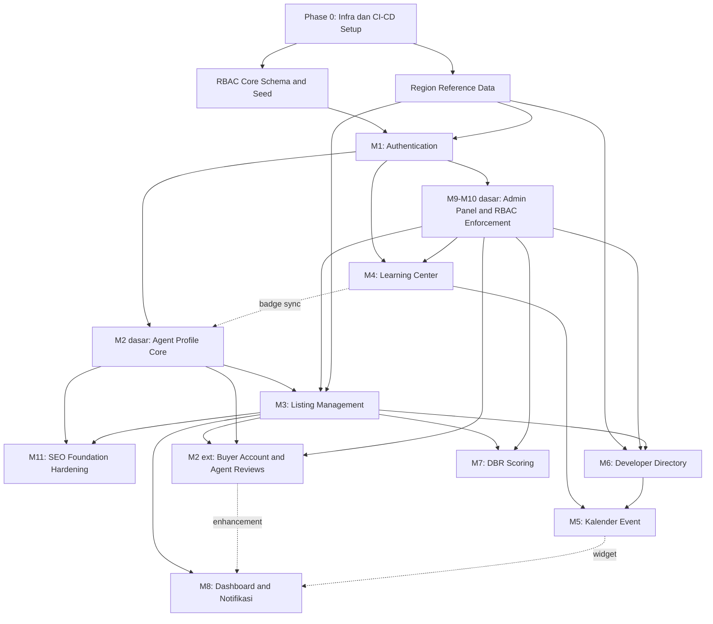

# DEVELOPMENT ROADMAP
## Platform Web RUMAHAGEN

**Versi:** 1.0
**Tanggal:** 27 Juli 2026
**Status:** Draft — menunggu review & pengesahan tim (belum berstatus "BERLAKU" seperti `PROJECT-CONSTITUTION.md`)
**Disusun oleh:** Principal Software Architect / Engineering Manager / Senior Technical Project Manager
**Dokumen sumber:** `PROJECT-CONSTITUTION.md`, `PRD-RUMAHAGEN-v1.1.md`, `ERD-Skema-Database-Real-Estate-Agency-v1.1.md`, `ERD-Diagram-v1.1.mermaid`, `API-Specification-RUMAHAGEN-v1.1.md`, `User-Flow-RUMAHAGEN-v1.1.md`, `SEO-Analytics-Specification-RUMAHAGEN-v1.1.md`, `SYSTEM-ARCHITECTURE.md`, `technology-decisions.md`, `dependency-manifest.md`, `AI-DEVELOPMENT-BLUEPRINT.md`, `AI-CONTEXT-PACK.md`

**Kedudukan dokumen dalam hierarki governance proyek:** Dokumen ini adalah **panduan perencanaan & eksekusi sprint**, turunan operasional dari seluruh dokumen sumber di atas. Roadmap ini **tidak mengubah** keputusan arsitektur/bisnis apa pun yang sudah final — fungsinya murni menata **urutan implementasi** agar konsisten dengan `PROJECT-CONSTITUTION.md` Bagian 21 poin 1 ("jangan membangun fitur fase mendatang sebelum fondasi fase saat ini solid"). Jika terjadi ketidaksesuaian antara Roadmap ini dan dokumen sumber manapun, dokumen sumber yang menang — laporkan sebagai gap, jangan menyimpang diam-diam.

---

## Ringkasan Pendekatan & Prinsip Pengurutan

Roadmap ini **tidak mengikuti urutan modul PRD (Modul 1 → 11) secara literal**. PRD menomori modul berdasarkan **kelompok kebutuhan bisnis** agar mudah dibaca stakeholder — bukan berdasarkan urutan teknis yang paling aman untuk dibangun. Roadmap ini menyusun ulang urutan tersebut berdasarkan **analisis dependency rekayasa perangkat lunak**, dengan lima prinsip berikut:

1. **Schema & akses sebelum fitur** — Tabel `roles`/`permissions`/`role_permissions` dan data referensi wilayah (`ref_provinces/cities/districts/villages`) harus ada sebelum modul apa pun yang bergantung padanya (Auth butuh `roles`; Listing & Developer Projects butuh data wilayah cascading). Membangun fitur dulu baru menambal referensi wilayah belakangan **memaksa migrasi ulang skema listing** yang sudah dipakai publik — risiko yang harus dihindari sejak awal (`PROJECT-CONSTITUTION.md` Bagian 18 poin 5).
2. **Ownership sebelum data ber-ownership** — `agent_id` adalah hard boundary (`PROJECT-CONSTITUTION.md` Bagian 18 poin 2). Maka **Authentication** (yang menerbitkan identitas & `role_id`) wajib selesai sebelum **Profil Agen**, dan keduanya wajib selesai sebelum **Listing** — persis pola yang diberikan sebagai contoh pada instruksi tugas ini, namun di sini dijelaskan secara eksplisit **mengapa**: Listing tidak bisa diuji ownership-nya tanpa agen yang sudah terverifikasi (Auth) dan tanpa nomor WA default (Profil).
3. **Moderasi sebelum konten publik** — Modul 9/10 (Admin Panel & RBAC dasar) harus fungsional **sebelum** Listing dapat tayang publik, karena lifecycle listing (`pending_review → published`) secara struktural membutuhkan antrean moderasi admin (`PRD Modul 3` Business Rules). Membangun Listing tanpa Admin Panel berarti tidak ada jalan bagi listing untuk pernah menjadi `published` — bukan MVP yang bisa diuji end-to-end.
4. **Agregator setelah sumber data, bukan sebelum** — Dashboard (Modul 8) **mengagregasi** data dari Listing, Lead, Review, dsb — ia tidak punya tabel transaksionalnya sendiri (`AI-CONTEXT-PACK.md` Bagian 4). Membangun Dashboard sebelum Listing/Review berarti membangun UI yang menampilkan data kosong/dummy, yang hampir pasti akan di-refactor. Notifikasi ditempatkan setelah Dashboard karena secara UI menempel di shell Dashboard (bell icon) dan triggernya berasal dari event modul-modul sebelumnya yang sudah ada.
5. **SEO dibangun menempel di halaman publik, bukan sebagai modul terpisah di akhir** — sesuai prinsip *"SEO-first, bukan SEO-afterthought"* (`PROJECT-CONSTITUTION.md` Bagian 18 poin 1), elemen SEO dasar (slug, meta tag) **wajib** ditulis pada saat halaman publik (Profil, Listing) pertama kali dibangun — bukan ditunda. Yang ditempatkan sebagai sprint tersendiri hanyalah **hardening tingkat sistem** (sitemap otomatis, Search Console/Indexing API, GTM/GA4 site-wide) yang secara alami membutuhkan lebih dari satu jenis halaman publik untuk diuji sekaligus.

**Perbandingan urutan PRD vs Roadmap:**

| Urutan PRD (Bagian 2) | Urutan Roadmap (dokumen ini) |
|---|---|
| M1 Auth → M2 Profil → M3 Listing → M4 Learning → M5 Event → M6 Developer → M7 DBR → M8 Dashboard → M9 Admin → M10 RBAC → M11 SEO | Infra/RBAC-Core/Region → **M1 Auth** → **M2 Profil (dasar)** → **M9+M10 (dasar)** → **M3 Listing** → **M11 SEO (hardening)** → **M2 ext. (Buyer & Review)** → **M8 Dashboard+Notifikasi** → **M6 Developer** → **M7 DBR** → **M4 Learning Center** → **M5 Event** |

Perbedaan utama: **M9/M10 (Admin & RBAC) dimajukan** sebelum Listing (bukan di akhir seperti nomor modul PRD) karena Listing tidak dapat diuji tanpa jalur moderasi; **M11 (SEO)** dipecah — bagian fondasi menempel di setiap sprint halaman publik, bagian hardening jadi sprint tersendiri setelah Profil & Listing ada; **M8 (Dashboard)** dimundurkan ke akhir Fase 1 karena sifatnya agregator; **M6 (Developer)** tetap mendahului **M7 (DBR)** karena alur data PRD Bagian 4.1 sendiri menunjukkan Developer → Listing → DBR (memvalidasi Listing dengan data Primary asli sebelum DBR mengonsumsi harga listing tersebut); **M4 (Learning Center)** mendahului **M5 (Event)** karena tabel `events` punya FK opsional ke `courses` (`related_course_id`) yang idealnya sudah ada isinya saat Event dibangun.

---

# Project Phases

| Phase | Nama | Cakupan Modul PRD | Tujuan Fase | Estimasi Durasi* |
|---|---|---|---|---|
| **Phase 0** | Foundation Infrastructure | *(non-modul PRD — prasyarat teknis)* | Monorepo, CI/CD, skema inti (RBAC, wilayah), rendering strategy terkunci | 1 sprint |
| **Phase 1** | Core Identity, Access & Public Marketplace | M1, M2 (dasar), M9 (dasar), M10 (dasar), M3, M11 (fondasi+hardening), M2 ext. (Buyer/Review), M8 | Agen dapat mendaftar → diverifikasi → posting listing; publik dapat mencari & menghubungi agen; admin dapat memoderasi; halaman publik siap terindeks | 8 sprint |
| **Phase 2** | Business Growth Features | M6, M7 | Diferensiasi bisnis: katalog developer & pre-screening KPR (DBR) | 3 sprint |
| **Phase 3** | Agent Enablement | M4, M5 | Edukasi agen (sertifikasi gratis) & kalender event terpusat | 2 sprint |
| **Phase 4** | Production Readiness & Launch | *(lintas modul)* | Hardening keamanan/performa, go-live checklist, deployment produksi | 1 sprint |
| **Phase 5 (Deferred)** | Advanced Growth & Monetization | M8 lanjutan, gamifikasi, SLIK/BI Checking, payment/komisi | Lihat bagian **Future Enhancements** — di luar cakupan roadmap aktif ini | — |

*Estimasi durasi mengasumsikan sprint 2 minggu dan tim yang sudah familiar stack (`technology-decisions.md`). Sesuaikan dengan kapasitas tim aktual — angka ini adalah baseline perencanaan, bukan komitmen kontraktual.

**Aturan lintas fase (wajib, non-negotiable):** Fase 2/3 tidak boleh dimulai sebelum seluruh *Acceptance Criteria* & *Module Completion Checklist* Fase 1 lolos (`PROJECT-CONSTITUTION.md` Bagian 21 poin 1; `AI-DEVELOPMENT-BLUEPRINT.md` Bagian 22). Ini berlaku untuk AI Coding Assistant maupun developer manusia tanpa pengecualian.

---

# Sprint Plan

Asumsi: 1 sprint = 2 minggu kerja. Kolom **Prasyarat** merujuk ke sprint yang wajib selesai (lolos Acceptance Criteria) sebelum sprint tersebut dimulai.

## Phase 0 — Foundation Infrastructure

| Sprint | Fokus | Prasyarat | Output Utama |
|---|---|---|---|
| **S0** | Project & Infra Scaffolding | — | Monorepo (`apps/web`, `packages/shared-types`), Next.js + TypeScript strict init, Tailwind v4 + shadcn/ui init, ESLint/Prettier/Husky, CI pipeline (lint+type-check+test), Supabase project + migration awal (`users`, `roles`, `permissions`, `role_permissions` — seed 7 role & modul/aksi permission), seed `ref_provinces/cities/districts/villages`, route group skeleton `(public)/(auth)/(dashboard)/(admin)`, middleware skeleton (`auth`/`rbac`/`rate-limit`), env var scaffold |

## Phase 1 — Core Identity, Access & Public Marketplace

| Sprint | Fokus | Prasyarat | Output Utama |
|---|---|---|---|
| **S1** | Modul 1 — Authentication & Agent Onboarding | S0 | Registrasi email/HP+OTP, login password+Google OAuth2, refresh/logout(-all), forgot/reset password, upload dokumen legalitas, status lifecycle `pending_review→active/suspended` |
| **S2** | Modul 2 (dasar) — Agent Profile Core | S1 | CRUD profil (bio, spesialisasi, area, WA, privasi kontak), halaman publik profil (SSR, slug), placeholder badge/statistik (nilai riil menyusul S4/S12) |
| **S3** | Modul 9+10 (dasar) — Admin Panel Shell & RBAC Enforcement | S1 | Manajemen user (approve/reject/suspend agen), Permission Matrix Editor (Superadmin) + editor terbatas (Manager → khusus Agen), audit log, middleware RBAC penuh (`own/all/none`, superadmin bypass, ownership hard rule) |
| **S4** | Modul 3 (Bagian A) — Listing CRUD & Media | S2, S3 | CRUD listing (kategori Primary/Secondary, tujuan Jual/Sewa, seluruh field spesifikasi PRD 3.2), upload multi-foto+video, price history, lifecycle status, moderasi admin (approve/reject/takedown) |
| **S5** | Modul 3 (Bagian B) — Public Search, Filter, Map View & CTA WhatsApp | S4 | `/properties/search`, `/properties/map-bounds`, `/properties/nearby`, `/properties/autocomplete`, filter kombinasi, mode List/Map, CTA WhatsApp + pencatatan lead event, form inquiry (`POST /leads`) |
| **S6** | Modul 11 — SEO Foundation Hardening | S2, S5 | Sitemap per tipe + regenerasi event-driven, `robots.txt`/meta robots per route group, Google Search Console submission, Google Indexing API integration, GTM/GA4 site-wide + Consent Mode, structured data (`Product`, `Person`, `BreadcrumbList`, `WebSite`) tervalidasi Rich Results Test |
| **S7** | Modul 2 ext. — Buyer Account & Agent Reviews | S5, S3 | Registrasi akun Buyer, submit review (rating+komentar) berstatus `pending`, antrean moderasi review (Admin/Manager/Superadmin), `aggregateRating` on-the-fly di halaman profil publik |
| **S8** | Modul 8 — Dashboard & Notifikasi | S5, S7 | Dashboard agen (ringkasan listing/lead/prospek), dashboard admin (statistik operasional), notifikasi in-app/email (approval, listing expiring, lead baru, review masuk) |

**🎯 Milestone: Fase 1 MVP selesai setelah S8 lolos penuh.**

## Phase 2 — Business Growth Features

| Sprint | Fokus | Prasyarat | Output Utama |
|---|---|---|---|
| **S9** | Modul 6 — Developer Directory | S4, S3 | CRUD proyek developer (`city_id` FK), materi marketing, klaim proyek oleh agen → auto-generate listing Primary (field harga/spek terkunci), sinkronisasi real-time perubahan harga/unit ke listing turunan |
| **S10** | Modul 7 — DBR Scoring Calculator | S5 | Kalkulator anuitas + DBR%, `tenor_months` (bulan-only, konversi tahun→bulan di client), simulasi what-if, simpan sebagai prospek, export PDF, `dbr_config` configurable (Superadmin) |
| **S11** | Stabilisasi Fase 2 | S9, S10 | Widget Dashboard untuk DBR/Developer, notifikasi tambahan ("update harga proyek", "hasil DBR tersimpan"), regression test sinkronisasi Developer↔Listing |

**🎯 Milestone: Fase 2 selesai setelah S11 lolos penuh.**

## Phase 3 — Agent Enablement

| Sprint | Fokus | Prasyarat | Output Utama |
|---|---|---|---|
| **S12** | Modul 4 — Learning Center | S1, S3 | Katalog kursus, self-enroll, materi video/PDF/kuis, sertifikat digital otomatis (passing grade configurable), aktivasi role Instructor, sinkronisasi badge → Profil Agen (S2) |
| **S13** | Modul 5 — Kalender Event | S12, S9 | Kalender bulanan/mingguan, RSVP+waitlist, reminder H-1/H-1 jam, event terhubung ke kursus (webinar) & proyek developer (launching), alur pengajuan Developer Partner + approval |

**🎯 Milestone: Fase 3 selesai setelah S13 lolos penuh.**

## Phase 4 — Production Readiness & Launch

| Sprint | Fokus | Prasyarat | Output Utama |
|---|---|---|---|
| **S14** | Go-Live Hardening & Deployment | S0–S13 | Audit keamanan penuh (lihat **Go Live Checklist**), load test endpoint kritis (search, DBR), verifikasi Core Web Vitals production-like, finalisasi item "Hal Perlu Dikonfirmasi" yang memblokir go-live, deployment produksi (Vercel + Supabase Production) |

**🎯 Milestone: Production Go-Live.**

---

# Module Order

Urutan implementasi final (gabungan Phase 0 infra + 11 modul PRD), dengan justifikasi singkat per item:

| # | Item | Justifikasi Urutan |
|---|---|---|
| 0 | **Infra & RBAC Core Schema & Region Data** | Prasyarat murni teknis — tidak ada modul bisnis yang bisa dibangun tanpa `roles` (untuk `users.role_id`) dan data wilayah (untuk field lokasi cascading di Listing & Developer Projects). |
| 1 | **Modul 1 — Authentication** | Sumber identitas & `role_id` bagi seluruh entitas ber-ownership di sistem. |
| 2 | **Modul 2 (dasar) — Agent Profile** | Membutuhkan user yang sudah `Verified` (M1); menyediakan nomor WA default yang dikonsumsi Listing. |
| 3 | **Modul 9 + 10 (dasar) — Admin Panel & RBAC Enforcement** | Listing tidak dapat mencapai status `published` tanpa jalur moderasi ini — harus ada *sebelum* Listing, bukan sesudah. |
| 4 | **Modul 3 — Listing Management** | Entitas inti platform; membutuhkan M1 (ownership), M2 (WA default), M9/10 (moderasi), Region Data (lokasi). |
| 5 | **Modul 11 — SEO (hardening tingkat sistem)** | Fondasinya sudah menempel sejak M2 & M3 dibangun; sprint ini mengunci sitemap/Indexing API/GTM-GA4 site-wide setelah ada ≥2 tipe halaman publik untuk diuji bersamaan. |
| 6 | **Modul 2 (ext.) — Buyer & Agent Reviews** | Membutuhkan Listing/Lead (bukti interaksi opsional) dan antrean moderasi Admin (M9/10) yang sudah berjalan. |
| 7 | **Modul 8 — Dashboard & Notifikasi** | Murni agregator — tidak berguna dibangun sebelum ada data Listing/Lead/Review untuk diagregasi. |
| 8 | **Modul 6 — Developer Directory** | Memperluas skema Listing (`developer_project_id`, auto-generate) — butuh Listing yang sudah stabil terlebih dahulu agar tidak ada dua kali migrasi besar pada tabel yang sama. |
| 9 | **Modul 7 — DBR Scoring** | Hanya butuh Listing (autofill harga, opsional) — coupling paling ringan di antara modul Fase 2, ditempatkan setelah Developer agar mengonsumsi listing Primary yang sudah "asli" (bukan data uji manual). |
| 10 | **Modul 4 — Learning Center** | Independen secara data (tabel sendiri penuh), hanya butuh M1 untuk enrollment agen; badge yang dihasilkan dikonsumsi M2 sebagai *enhancement*, bukan dependency wajib. |
| 11 | **Modul 5 — Kalender Event** | Tabel `events` memiliki FK opsional ke `courses` (M4) dan `developer_projects` (M6) — ditempatkan terakhir agar kedua sumber data tersebut sudah terisi saat event webinar/launching pertama dibuat. |

---

# Dependency Graph

**Penjelasan tiap edge (mengapa dependency ini nyata, bukan asumsi):**

| Dari → Ke | Alasan Teknis |
|---|---|
| Infra → RBAC Core / Region Data | Migration awal & seed data adalah bagian dari setup proyek — tidak ada "modul" yang bisa jalan tanpa database & CI siap. |
| RBAC Core, Region Data → Auth | `users.role_id` adalah FK wajib (NOT NULL) ke `roles`; form registrasi agen mengumpulkan "area operasional (kota/kecamatan)" yang butuh dropdown wilayah (PRD Modul 1). |
| Auth → Profile | `agent_profiles.user_id` adalah FK 1:1 ke `users` — profil hanya bisa dibuat untuk user yang sudah ada & `Verified`. |
| Auth → Admin Panel | Fitur pertama Admin Panel (approve/reject registrasi) beroperasi langsung di atas data yang dihasilkan M1. |
| Profile, Admin, Region → Listing | WA default (Profile), jalur moderasi (Admin), field lokasi cascading (Region) semuanya prasyarat struktural form listing (PRD 3.2). |
| Profile, Listing → SEO Hardening | Sitemap per-tipe & structured data butuh minimal 2 tipe halaman publik (profil + listing) untuk diverifikasi bersamaan secara realistis. |
| Listing, Profile, Admin → Reviews | `agent_reviews.listing_lead_id` (opsional, bukti interaksi), target review adalah `agent_profiles`, dan moderasi review memakai pola antrean yang sama dengan Admin Panel. |
| Listing → Dashboard | Dashboard agen menampilkan "jumlah listing aktif" & "jumlah lead" — tidak ada data berarti tanpa Listing selesai. Reviews → Dashboard bersifat *enhancement* (notifikasi review baru), bukan blocker. |
| Region, Admin, Listing → Developer Directory | `developer_projects.city_id` butuh Region Data; CRUD proyek adalah fitur Admin; klaim proyek meng-*extend* skema Listing (`developer_project_id`, auto-generate) sehingga Listing wajib stabil dulu. |
| Listing, Admin → DBR Scoring | Autofill harga (opsional) dari Listing; `dbr_config` dikelola lewat Admin Panel (Superadmin only). |
| Auth, Admin → Learning Center | Enrollment butuh agen terautentikasi; kelola konten kursus butuh Admin Panel/role Instructor yang sudah bisa dikelola RBAC. Learning Center → Profile bersifat *enhancement* (badge sync), bukan blocker sebaliknya. |
| Learning Center, Developer Directory → Event Calendar | `events.related_course_id` dan `events.related_project_id` adalah FK opsional yang idealnya sudah punya data nyata saat modul ini dibangun. |

---

# Milestones

| Milestone | Tercapai Setelah | Definisi "Selesai" |
|---|---|---|
| **M0 — Fondasi Siap** | Sprint S0 | Monorepo berjalan, CI hijau, skema RBAC+Region ter-seed, route group skeleton siap, semua developer/AI dapat mulai bekerja di atas fondasi yang sama. |
| **M1 — Agent Onboarding Live** | Sprint S3 | Agen dapat registrasi → OTP → upload dokumen → menunggu approval → admin approve/reject via Admin Panel; RBAC middleware aktif penuh di seluruh endpoint. |
| **M2 — Public Marketplace Live** | Sprint S6 | Listing dapat dibuat, dimoderasi, tayang publik; publik dapat mencari & klik CTA WhatsApp; halaman publik lolos audit SEO dasar (SSR, sitemap, structured data). |
| **M3 — Fase 1 MVP Complete** | Sprint S8 | Seluruh Acceptance Criteria Fase 1 PRD terpenuhi: Auth, Profil, Listing, Admin dasar, RBAC dasar, fondasi SEO, Dashboard, Buyer & Review. Siap untuk *soft-launch* internal/terbatas. |
| **M4 — Business Differentiation Live** | Sprint S11 | Katalog developer & kalkulator DBR berjalan, tersinkron dengan Listing, Dashboard menampilkan data Fase 2. |
| **M5 — Agent Enablement Live** | Sprint S13 | Learning Center & Kalender Event berjalan, badge tersinkron ke Profil, event terhubung kursus/proyek developer. |
| **M6 — Production Go-Live** | Sprint S14 | Seluruh **Go Live Checklist** lolos, deployment produksi aktif, monitoring berjalan. |

---

# Deliverables

Ringkasan output konkret per sprint (detail field/endpoint mengikuti dokumen sumber masing-masing modul):

| Sprint | Deliverables |
|---|---|
| S0 | Repo monorepo + CI hijau · Migration `users/roles/permissions/role_permissions` + seed 7 role · Migration & seed `ref_provinces/cities/districts/villages` · `packages/shared-types` skeleton · Route group `(public)/(auth)/(dashboard)/(admin)` dengan `layout.tsx` masing-masing |
| S1 | Endpoint `/auth/register`, `/verify-otp`, `/resend-otp`, `/login`, `/oauth/google`, `/refresh`, `/logout(-all)`, `/forgot-password`, `/reset-password` · Halaman registrasi/login/verifikasi OTP · Upload dokumen legalitas ke bucket privat terenkripsi |
| S2 | Endpoint `GET/PUT /users/profile`, `GET /agents/{id}` · Halaman publik `/agen/{slug}` (SSR) · Form edit profil dengan alur approval field sensitif |
| S3 | Endpoint `/admin/agents/*`, `/admin/permissions/matrix*`, `/admin/roles`, `/admin/users/{id}/role`, `/admin/audit-logs` · Admin Panel shell + sub-menu role-gated · Permission Matrix Editor (Superadmin) + editor terbatas (Manager) |
| S4 | Endpoint `POST/PUT/PATCH/DELETE /listings`, `/listings/{id}/media*`, `/listings/{id}/price-history` · Form listing multi-step · Antrean moderasi `/admin/listings/pending` |
| S5 | Endpoint `/properties/search`, `/map-bounds`, `/nearby`, `/autocomplete`, `/{id}/similar` · Halaman katalog (List/Map View) · CTA WhatsApp + `POST /leads` |
| S6 | `sitemap-index.xml` + 4 sitemap turunan · `robots.txt` dinamis · Integrasi Google Search Console & Indexing API · GTM/GA4 site-wide + Consent Mode · JSON-LD tervalidasi |
| S7 | Endpoint `/agents/{id}/reviews`, `/admin/agent-reviews/*` · Registrasi Buyer · UI submit & moderasi review |
| S8 | Endpoint `/dashboard/summary`, `/notifications*` · Dashboard agen & admin · Notifikasi in-app/email |
| S9 | Endpoint `/developer-projects*`, `/admin/developer-projects` · Katalog & klaim proyek · Auto-generate listing dari proyek |
| S10 | Endpoint `/calculator/dbr*`, `/admin/config/dbr` · Kalkulator UI + simulasi what-if · Export PDF |
| S11 | Widget Dashboard Fase 2 · Test regresi sinkronisasi Developer↔Listing |
| S12 | Endpoint `/courses*`, `/admin/courses*` · Katalog kursus, kuis, sertifikat digital · Aktivasi role Instructor |
| S13 | Endpoint `/events*`, `/developer-partners/events` · Kalender + RSVP · Reminder H-1/H-1 jam |
| S14 | Laporan audit keamanan · Hasil load test · Deployment produksi (Vercel + Supabase Production) |

---

# Acceptance Criteria

Kriteria "selesai" per sprint — diturunkan dari Acceptance Criteria PRD per modul ditambah Definition of Done rekayasa (`AI-DEVELOPMENT-BLUEPRINT.md` Bagian 22):

| Sprint | Acceptance Criteria |
|---|---|
| **S0** | CI pipeline lolos (lint+type-check+test) pada commit kosong · Migration dapat dijalankan ulang dari nol tanpa error · Seed data wilayah terverifikasi jumlah baris sesuai sumber resmi |
| **S1** | Agen baru dapat submit registrasi lengkap dengan validasi field wajib · OTP terkirim & dapat diverifikasi · Admin menerima notifikasi registrasi baru · Login gagal pada kredensial salah, berhasil pada kredensial benar sesuai status akun |
| **S2** | Profil dapat diedit oleh agen ybs · Perubahan field sensitif (nama, no. lisensi) masuk antrean approval · Profil publik dapat diakses tanpa login |
| **S3** | Superadmin dapat mengubah permission Manager/Admin/Agen · Manager hanya dapat mengubah baris permission role Agen (403 pada percobaan lain) · Percobaan akses tanpa izin menghasilkan "Akses Ditolak" informatif, bukan error generik |
| **S4** | Agen dapat CRUD listing miliknya sendiri · Form memvalidasi seluruh field wajib (judul, lokasi, harga, min. 3 foto, legalitas, WA) sebelum submit review · Admin dapat approve/reject/takedown listing |
| **S5** | Katalog dapat difilter kombinasi (AND logic) sesuai PRD 3.4 · Ditampilkan mode List & Map · CTA WhatsApp membuka `wa.me` dengan pesan template terisi & tercatat sebagai lead event |
| **S6** | Homepage/Search/Detail Listing/Profil Agen menghasilkan HTML lengkap tanpa JavaScript aktif · Sitemap ter-update otomatis maksimal beberapa menit setelah listing baru publish · `site:` search tidak menampilkan halaman dashboard/admin/DBR |
| **S7** | Buyer dapat submit review, status awal selalu `pending` · Review tidak tampil publik sebelum di-approve · `aggregateRating` hanya muncul jika ≥1 review `approved` |
| **S8** | Dashboard agen menampilkan data hanya miliknya sendiri · Dashboard admin menampilkan data global · Notifikasi personal per user, tidak bocor lintas scope |
| **S9** | Admin dapat CRUD proyek developer & materi marketing · Agen dapat klaim proyek → listing Primary auto-generate dengan field harga terkunci · Perubahan harga developer ter-update ke seluruh listing turunan |
| **S10** | Kalkulasi DBR% & status kelayakan sesuai formula anuitas · Tenor selalu tersimpan dalam bulan (`tenor_months`) meski input UI dalam tahun · Export PDF berhasil menghasilkan file |
| **S11** | Tidak ada regresi pada Listing setelah integrasi Developer · Notifikasi update harga proyek terverifikasi terkirim |
| **S12** | Agen dapat enroll tanpa biaya/approval · Sertifikat terbit otomatis saat skor kuis ≥ passing grade · Superadmin/Admin/Instructor dapat kelola kursus; Manager & Agen tidak dapat kelola konten |
| **S13** | Agen dapat RSVP event · Kuota penuh otomatis masuk waiting list · Developer Partner hanya dapat mengajukan event (butuh approval), tidak publikasi langsung |
| **S14** | Seluruh item **Go Live Checklist** tercentang · Aplikasi dapat diakses di domain produksi tanpa error kritis |

---

# Risks

Risiko teknis per sprint/fase beserta mitigasi (melengkapi `SYSTEM-ARCHITECTURE.md` Bagian 21):

| Sprint/Fase | Risiko | Mitigasi |
|---|---|---|
| **S0** | Keputusan arsitektur backend (Route Handlers vs service terpisah) belum terkunci resmi di `PROJECT-CONSTITUTION.md`, sementara `technology-decisions.md` sudah mengarah ke Supabase+Route Handlers saja. | Konfirmasi & sinkronkan keputusan ini ke Constitution **sebelum** S1 dimulai — jangan biarkan dua dokumen sumber punya status "final" yang berbeda saat implementasi jalan. |
| **S1** | Verifikasi `id_token` Google OAuth2 di-skip/di-trust dari client demi kecepatan pengembangan. | Enforce verifikasi server-side via Google Auth Library resmi sebagai bagian dari Definition of Done S1, bukan opsional. |
| **S2** | Field lokasi profil (area jangkauan) diimplementasikan freetext karena form Listing (yang cascading) belum ada sebagai acuan. | Tunda keputusan struktur `coverage_area` sampai pola cascading Region Data (S0) dipakai konsisten; jangan buat pola lokasi kedua. |
| **S3** | Middleware RBAC ditulis ulang berbeda-beda per endpoint oleh sesi AI yang berbeda. | Wajib satu implementasi terpusat di repository layer (`SYSTEM-ARCHITECTURE.md` Bagian 11) — bukan logic RBAC tersebar per controller. |
| **S4** | Denormalisasi counter (`cta_click_count`, `total_listings_sold`) dihitung on-the-fly oleh developer yang tidak sadar aturan ini. | Komentar kode eksplisit + review checklist menandai kolom counter sebagai "wajib trigger/job" (`SYSTEM-ARCHITECTURE.md` Bagian 21). |
| **S5** | Query pencarian kombinasi filter lambat pada volume data besar karena hanya mengandalkan Postgres tanpa search engine khusus. | Search Engine (Typesense/Elasticsearch) masih berstatus *Open Question* di `technology-decisions.md` Bagian 9 poin 2 — pantau performa sejak S5, eskalasi keputusan sebelum volume listing bertumbuh signifikan. |
| **S6** | Google Indexing API/GSC gagal terhubung karena kepemilikan akun organisasi belum ditentukan. | Item ini tidak memblokir *development* (`SEO Spec` Bagian 9) tetapi wajib diselesaikan tim operasional sebelum S14 (Go-Live). |
| **S7** | Fitur review disalahgunakan untuk spam/fake review sebelum moderasi matang. | Antrean moderasi wajib aktif sejak S7 dilaunch (bukan ditambah belakangan); pertimbangkan rate-limit submission review per Buyer. |
| **S8** | Dashboard agen/admin lambat karena query agregasi langsung ke tabel transaksional. | Pastikan seluruh counter yang ditampilkan Dashboard sudah dari kolom denormalisasi (hasil S4), bukan `JOIN`/`COUNT()` real-time. |
| **S9** | Race condition saat developer mengubah harga bersamaan dengan agen mengklaim proyek. | Terapkan locking/transaction level database saat auto-generate listing dari proyek; uji skenario konkuren di regression test S11. |
| **S10** | Threshold DBR & suku bunga default di-hardcode karena tim bisnis belum memutuskan angka final. | Wajib dibaca dari `dbr_config`, ditandai `// TODO: menunggu keputusan bisnis` jika nilai default masih sementara. |
| **S12** | Sertifikat PDF disimpan di bucket publik tanpa kontrol akses, berisiko data agen bocor. | Ikuti pola bucket privat + signed URL yang sama seperti dokumen legalitas (`PROJECT-CONSTITUTION.md` Bagian 16). |
| **S13** | Reminder event (H-1/H-1 jam) gagal terkirim karena belum ada job scheduler resmi di stack. | Job Queue masih *Open Question* (`technology-decisions.md` Bagian 9 poin 4) — putuskan BullMQ vs Supabase Edge Functions + cron sebelum S13, bukan saat S13 berjalan. |
| **S14** | Provider Maps final (Google Maps Platform per `technology-decisions.md`), kepemilikan akun GSC/GTM/GA4, dan threshold DBR final belum disepakati tim bisnis saat go-live mendekat. | Eskalasi seluruh item "Hal Perlu Dikonfirmasi" yang memblokir go-live ke manusia jauh sebelum S14 dimulai — jangan menunggu sampai sprint terakhir. |

---

# Recommended Testing

Mengikuti stack testing resmi (`technology-decisions.md` Bagian 3: Vitest, React Testing Library, Playwright):

| Modul/Sprint | Unit Test (Vitest) | Component Test (RTL) | E2E Test (Playwright) |
|---|---|---|---|
| S1 Auth | Validasi OTP, hashing password, resolusi status akun | Form registrasi (error state, submit) | Alur registrasi → OTP → approval → login |
| S2 Profile | Logic approval field sensitif | Form edit profil | Edit profil → simpan → tampil di halaman publik |
| S3 Admin/RBAC | Resolusi `granted_scope` (own/all/none), `editable_by_role_code`, superadmin bypass | Permission Matrix Editor (toggle & simpan) | Manager mencoba ubah permission Admin → 403; approve agen baru |
| S4 Listing CRUD | Validasi Zod field wajib, slug generator, price history logic | Form listing multi-step, upload foto | Agen buat listing → submit review → admin approve → published |
| S5 Search/CTA | Query filter kombinasi, formula sort popularitas | Komponen filter (debounce), toggle List/Map | Guest cari listing → buka detail → klik CTA WA → lead tercatat |
| S6 SEO | Generator meta title/description dari template, slug↔redirect logic | — | Verifikasi HTML lengkap tanpa JS aktif (SSR check) |
| S7 Reviews | Validasi rating 1-5, kalkulasi `aggregateRating` on-the-fly | Form submit review, kartu review | Buyer submit review → admin approve → tampil di profil publik |
| S8 Dashboard | Agregasi ringkasan per scope role | Widget dashboard (loading/empty/error/success) | Login agen → lihat dashboard hanya data sendiri |
| S9 Developer | Logic auto-generate listing dari proyek, sinkronisasi harga | Form klaim proyek | Agen klaim proyek → listing Primary muncul di "Listing Saya" |
| S10 DBR | Formula anuitas, kalkulasi DBR%, threshold comparison, konversi tahun→bulan | Kalkulator DBR (real-time re-kalkulasi) | Agen hitung DBR → simpan prospek → export PDF |
| S12 Learning Center | Logic passing grade, prasyarat kursus | Player materi, form kuis | Agen enroll → selesaikan materi → kuis lulus → sertifikat terbit |
| S13 Event | Logic kuota/waiting list, reminder scheduling | Kalender view, form RSVP | Agen RSVP event penuh → masuk waiting list |
| **Lintas modul (wajib tiap sprint)** | Regression test bug fix (`AI-DEVELOPMENT-BLUEPRINT.md` Bagian 20) | Error boundary per route group | Minimal 1 alur kritis per modul sesuai Acceptance Criteria PRD |

---

# Go Live Checklist

Diadaptasi & dikonsolidasikan dari `AI-DEVELOPMENT-BLUEPRINT.md` Bagian 23 (Production Readiness Checklist), untuk dieksekusi di Sprint S14:

### Keamanan
- [ ] Audit build output — tidak ada `*_SECRET`/`*_SERVICE_ROLE_KEY`/`*_SERVER` ter-bundle ke client-side JavaScript.
- [ ] RLS aktif di seluruh tabel ber-scope kepemilikan di environment production.
- [ ] Enkripsi at-rest terverifikasi aktif untuk dokumen legalitas agen & field finansial DBR.
- [ ] Rate limiting aktif & teruji untuk endpoint auth/OTP/sensitif.
- [ ] Minimal 1 akun Superadmin aktif terverifikasi ada di database production.
- [ ] Cookie consent banner + Google Consent Mode aktif sebelum tracking non-esensial berjalan.
- [ ] Signed URL berumur pendek terverifikasi untuk seluruh akses dokumen privat.

### Data & Migrasi
- [ ] Seluruh migration sudah direview dan diterapkan lewat pipeline resmi (bukan edit langsung Supabase Studio production).
- [ ] Data referensi wilayah Indonesia sudah di-seed lengkap dari sumber resmi.
- [ ] Rencana rollback migration terdokumentasi untuk perubahan skema signifikan.

### SEO & Performa
- [ ] Homepage, Search, Detail Listing, Profil Agen, Detail Proyek Developer menghasilkan HTML lengkap tanpa JavaScript aktif.
- [ ] `robots.txt` & meta robots membedakan halaman publik vs privat (`noindex, nofollow`).
- [ ] Sitemap XML dapat diakses publik, ter-update otomatis, sudah disubmit ke Google Search Console.
- [ ] Structured data (JSON-LD) tervalidasi Google Rich Results Test untuk listing, profil agen, breadcrumb.
- [ ] Target Core Web Vitals (LCP < 2.5s, CLS < 0.1, INP < 200ms, TTFB < 600ms) terverifikasi production-like.
- [ ] Event `generate_lead` (GA4) terverifikasi tercatat saat CTA WhatsApp diklik.

### Operasional
- [ ] CI/CD pipeline (lint+type-check+test+migration check) berjalan konsisten di branch `main`.
- [ ] Environment variables production terpisah dari staging/preview, tidak pernah di-commit ke repo.
- [ ] Monitoring/error tracking (Sentry) aktif & terverifikasi menangkap error production tanpa mengirim data sensitif.
- [ ] Audit log terverifikasi mencatat aksi sensitif (approval, moderasi, perubahan role/permission/config) di production.
- [ ] Item "Hal Perlu Dikonfirmasi" yang **memblokir go-live** (kepemilikan akun GSC/GTM/GA4, provider Maps final, dsb.) sudah diselesaikan atau disepakati eksplisit dapat menyusul pasca-go-live tanpa risiko.

### Roadmap & Scope
- [ ] Hanya modul Phase 0–4 (dokumen ini) yang di-deploy — modul Phase 5/Future Enhancements tidak dibangun mendahului fondasi yang solid.
- [ ] Setiap modul yang di-deploy sudah lolos Acceptance Criteria & Module Completion Checklist masing-masing (lihat bagian **Acceptance Criteria** dokumen ini serta `AI-DEVELOPMENT-BLUEPRINT.md` Bagian 22).
- [ ] Dokumentasi (`ERD`, `API Specification`, roadmap ini) sinkron dengan implementasi nyata — tidak ada modul yang diam-diam menyimpang dari skema/kontrak yang didokumentasikan.

---

# Future Enhancements

Fitur/kapabilitas berikut **secara sadar ditunda** ke luar cakupan roadmap aktif ini (Phase 0–4), konsisten dengan roadmap Fase 4 PRD dan status "Fase Lanjutan" di dokumen sumber lain. Jangan diimplementasikan mendahului fondasi Phase 0–4 tanpa keputusan bisnis eksplisit:

| Item | Sumber Keputusan Semula | Catatan |
|---|---|---|
| **Dashboard analitik lanjutan & funnel lead-to-closing** | PRD Fase 4 | Dibangun di atas data `listing_leads`/`listing_views` yang sudah terstruktur sejak Phase 1. |
| **Gamifikasi/Leaderboard Learning Center** | PRD Modul 4 (disebut opsional fase 2) | Menyusul setelah Learning Center dasar (S12) stabil. |
| **Integrasi SLIK/BI Checking** (validasi cicilan otomatis untuk DBR) | PRD Fase 4, `SYSTEM-ARCHITECTURE.md` Bagian 20 | Membutuhkan kerja sama pihak ketiga/OJK — di luar cakupan MVP DBR (S10). |
| **Payment Gateway & Komisi Otomatis** (Midtrans/Xendit) | `API-Specification` §9.3 — placeholder non-breaking sudah disiapkan (`POST /billing/*`) | Menunggu keputusan model monetisasi final (komisi/tier/boost listing). |
| **Chat In-App (WebSocket)** | `API-Specification` Bagian 5 — didokumentasikan sebagai referensi desain fase lanjutan | MVP cukup memakai CTA WhatsApp (S5); jangan bangun sebelum kebutuhan bisnis konkret muncul. |
| **Konten Blog/Artikel SEO** (mis. "Cara menghitung DBR sebelum ajukan KPR") | `SEO Spec` Bagian 6 | Dapat memakai ulang materi Learning Center (S12) yang disederhanakan untuk konsumsi publik. |
| **Role Kustom di luar 7 role bawaan** | PRD Modul 10 | Hanya Superadmin yang dapat membuat — fitur fase lanjutan, tidak dibutuhkan untuk MVP. |
| **Mobile App native (Flutter/React Native)** | `SYSTEM-ARCHITECTURE.md` Bagian 20 | Kontrak `/api/v1` dijaga stabil sejak awal justru agar opsi ini terbuka tanpa perubahan backend. |
| **Multi-Tenant** | `SYSTEM-ARCHITECTURE.md` Bagian 20 | Perubahan skema besar (`tenant_id` + RLS baru) — harus jadi keputusan arsitektur eksplisit terpisah, bukan ditambal. |
| **AI-Powered Features** (rekomendasi listing personalisasi, auto-deskripsi, penilaian kualitas foto, chatbot FAQ) | `SYSTEM-ARCHITECTURE.md` Bagian 20 | Wajib tetap SSR-compatible agar tidak mengorbankan SEO yang sudah dibangun sejak S6. |

**Keputusan bisnis yang masih terbuka** (bukan fitur yang ditunda, melainkan parameter yang wajib tetap *configurable* sampai keputusan turun — lihat `PROJECT-CONSTITUTION.md` catatan pembuka & Bagian 21 poin 4): threshold DBR final per bank, model monetisasi, kebijakan eksklusivitas proyek developer per wilayah, kebijakan promosi/demosi role Manager↔Superadmin, kepemilikan akun organisasi GSC/GTM/GA4, provider Search Engine (Typesense/Elasticsearch) dan Job Queue (BullMQ vs Supabase Edge Functions) untuk skala besar.

---

*Dokumen ini adalah roadmap operasional turunan dari seluruh dokumen governance proyek (26–27 Juli 2026). Wajib direview ulang setiap kali ada perubahan signifikan pada `PROJECT-CONSTITUTION.md`, `PRD`, atau `SYSTEM-ARCHITECTURE.md` yang memengaruhi urutan dependency di atas. Menjadi acuan tetap bagi AI Coding Assistant maupun kontributor manusia selama siklus pengembangan proyek berlangsung.*
